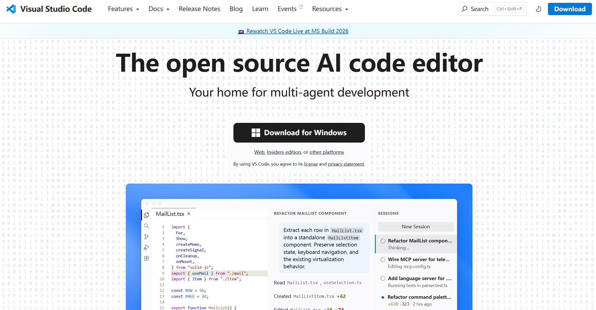
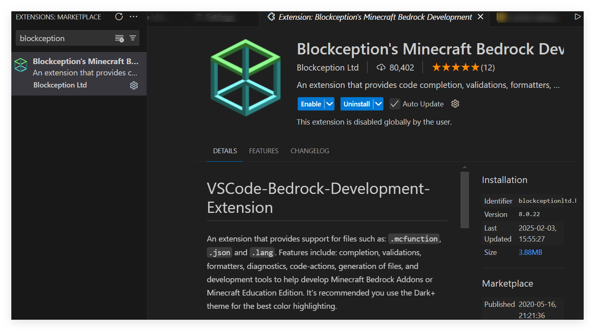
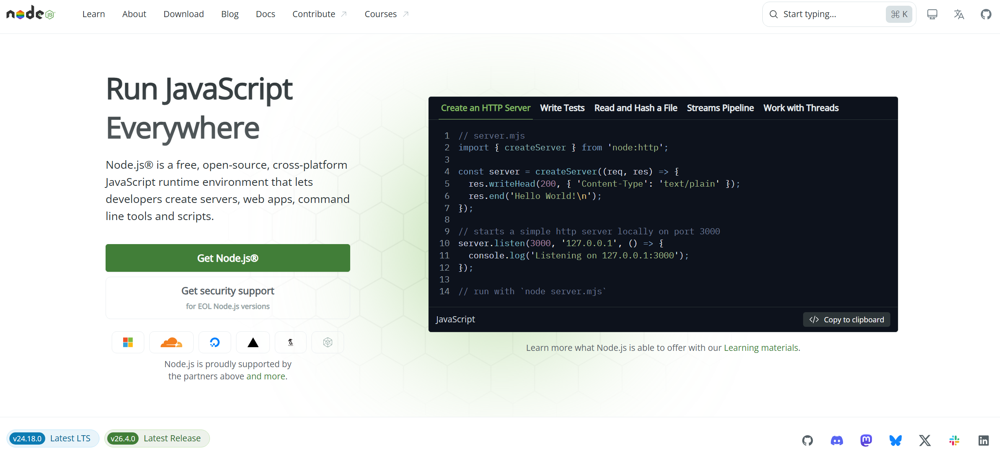
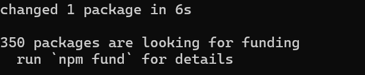
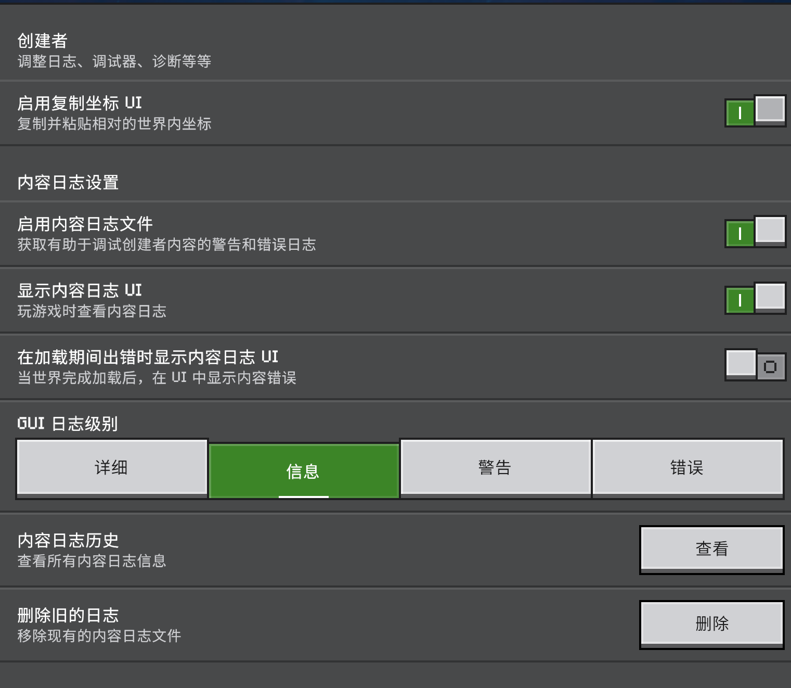
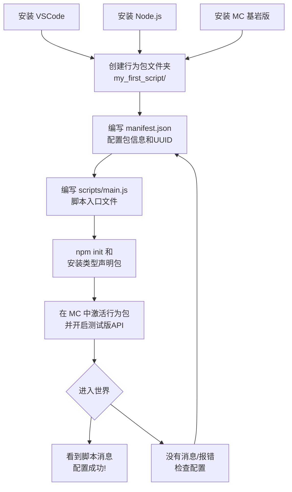

# 2.1 开发环境搭建

## 前言：工欲善其事，必先利其器

在第一章中，我们学习了 JavaScript 的基础语法，所有的代码示例都停留在"概念演示"的层面。从这一章开始，我们要写真正能在 Minecraft 里运行的代码。

在动手写第一行 API 代码之前，需要先把开发环境搭建好。这一节会带你完成从零到"能运行第一个脚本"的全部准备工作。内容偏实操，步骤会尽量详细，跟着一步一步来即可。

---

## 2.1.1 你需要准备什么

在开始之前，先明确需要安装哪些东西，以及为什么需要它们：


**Minecraft 基岩版（Bedrock Edition）**

Script API 只在基岩版上可用，Java 版不支持。你需要一个正版的基岩版客户端，Windows 版本（通过 Microsoft Store 安装）是最方便的开发平台。

**Visual Studio Code（VSCode）**

一个免费的代码编辑器，拥有出色的 JavaScript 支持，以及我们后面会用到的类型提示功能。强烈推荐，不建议用记事本或其他编辑器替代。

**Node.js**

JavaScript 的运行环境。虽然我们的脚本最终是在 Minecraft 里运行的，但 Node.js 提供了我们需要的一些开发工具链。

这三样是必须的。下面开始逐一安装和配置。

---

## 2.1.2 安装 Visual Studio Code

前往 [VSCode 官网](https://code.visualstudio.com/)下载。


下载对应你操作系统的版本，安装过程一路默认即可。安装时建议勾选"添加到 PATH"选项，方便后续在终端中使用。

安装完成后，打开 VSCode，安装以下两个扩展插件（在左侧扩展面板搜索安装）：

**Blockception's Minecraft Bedrock Development**

这是专门为 Minecraft 基岩版开发设计的插件，提供了 Script API 的代码补全和类型提示，能极大地提升开发效率。

**ESLint**（可选但推荐）

代码质量检查工具，能在你写代码时实时提示潜在的错误和不规范写法。

:::tip
安装了 Blockception's Minecraft Bedrock Development 插件之后，当你在代码里写 `world.` 或 `player.` 时，VSCode 会自动弹出可用的属性和方法列表。这个功能在你刚开始学 API 时非常有帮助，能让你边写边探索 API 有哪些功能。
:::

---

## 2.1.3 安装 Node.js

前往 [Node.js 官网](https://nodejs.org/)下载。




选择 **LTS（长期支持）版本**下载安装。安装过程同样一路默认。

安装完成后，验证是否安装成功。打开系统终端（Windows 上按 `Win + R`，输入 `cmd` 回车），输入以下命令：

```bash
node --version
npm --version
```

如果看到类似下面的输出，说明安装成功：

```
v22.13.1
11.4.2
```

具体版本号不需要完全一致，只要能正常输出版本号就行。

:::note
`npm` 是 Node.js 自带的包管理器，全称 Node Package Manager。我们后面会用它来安装一些开发时需要的工具。
:::

---

## 2.1.4 了解行为包的目录结构

在写任何代码之前，需要先理解 Minecraft 行为包（Behavior Pack）的基本结构。脚本文件是行为包的一部分，放错位置就无法被游戏识别。

一个包含脚本的行为包，目录结构如下：

```
我的行为包/
├── manifest.json          ← 行为包的清单，必须有
├── pack_icon.png          ← 行为包图标（可选）
└── scripts/               ← 所有脚本文件放在这个文件夹里
    └── main.js            ← 脚本的入口文件
```

这是最简单的结构。随着项目变复杂，`scripts` 文件夹内部还会有更多层级，但基本框架就是这样。

:::note
`manifest.json` 是整个行为包最重要的文件，它告诉 Minecraft 这个包叫什么、版本是多少、需要使用哪些 API。我们会在 2.2 节详细讲解它的写法，这一节先把它当成一个必须存在的配置文件即可。
:::

---

## 2.1.5 找到 Minecraft 的开发包目录

Minecraft 基岩版有一个专门存放开发中的行为包和资源包的目录，我们需要把自己的行为包放进去，游戏才能加载它。

**Windows 系统下的路径是：**

```
%appdata%\Minecraft Bedrock\Users\Shared\games\com.mojang\development_behavior_packs
```

:::tip
`development_behavior_packs`内的行为包可以做到热重载，而无需卸载行为包后重新安装。
:::

打开这个目录，你会看到里面可能已经有一些其他的开发包，也可能是空的。我们接下来会在这里创建自己的行为包文件夹。

---

## 2.1.6 创建第一个行为包项目

现在我们来动手创建项目。跟着以下步骤操作：

**第一步：创建项目文件夹**

在 `development_behavior_packs` 目录下，新建一个文件夹，命名为 `my_first_script`（名字可以自定，但建议只用字母、数字和下划线，不要用中文或空格）。

**第二步：用 VSCode 打开这个文件夹**

打开 VSCode，选择"文件 → 打开文件夹"，找到刚才创建的 `my_first_script` 文件夹并打开。

**第三步：创建项目文件结构**

在 VSCode 的文件面板里，依次创建以下文件和文件夹：

```
my_first_script/
├── manifest.json
└── scripts/
    └── main.js
```

创建文件夹：点击文件面板右上角的"新建文件夹"图标，输入 `scripts`。

创建文件：点击"新建文件"图标，分别创建 `manifest.json`（在根目录）和 `main.js`（在 `scripts` 文件夹内）。

**第四步：写入 manifest.json 的内容**

打开 `manifest.json`，写入以下内容：

```json title="manifest.json"
{
    "format_version": 2,
    "header": {
        "name": "我的第一个脚本",
        "description": "用于学习 Script API 的第一个行为包",
        "uuid": "你需要在这里填入一个UUID",
        "version": [1, 0, 0],
        "min_engine_version": [1, 21, 0]
    },
    "modules": [
        {
            "type": "script",
            "language": "javascript",
            "uuid": "你需要在这里填入另一个UUID",
            "entry": "scripts/main.js",
            "version": [1, 0, 0]
        }
    ],
    "dependencies": [
        {
            "module_name": "@minecraft/server",
            "version": "2.8.0"
        }
    ]
}
```

:::warning
注意文件中有两处 `"uuid"` 字段，每一个都需要填入一个唯一的 UUID（通用唯一识别码）。UUID 是一串随机生成的字符串，格式类似：

```
550e8400-e29b-41d4-a716-446655440000
```

你可以访问[此网站](https://www.uuidgenerator.net/)在线生成 UUID：
```
```

每次点击生成按钮都会得到一个新的 UUID。你需要生成**两个不同的** UUID，分别填入 `header` 里的 `uuid` 和 `modules` 里的 `uuid`。

这两个 UUID 绝对不能相同，也不能随便乱写，格式必须正确，否则游戏无法识别这个行为包。
:::

填写完 UUID 后，你的 `manifest.json` 应该看起来像这样（UUID 是你自己生成的，和下面示例不同是正常的）：

```json title="manifest.json"
{
    "format_version": 2,
    "header": {
        "name": "我的第一个脚本",
        "description": "用于学习 Script API 的第一个行为包",
        "uuid": "a1b2c3d4-e5f6-7890-abcd-ef1234567890",
        "version": [1, 0, 0],
        "min_engine_version": [1, 21, 0]
    },
    "modules": [
        {
            "type": "script",
            "language": "javascript",
            "uuid": "f0e9d8c7-b6a5-4321-fedc-ba9876543210",
            "entry": "scripts/main.js",
            "version": [1, 0, 0]
        }
    ],
    "dependencies": [
        {
            "module_name": "@minecraft/server",
            "version": "2.8.0"
        }
    ]
}
```

**第五步：写入第一行脚本代码**

打开 `scripts/main.js`，写入以下内容，以便后续验证是否加载成功。

```js title="scripts/main.js"
import { world,system } from "@minecraft/server";

system.run(()=>world.sendMessage("脚本加载成功！"));
```
:::note
由于 Script API 2.0 版本对脚本加载顺序进行了较大调整，上面代码在实际开发中并不推荐使用。后续教程将会对此进行说明。
:::

---

## 2.1.7 安装类型声明包

在正式开发之前，还应该安装 Script API 的类型声明包。

类型声明包能告诉 VSCode，`@minecraft/server` 这个模块里有哪些类、哪些方法、每个方法需要什么参数、返回什么类型。有了它，你写代码时 VSCode 就能给出精确的自动补全提示和错误警告。

首先，在命令提示符(CMD)中输入下面内容并回车：
```bash
npm i @minecraft/server
```

出现上述提示后，即安装成功。

配置完成后，当你在 `main.js` 里输入 `world.` 时，VSCode 就会显示出所有可用的方法和属性，并且每个方法都有文档说明。

此时，你的完整项目结构是这样的：

```
my_first_script/
├── manifest.json
└── scripts/
    └── main.js
```

---

## 2.1.8 在 Minecraft 中加载脚本

现在让我们验证一切是否正常工作。

**第一步：开启内容日志**

在 Minecraft 的设置中，找到"创建者"选项，开启：
- 启用内容日志文件
- 现实内容日志 GUI（这会在游戏内显示日志信息），并将日志级别改为信息。

这个设置能让你看到脚本的报错信息和 `console.log` 的输出，调试时非常重要。

**第二步：创建一个新世界**

打开 Minecraft，创建一个新世界，注意以下设置：
- 游戏模式不限
- 在"行为包"选项卡中，找到你创建的 `我的第一个脚本` 行为包，点击激活

**第三步：进入世界**

创建并进入世界后，如果一切配置正确，你应该在进入世界时看到聊天栏中出现：

```
脚本加载成功！
```

如果看到了这条消息，恭喜你！你的第一个 Minecraft 脚本已经成功运行了。

如果没有看到，检查以下几点：
- `manifest.json` 的格式是否正确，UUID 是否填写
- 行为包是否已经激活
- 内容日志(`crtl`+`H`查看详情页面)是否有报错信息

---

## 2.1.9 整体流程回顾

用一张图来梳理我们刚刚完成的整个配置流程：



---

## 2.1.10 开发时的基本工作流

配置完成后，日常的开发流程是这样的：


每次修改代码后，需要输入指令`/reload`，脚本才会重新加载。

:::tip
部分涉及游戏加载或自定义命令的脚本编写时，你也许需要使用`/reload all`来使有关功能生效。
:::

---

## 本节小结

这一节完成的事情：

| 步骤 | 完成内容 |
|------|----------|
| 工具安装 | VSCode、Node.js |
| VSCode 配置 | 安装 Bedrock 开发插件 |
| 项目创建 | 建立行为包目录结构 |
| manifest.json | 配置包信息、UUID、脚本模块、API 依赖 |
| 类型支持 | npm 初始化、安装类型声明包、配置 jsconfig.json |
| 验证运行 | 在 Minecraft 中激活行为包并成功运行第一个脚本 |

---

## 课后练习

**练习1：** 修改 `main.js` 中 `world.sendMessage()` 里的文字内容，再于游戏中输入`/reload`，确认修改生效。这个练习的目的是熟悉"改代码 → reload → 看效果"的基本开发循环。

**练习2：** 尝试在 `main.js` 中故意写一个错误（比如删掉一个引号），进入世界后观察内容日志里显示的报错信息长什么样。然后修复它，确认恢复正常。熟悉报错信息是开发中非常重要的能力。

**练习3（思考题）：** 回顾 `manifest.json` 中的 `dependencies` 字段，我们填写了 `@minecraft/server` 的版本 `2.8.0`。思考一下：如果你输入了更旧的版本，如`1.8.0`，可能会发生什么？版本号的选择对脚本开发有什么影响？（不需要动手验证，思考即可，我们会在 2.2 节详细讨论这个问题。）

---

> **下一节预告：2.2 清单文件详解**
>
> 这一节我们快速过了一遍 `manifest.json` 的内容，但很多字段的含义还没有深入解释。下一节将完整解析 `manifest.json` 的每一个字段，包括版本号的选择策略、多模块配置、资源包依赖等更复杂的场景，让你彻底搞清楚这个文件在做什么。