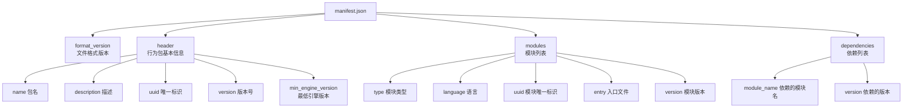
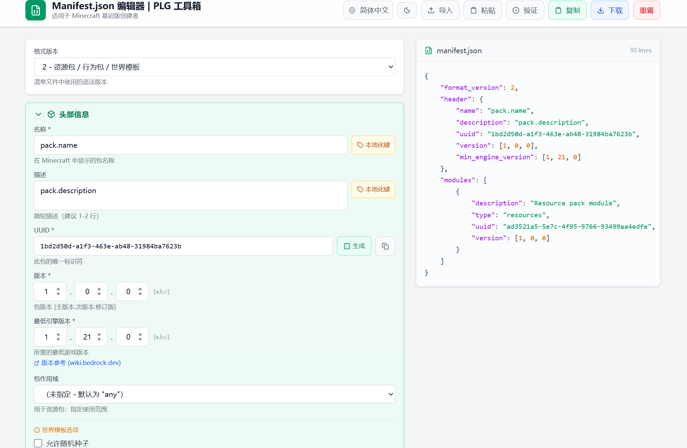

# 2.2 清单文件详解

## 前言：行为包的身份证

在上一节中，我们创建了第一个行为包，并快速填写了一个 `manifest.json` 文件来让脚本跑起来。但当时很多字段都是照抄的，并没有真正理解它们的含义。

`manifest.json` 是行为包中最重要的文件。Minecraft 在加载一个行为包时，做的第一件事就是读取这个文件。它决定了这个包叫什么、是什么版本、需要哪些权限、依赖哪些模块。如果这个文件写错了，整个行为包就无法被游戏识别，更不用说运行脚本了。

这一节我们来彻底搞清楚 `manifest.json` 的每一个字段。

---

## 2.2.1 整体结构一览

先看一个相对完整的 `manifest.json`，然后我们逐块拆解：

```json title="manifest.json"
{
    "format_version": 2,
    "header": {
        "name": "我的脚本插件",
        "description": "这是一个示例脚本插件",
        "uuid": "a1b2c3d4-e5f6-7890-abcd-ef1234567890",
        "version": [1, 0, 0],
        "min_engine_version": [1, 21, 0]
    },
    "modules": [
        {
            "type": "script",
            "language": "javascript",
            "uuid": "f0e9d8c7-b6a5-4321-fedc-ba9876543210",
            "entry": "scripts/main.js",
            "version": [1, 0, 0]
        }
    ],
    "dependencies": [
        {
            "module_name": "@minecraft/server",
            "version": "2.8.0"
        }
    ]
}
```

整个文件由四个顶级字段构成：



下面逐一详细讲解。

---

## 2.2.2 format_version：文件格式版本

```json title="manifest.json" {2}
{
    "format_version": 2,
    ...
}
```

这个字段告诉 Minecraft 用哪种方式来解析这个清单文件。目前可以填写 `2`，这是当前版本的标准格式。

如果你对此有了解，你也可以更改为`3`，但是要符合有关格式要求。

---

## 2.2.3 header：行为包的基本信息

`header` 是行为包的核心描述信息，包含五个字段：

```json title="manifest.json" {3-9}
{
    "format_version": 2,
    "header": {
        "name": "我的脚本插件",
        "description": "这是一个示例脚本插件",
        "uuid": "a1b2c3d4-e5f6-7890-abcd-ef1234567890",
        "version": [1, 0, 0],
        "min_engine_version": [1, 21, 0]
    },
    ...
}
```

### name（包名）

行为包的名称，会显示在 Minecraft 的行为包列表里。可以使用中文，建议简洁明了。

### description（描述）

行为包的描述文字，同样显示在行为包列表里，用于说明这个包的功能。可以为空字符串，但建议写清楚。

### uuid（唯一标识符）

这是整个清单文件里最需要认真对待的字段之一。

UUID 的全称是 Universally Unique Identifier（通用唯一识别码），是一串按照特定规则生成的随机字符串，格式固定为：

```
xxxxxxxx-xxxx-xxxx-xxxx-xxxxxxxxxxxx
```

每个 `x` 是一个十六进制字符（0-9 或 a-f）。例如：

```
550e8400-e29b-41d4-a716-446655440000
```

**为什么需要 UUID？**

想象一下，全世界有无数人在开发 Minecraft 行为包，如果两个行为包的名字相同，Minecraft 怎么区分它们？UUID 就是解决这个问题的——由于 UUID 是随机生成的，两个不同的 UUID 相同的概率极低，可以认为每个 UUID 都是全球唯一的。

:::danger
关于 UUID 有两条铁律，违反任何一条都会导致行为包无法正常工作：

**第一条：`header` 里的 UUID 和 `modules` 里的 UUID 必须不同。**

这两个 UUID 标识的是不同的东西：一个标识整个行为包，一个标识行为包内的脚本模块。它们不能相同。

**第二条：不能使用别人行为包的 UUID。**

如果你复制了别人的 `manifest.json` 然后直接修改其他字段，记得重新生成 UUID。使用相同 UUID 的两个行为包会产生冲突，游戏可能只加载其中一个。

生成 UUID 的方法：访问 [UUID Generator](https://www.uuidgenerator.net/)，点击生成按钮即可。每次点击都会得到一个新的唯一 UUID。
:::

### version（版本号）

```json
"version": [1, 0, 0]
```

行为包的版本号，格式是一个包含三个整数的数组，分别代表：主版本号、次版本号、修订号。

这套规则叫做**语义化版本控制（Semantic Versioning）**：

| 版本位 | 含义 | 什么时候递增 |
|--------|------|-------------|
| 第一位（主版本） | 重大更新 | 有不兼容的重大改动时 |
| 第二位（次版本） | 新功能 | 新增了功能，但向下兼容 |
| 第三位（修订号） | 小修复 | 修复了 Bug，没有新功能 |

对于个人学习项目，保持 `[1, 0, 0]` 即可。如果你在正式开发一个要分发给别人使用的插件，应该认真维护版本号。

### min_engine_version（最低引擎版本）

```json
"min_engine_version": [1, 21, 0]
```

指定这个行为包需要的最低 Minecraft 版本。格式同样是三个整数的数组，对应 Minecraft 的版本号（主版本.次版本.修订）。

这个字段的作用是：如果玩家的 Minecraft 版本低于这个要求，游戏会拒绝加载这个行为包并给出提示，避免在不支持的版本上运行产生奇怪的错误。

:::tip
`min_engine_version` 应该设置为你开发和测试时使用的 Minecraft 版本，或者你确定行为包所需 API 开始可用的版本。

设置得太低（比如 `[1, 19, 0]`）可能导致玩家用旧版本游戏加载了你的包，但你用到的某些新 API 在那个版本里还不存在，从而导致报错。设置得和你实际使用的版本一致是最稳妥的做法。
:::

---

## 2.2.4 modules：模块列表

`modules` 是一个数组，定义了这个行为包包含哪些模块。对于脚本行为包，至少需要一个类型为 `script` 的模块：

```json title="manifest.json" {10-18}
{
    "format_version": 2,
    "header": {
        "name": "我的脚本插件",
        "description": "这是一个示例脚本插件",
        "uuid": "a1b2c3d4-e5f6-7890-abcd-ef1234567890",
        "version": [1, 0, 0],
        "min_engine_version": [1, 21, 0]
    },
    "modules": [
        {
            "type": "script",
            "language": "javascript",
            "uuid": "f0e9d8c7-b6a5-4321-fedc-ba9876543210",
            "entry": "scripts/main.js",
            "version": [1, 0, 0]
        }
    ],
    ...
}
```

### type（模块类型）

```json
"type": "script"
```

对于脚本模块，这里固定写 `"script"`。

Minecraft 行为包还支持其他类型的模块（比如 `"data"` 用于数据驱动内容），但在本教程中我们只关注脚本模块。

### language（脚本语言）

```json
"language": "javascript"
```

目前 Script API 只支持 JavaScript，固定写 `"javascript"`。

### uuid（模块的唯一标识符）

和 `header` 里的 `uuid` 类似，这里也需要一个 UUID，但必须是**另一个不同的** UUID。这个 UUID 标识的是脚本模块本身，而不是整个行为包。

### entry（入口文件）

```json
"entry": "scripts/main.js"
```

这是最关键的字段之一。它告诉 Minecraft 从哪个文件开始执行脚本。路径是相对于行为包根目录的相对路径。

你可以把入口文件命名为任何名字，放在任何位置，只要这里的路径能对应到实际的文件即可：

```json
// 以下写法都是合法的，只要对应的文件存在
"entry": "scripts/main.js"
"entry": "scripts/index.js"
"entry": "scripts/core/startup.js"
```

### version（模块版本）

```json
"version": [1, 0, 0]
```

模块自身的版本号，格式和 `header` 里的 `version` 相同。通常和行为包版本保持一致即可。

---

## 2.2.5 dependencies：依赖列表

`dependencies` 声明了这个行为包依赖的外部模块。对于使用 Script API 的行为包，必须在这里声明对 `@minecraft/server` 的依赖：

```json title="manifest.json" {19-25}
{
    "format_version": 2,
    "header": {
        "name": "我的脚本插件",
        "description": "这是一个示例脚本插件",
        "uuid": "a1b2c3d4-e5f6-7890-abcd-ef1234567890",
        "version": [1, 0, 0],
        "min_engine_version": [1, 21, 0]
    },
    "modules": [
        {
            "type": "script",
            "language": "javascript",
            "uuid": "f0e9d8c7-b6a5-4321-fedc-ba9876543210",
            "entry": "scripts/main.js",
            "version": [1, 0, 0]
        }
    ],
    "dependencies": [
        {
            "module_name": "@minecraft/server",
            "version": "2.8.0"
        }
    ]
}
```

### module_name（模块名称）

```json
"module_name": "@minecraft/server"
```

这是 Minecraft 官方提供的核心 API 模块名称，固定写法。在你的脚本代码里，`import { world } from "@minecraft/server"` 中的字符串和这里必须一致。

Script API 目前提供了以下几个官方模块：

| 模块名 | 用途 |
|--------|------|
| `@minecraft/server` | 核心模块，包含世界、玩家、实体、方块等主要 API |
| `@minecraft/server-ui` | UI 模块，用于创建表单界面（第九章会用到） |
| `@minecraft/server-gametest` | 游戏测试模块（较少使用） |

本教程的大部分内容只需要 `@minecraft/server`。当我们在第九章学习表单时，会再加入 `@minecraft/server-ui`。

### version（依赖版本）

```json
"version": "2.8.0"
```

注意这里的版本号格式和前面不同——这里是**字符串**，不是数组。

这是你使用的 `@minecraft/server` 模块的版本号。不同版本的模块包含不同的 API，选错版本可能导致你代码里用到的某些功能不存在。

---

## 2.2.6 关于 @minecraft/server 的版本选择

这是初学者最容易困惑的地方之一，值得单独详细说明。

`@minecraft/server` 的版本和 Minecraft 游戏版本之间没有一定的对应关系。Script API更新后，你只需要修改清单文件里的版本即可。


**稳定版（Stable）与测试版（Beta）**

`@minecraft/server` 的版本分为两类：

- **稳定版**：功能经过充分测试，API 不会在小版本之间发生破坏性变化
- **测试版**：包含最新功能，但 API 可能随时变动，需要在世界设置里开启"测试版 API"

在 `manifest.json` 里，版本号的写法区分了这两类：

```json
// 稳定版写法（具体版本号）
"version": "2.8.0"

// 测试版写法（在版本号后加 -beta 后缀，或直接写 beta）
"version": "2.9.0-beta"
```

:::note
在本教程中，我们统一使用**稳定版**。稳定版的 API 更可靠，也不需要每次游戏更新后去修改代码。代价是你可能用不到最新的实验性功能，但对于学习阶段来说，这完全够用。

如果你将来想使用某个只在测试版里有的新功能，届时再切换到测试版即可。
:::
:::warning
测试版的API通常会在更新新版本后移除对旧的测试版本的支持，因此测试版API一旦更新，旧版代码可能会直接报错。使用时请务必小心。
:::

**如何确认当前 Minecraft 版本对应的稳定 API 版本？**

最可靠的方式是查阅 Minecraft 官方文档或 npm 上的包信息：

```
https://www.npmjs.com/package/@minecraft/server
```

在这个页面可以看到所有发布的版本及其发布时间，对照你的 Minecraft 版本选择合适的稳定版本即可。

当然，你也可以直接通过查询 [JaylyDev 的 API 文档](https://jaylydev.github.io/scriptapi-docs/latest/modules/_minecraft_server.html)来确认最新版本。

---

## 2.2.7 添加多个依赖模块

当你的脚本同时需要用到多个官方模块时，在 `dependencies` 数组里添加多个条目即可：

```json title="manifest.json" {19-28}
{
    "format_version": 2,
    "header": {
        "name": "带 UI 的脚本插件",
        "description": "同时使用核心模块和 UI 模块",
        "uuid": "a1b2c3d4-e5f6-7890-abcd-ef1234567890",
        "version": [1, 0, 0],
        "min_engine_version": [1, 21, 0]
    },
    "modules": [
        {
            "type": "script",
            "language": "javascript",
            "uuid": "f0e9d8c7-b6a5-4321-fedc-ba9876543210",
            "entry": "scripts/main.js",
            "version": [1, 0, 0]
        }
    ],
    "dependencies": [
        {
            "module_name": "@minecraft/server",
            "version": "2.8.0"
        },
        {
            "module_name": "@minecraft/server-ui",
            "version": "2.1.0"
        }
    ]
}
```

---

## 2.2.8 依赖资源包

如果你的行为包需要搭配一个资源包使用（比如自定义的材质、声音等），可以在 `dependencies` 里通过 UUID 声明对资源包的依赖：

```json title="manifest.json"
{
    "dependencies": [
        {
            "module_name": "@minecraft/server",
            "version": "2.8.0"
        },
        {
            "uuid": "资源包的UUID",
            "version": [1, 0, 0]
        }
    ]
}
```

注意：依赖模块用 `module_name` 字段，依赖其他包用 `uuid` 字段，两种写法不能混用。

在本教程中，我们暂时不涉及资源包的内容，这里了解即可。
:::tip
为了方便开发者编辑清单文件，PixelLingual 创建了一个可视化 Manifest.json 编辑应用。你可以直接访问[此页面](http://manifest.pling.top/)来快速编辑有关内容。

:::

---

## 2.2.9 常见错误与排查

下面整理了 `manifest.json` 最常见的几类错误：

### JSON 格式错误

`manifest.json` 是标准的 JSON 文件，必须严格遵守 JSON 格式。最常见的格式错误有：

```json
// 错误示例1：最后一个属性后面多了逗号
{
    "name": "测试",
    "version": [1, 0, 0],   // ← 这个逗号不能有！
}

// 错误示例2：用了单引号而不是双引号
{
    'name': '测试'   // ← JSON 里必须用双引号
}

// 错误示例3：缺少逗号分隔
{
    "name": "测试"
    "version": [1, 0, 0]   // ← 两个属性之间缺少逗号
}
```

VSCode 在你写 JSON 文件时会实时标出格式错误，看到红色波浪线就说明有语法问题。

### UUID 相关错误

```json
// 错误：header 和 modules 的 UUID 相同
"header": {
    "uuid": "a1b2c3d4-e5f6-7890-abcd-ef1234567890"  // ← 和下面的相同，会出错
},
"modules": [
    {
        "uuid": "a1b2c3d4-e5f6-7890-abcd-ef1234567890"  // ← 和上面的相同，会出错
    }
]
```

### 版本格式错误

```json
// 错误：@minecraft/server 的版本用了数组格式
"dependencies": [
    {
        "module_name": "@minecraft/server",
        "version": [2, 8, 0]   // ← 错误！应该是字符串 "2.8.0"
    }
]

// 错误：header 的 version 用了字符串格式
"header": {
    "version": "1.0.0"   // ← 错误！应该是数组 [1, 0, 0]
}
```

### 入口文件路径错误

```json
// 如果你的文件实际在 scripts/main.js
"entry": "script/main.js"    // ← 错误！文件夹名拼错了
"entry": "scripts/Main.js"   // ← 错误！文件名大小写不对（在某些系统上会出错）
"entry": "scripts/main"      // ← 错误！缺少 .js 后缀
```

---

## 2.2.10 完整模板

下面提供一个干净的 `manifest.json` 模板，你可以在每次新建项目时直接复制使用，然后替换其中需要修改的部分：

```json title="manifest.json"
{
    "format_version": 2,
    "header": {
        "name": "在这里填写行为包名称",
        "description": "在这里填写行为包描述",
        "uuid": "在这里填写第一个UUID",
        "version": [1, 0, 0],
        "min_engine_version": [1, 21, 0]
    },
    "modules": [
        {
            "type": "script",
            "language": "javascript",
            "uuid": "在这里填写第二个UUID",
            "entry": "scripts/main.js",
            "version": [1, 0, 0]
        }
    ],
    "dependencies": [
        {
            "module_name": "@minecraft/server",
            "version": "2.8.0"
        }
    ]
}
```

每次使用时需要替换的内容：
1. `name` 和 `description`
2. `header` 里的 `uuid`（重新生成一个）
3. `modules` 里的 `uuid`（重新生成另一个，与第一个不同）
4. 如有需要，调整 `min_engine_version` 和 `@minecraft/server` 的 `version`

---

## 本节知识总结

| 字段 | 位置 | 作用 | 注意事项 |
|------|------|------|----------|
| `format_version` | 顶层 | 文件格式版本 | 固定写 `2` |
| `header.name` | header | 行为包名称 | 显示在游戏列表里 |
| `header.description` | header | 行为包描述 | 可以为空字符串 |
| `header.uuid` | header | 行为包唯一标识 | 必须唯一，不能和模块 UUID 相同 |
| `header.version` | header | 行为包版本号 | 数组格式 `[主, 次, 修]` |
| `header.min_engine_version` | header | 最低游戏版本要求 | 设置为你测试用的游戏版本 |
| `modules[].type` | modules | 模块类型 | 脚本模块固定写 `"script"` |
| `modules[].language` | modules | 脚本语言 | 固定写 `"javascript"` |
| `modules[].uuid` | modules | 模块唯一标识 | 必须唯一，不能和包 UUID 相同 |
| `modules[].entry` | modules | 脚本入口文件路径 | 相对于行为包根目录 |
| `modules[].version` | modules | 模块版本号 | 数组格式，通常和包版本一致 |
| `dependencies[].module_name` | dependencies | 依赖的 API 模块名 | 和 import 里的字符串一致 |
| `dependencies[].version` | dependencies | 依赖的模块版本 | 字符串格式，如 `"2.8.0"` |


---

> **下一节预告：2.3 模块系统与 import**
>
> 现在你已经完全搞清楚了 `manifest.json` 的每个字段。下一节我们将把目光转向脚本文件本身，学习 JavaScript 的模块系统是如何工作的，`import` 和 `export` 语句的含义，以及如何把一个大型脚本拆分成多个文件来组织代码。这是写出结构清晰的 Script API 项目的基础。