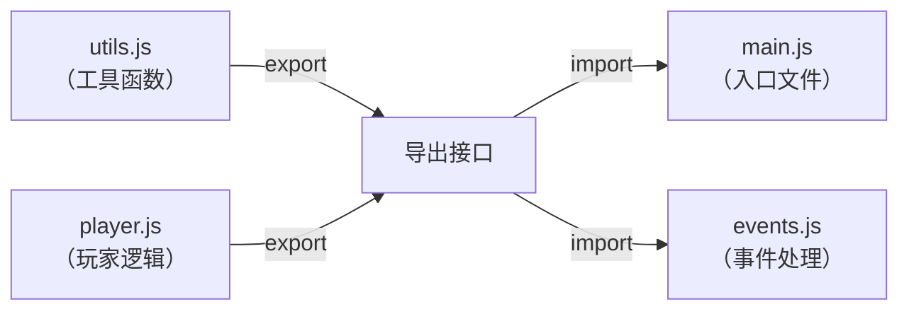
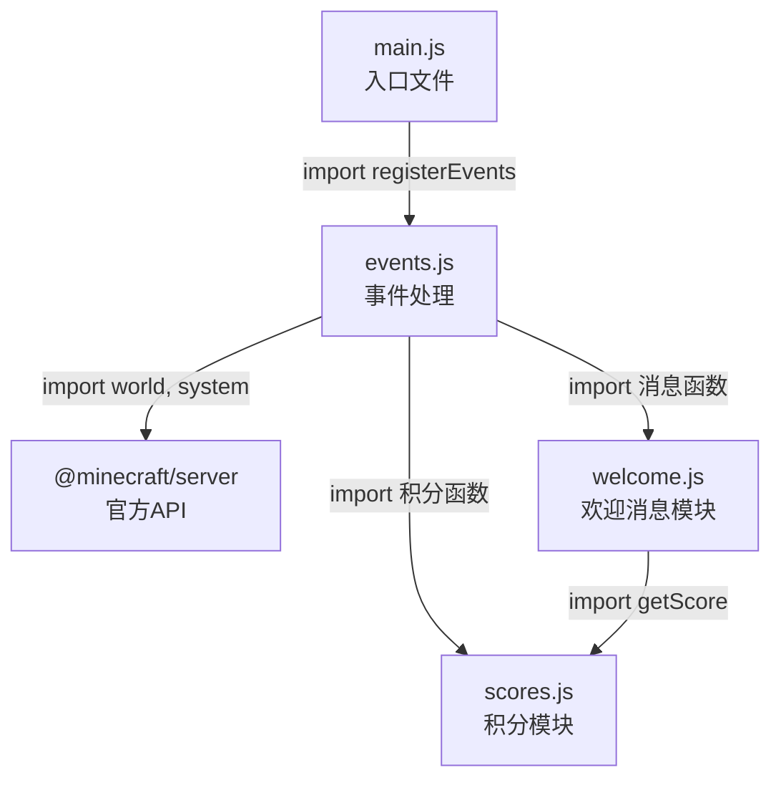

# 2.3 模块系统与 import

## 前言：代码也需要"分门别类"

在前两节中，我们把所有的脚本代码都写在了 `scripts/main.js` 这一个文件里。对于只有几行代码的入门示例，这没有任何问题。

但想象一下，当你的插件越来越复杂：有处理玩家事件的代码，有管理积分系统的代码，有控制游戏逻辑的代码，有各种工具函数……如果把这些全部塞进一个文件，这个文件可能会膨胀到几千行，找一个函数需要翻很久，修改一个地方可能影响到毫不相关的其他功能。

解决这个问题的方案，就是**模块系统**：把代码按照功能拆分到不同的文件里，每个文件只负责一件事，需要的时候再把它们组合起来。

这一节我们将学习 JavaScript 的模块系统，以及如何在 Script API 项目中正确地组织多文件代码。

---

## 2.3.1 什么是模块

在 JavaScript 里，**每一个 `.js` 文件就是一个模块**。

默认情况下，一个文件里的变量和函数只在这个文件内部有效，其他文件看不到它们。这是好事——它避免了不同文件之间的变量互相干扰。

但如果你想让某个文件里的函数被其他文件使用，就需要用到两个关键字：

- `export`：把这个文件里的某些内容"导出"，允许外部访问
- `import`：把其他文件导出的内容"导入"，在当前文件里使用

用一个图来理解它们的关系：



`utils.js` 和 `player.js` 导出它们的功能，`main.js` 和 `events.js` 按需导入使用。每个文件各司其职，整个项目的结构一目了然。

---

## 2.3.2 export：导出模块内容

要让一个文件里的内容可以被外部使用，需要用 `export` 关键字标记它。

### 命名导出（Named Export）

在变量、函数或类的定义前加上 `export` 关键字：

```js title="scripts/utils.js"
// 导出一个常量
export const MAX_PLAYERS = 20;

// 导出一个函数
export function formatPlayerName(name) {
    return `[玩家] ${name}`;
}

// 导出一个箭头函数
export const calculateDamage = (base, multiplier) => {
    return Math.round(base * multiplier * 10) / 10;
};
```

你也可以先定义，在文件末尾统一导出：

```js title="scripts/utils.js"
const MAX_PLAYERS = 20;

function formatPlayerName(name) {
    return `[玩家] ${name}`;
}

const calculateDamage = (base, multiplier) => {
    return Math.round(base * multiplier * 10) / 10;
};

// 在文件末尾统一导出
export { MAX_PLAYERS, formatPlayerName, calculateDamage };
```

两种写法效果完全相同，选择哪种风格取决于你的习惯。本教程推荐在定义时直接加 `export`，这样看到定义就能知道它是否被导出，更直观。

### 默认导出（Default Export）

每个文件还可以有一个"默认导出"，用 `export default`：

```js title="scripts/PlayerManager.js"
// 定义一个管理玩家数据的类
class PlayerManager {
    constructor() {
        this.playerData = new Map();
    }

    addPlayer(name) {
        this.playerData.set(name, { score: 0, level: 1 });
    }

    getPlayer(name) {
        return this.playerData.get(name) ?? null;
    }
}

// 默认导出这个类
export default PlayerManager;
```

:::note
命名导出和默认导出的区别：

- **命名导出**：一个文件可以有多个，导入时必须用花括号 `{}` 包裹，且名字必须和导出时一致
- **默认导出**：一个文件只能有一个，导入时不需要花括号，且可以取任意名字

在实际开发中，如果一个文件的核心是导出"一个主要的东西"（比如一个类），用默认导出；如果是导出"一批工具函数或常量"，用命名导出。
:::

---

## 2.3.3 import：导入模块内容

在需要使用其他文件内容的地方，用 `import` 语句导入。

### 导入命名导出

用花括号 `{}` 指定要导入的名字：

```js title="scripts/main.js" {1-2}
import { MAX_PLAYERS, formatPlayerName, calculateDamage } from "./utils.js";

console.log(MAX_PLAYERS);                        // 输出：20
console.log(formatPlayerName("Steve"));          // 输出：[玩家] Steve
console.log(calculateDamage(5, 1.5));            // 输出：7.5
```

如果你只需要其中某几个，不需要全部导入：

```js title="scripts/main.js"
// 只导入需要的部分
import { formatPlayerName } from "./utils.js";
```

### 导入时重命名

如果导入的名字和当前文件里已有的变量冲突，可以用 `as` 重命名：

```js title="scripts/main.js"
import { calculateDamage as calcDmg } from "./utils.js";

console.log(calcDmg(5, 2));  // 用新名字调用
```

### 导入默认导出

默认导出的导入不需要花括号，且可以自定义名字：

```js title="scripts/main.js"
import PlayerManager from "./PlayerManager.js";

const manager = new PlayerManager();
manager.addPlayer("Steve");
```

### 同时导入默认导出和命名导出

```js title="scripts/main.js"
import PlayerManager, { MAX_PLAYERS, formatPlayerName } from "./PlayerManager.js";
```

### 导入全部内容

用 `* as` 语法可以把一个模块的所有命名导出打包成一个对象：

```js title="scripts/main.js"
import * as Utils from "./utils.js";

console.log(Utils.MAX_PLAYERS);
console.log(Utils.formatPlayerName("Steve"));
console.log(Utils.calculateDamage(5, 1.5));
```

---

## 2.3.4 路径规则：怎么写 import 路径

`import` 语句里的路径字符串有一些规则需要注意。

### 相对路径

导入你自己写的文件，使用相对路径：

```js
// ./ 表示当前文件所在的目录
import { something } from "./otherFile.js";

// ../ 表示上一级目录
import { something } from "../utils/helper.js";

// ../../ 表示上两级目录
import { something } from "../../common/constants.js";
```

:::tip
在 Minecraft Script API 中，可以忽略 `.js` 后缀。

```js
import { helper } from "./helper.js";

import { helper } from "./helper";
```

以上两种写法均可。
:::

### 模块名（官方 API 模块）

导入 Minecraft 官方提供的模块，直接写模块名，不需要路径：

```js
// 导入官方模块，不需要 ./ 路径前缀
import { world, system } from "@minecraft/server";
import { ModalFormData } from "@minecraft/server-ui";
```

这类以 `@` 开头的名字叫做"包名"，Minecraft 会自动找到对应的模块，不需要你指定路径。

---

## 2.3.5 导入 @minecraft/server 的常用内容

`@minecraft/server` 是我们使用最频繁的模块，它导出了大量的类、对象和常量。下面介绍最常用的几个：

```js title="scripts/main.js"
import {
    world,          // 世界对象，访问游戏世界的主要入口
    system,         // 系统对象，用于定时任务等
    Direction,      // 方向枚举（上下左右前后）
    GameMode,       // 游戏模式枚举（生存、创造等）
    EntityDamageCause, // 实体受伤原因枚举
} from "@minecraft/server";
```

你不需要把所有东西都导入，**只导入你实际用到的内容**。这是一个好习惯，能让代码更清晰，也更容易看出这个文件依赖了哪些 API。

:::tip
在 VSCode 中，如果你安装了 Blockception's Minecraft Bedrock Development 插件并配置好了类型声明包，当你输入 `import {  } from "@minecraft/server"` 时，把光标放在花括号里，按 `Ctrl + Space`，VSCode 会弹出这个模块里所有可以导入的内容，非常方便。
:::

---

## 2.3.6 实战：把代码拆分成多个文件

现在来看一个实际的例子，把一个功能相对完整的脚本拆分成合理的多文件结构。

**场景：一个简单的玩家欢迎和积分系统**

在拆分之前，所有代码都在一个文件里：

```js title="scripts/main.js（拆分前，所有代码混在一起）"
import { world, system } from "@minecraft/server";

const playerScores = new Map();
const SCORE_FILE_KEY = "playerScores";

function getScore(name) {
    return playerScores.get(name) ?? 0;
}

function addScore(name, points) {
    const current = getScore(name);
    playerScores.set(name, current + points);
    return current + points;
}

function getLeaderboard(topN = 5) {
    return [...playerScores.entries()]
        .sort((a, b) => b[1] - a[1])
        .slice(0, topN)
        .map(([name, score], i) => `${i + 1}. ${name} - ${score} 分`);
}

function buildWelcomeMessage(name, isFirstJoin) {
    if (isFirstJoin) {
        return `欢迎首次加入，${name}！`;
    }
    return `欢迎回来，${name}！你当前积分：${getScore(name)}`;
}

world.afterEvents.playerSpawn.subscribe(({ player, initialSpawn }) => {
    if (!initialSpawn) return;
    const name = player.name;
    const isFirstJoin = !playerScores.has(name);
    if (isFirstJoin) {
        playerScores.set(name, 0);
    }
    player.sendMessage(buildWelcomeMessage(name, isFirstJoin));
    world.sendMessage(`${name} 加入了游戏。`);
});

world.afterEvents.chatSend.subscribe(({ sender, message }) => {
    if (message === "!积分") {
        sender.sendMessage(`你的积分：${getScore(sender.name)}`);
    }
    if (message === "!排行榜") {
        const board = getLeaderboard();
        sender.sendMessage("=== 排行榜 ===\n" + board.join("\n"));
    }
});

system.runInterval(() => {
    for (const player of world.getPlayers()) {
        const newScore = addScore(player.name, 1);
        if (newScore % 100 === 0) {
            player.sendMessage(`积分里程碑：你已获得 ${newScore} 积分！`);
        }
    }
}, 20);
```

代码不长，但已经混杂了积分逻辑、欢迎消息逻辑、事件处理逻辑和定时任务逻辑。现在把它拆分开：

**拆分后的目录结构：**

```
scripts/
├── main.js           ← 入口文件，只负责组装和启动
├── scores.js         ← 积分系统的数据与逻辑
├── welcome.js        ← 欢迎消息相关的逻辑
└── events.js         ← 所有事件处理的注册
```

**第一步：创建积分模块**

```js title="scripts/scores.js"
// 积分系统模块
// 职责：管理所有玩家的积分数据，提供增删改查功能

// 内部数据，不导出，外部无法直接修改
const playerScores = new Map();

// 获取玩家积分，如果不存在则返回 0
export function getScore(name) {
    return playerScores.get(name) ?? 0;
}

// 初始化玩家积分（首次加入时调用）
export function initPlayer(name) {
    if (!playerScores.has(name)) {
        playerScores.set(name, 0);
        return true;   // 返回 true 表示是新玩家
    }
    return false;      // 返回 false 表示已存在
}

// 增加积分，返回增加后的新积分
export function addScore(name, points) {
    const current = getScore(name);
    const newScore = current + points;
    playerScores.set(name, newScore);
    return newScore;
}

// 获取排行榜，返回格式化后的字符串数组
export function getLeaderboard(topN = 5) {
    return [...playerScores.entries()]
        .sort((a, b) => b[1] - a[1])
        .slice(0, topN)
        .map(([name, score], i) => `${i + 1}. ${name} - ${score} 分`);
}
```

**第二步：创建欢迎消息模块**

```js title="scripts/welcome.js"
// 欢迎消息模块
// 职责：根据玩家状态生成合适的欢迎消息

import { getScore } from "./scores.js";

// 根据是否是新玩家，生成不同的欢迎消息
export function buildWelcomeMessage(name, isNewPlayer) {
    if (isNewPlayer) {
        return `欢迎首次加入，${name}！祝你游戏愉快！`;
    }
    const score = getScore(name);
    return `欢迎回来，${name}！你当前积分：${score} 分。`;
}

// 生成全服广播用的加入通知
export function buildJoinAnnouncement(name, isNewPlayer) {
    if (isNewPlayer) {
        return `新玩家 ${name} 加入了服务器！`;
    }
    return `${name} 回来了！`;
}
```

**第三步：创建事件处理模块**

```js title="scripts/events.js"
// 事件处理模块
// 职责：注册所有游戏事件的监听器

import { world, system } from "@minecraft/server";
import { initPlayer, addScore, getScore, getLeaderboard } from "./scores.js";
import { buildWelcomeMessage, buildJoinAnnouncement } from "./welcome.js";

// 注册所有事件监听器，以及启动定时任务
export function registerEvents() {

    // 玩家加入事件
    world.afterEvents.playerSpawn.subscribe(({ player, initialSpawn }) => {
        if (!initialSpawn) return;

        const name = player.name;
        const isNewPlayer = initPlayer(name);
        const welcomeMsg = buildWelcomeMessage(name, isNewPlayer);
        const announcement = buildJoinAnnouncement(name, isNewPlayer);

        player.sendMessage(welcomeMsg);
        world.sendMessage(announcement);
    });

    // 聊天指令事件
    world.afterEvents.chatSend.subscribe(({ sender, message }) => {
        const name = sender.name;

        if (message === "!积分") {
            sender.sendMessage(`你的当前积分：${getScore(name)} 分`);
            return;
        }

        if (message === "!排行榜") {
            const board = getLeaderboard();
            if (board.length === 0) {
                sender.sendMessage("暂无排行榜数据。");
                return;
            }
            sender.sendMessage("=== 积分排行榜 ===\n" + board.join("\n"));
        }
    });

    // 定时积分任务：每秒给所有在线玩家加1分
    system.runInterval(() => {
        for (const player of world.getPlayers()) {
            const newScore = addScore(player.name, 1);
            // 每达到100分的整数倍，发一条里程碑消息
            if (newScore % 100 === 0) {
                player.sendMessage(`积分里程碑：你已累计获得 ${newScore} 积分！`);
            }
        }
    }, 20);
}
```

**第四步：整理入口文件**

```js title="scripts/main.js"
// 入口文件
// 职责：导入所有模块，启动整个脚本系统

import { registerEvents } from "./events.js";

// 启动
registerEvents();

console.log("[脚本] 所有模块加载完毕，脚本已启动。");
```

拆分之后，`main.js` 变得极其简洁，它只做一件事：把各个模块组合起来，启动整个系统。每个功能模块都在自己的文件里，职责清晰。

---

## 2.3.7 模块之间的依赖关系

拆分完成后，我们来看看这几个文件之间的依赖关系：



从图中可以看出几个设计原则：

- `main.js` 只依赖 `events.js`，它不需要知道其他模块的存在
- `events.js` 是"协调者"，它把各个功能模块组合在一起
- `scores.js` 是最底层的模块，它不依赖任何自定义模块，只依赖官方 API（如果有需要的话）
- `welcome.js` 依赖 `scores.js`，因为它需要获取积分数据来生成消息

:::note
模块间的依赖关系应该是单向的、清晰的，不应该出现循环依赖。

所谓循环依赖，就是 A 依赖 B，同时 B 也依赖 A。这会导致 JavaScript 模块系统产生意外行为，某些导入的值可能是 `undefined`。

如果你发现自己的代码里出现了循环依赖，通常意味着模块的职责划分需要重新考虑，可能需要把两个模块共用的部分提取到第三个模块里。
:::

---

## 2.3.8 实际项目的文件组织建议

随着项目规模增长，`scripts` 文件夹内部也可以进一步用子文件夹来分类：

```
scripts/
├── main.js                  ← 入口文件
├── config.js                ← 全局配置常量
├── systems/                 ← 各个游戏系统
│   ├── scoreSystem.js
│   ├── welcomeSystem.js
│   └── shopSystem.js
├── events/                  ← 事件处理
│   ├── playerEvents.js
│   ├── entityEvents.js
│   └── blockEvents.js
└── utils/                   ← 通用工具函数
    ├── mathUtils.js
    ├── stringUtils.js
    └── playerUtils.js
```

这种结构对于中大型项目非常有帮助，但对于学习阶段的小项目，保持扁平的文件结构反而更清晰，不需要过度设计。

:::tip
一个实用的判断标准：**当你的脚本文件超过 150 行时，就应该考虑拆分了。** 如果一个文件包含明显不同的两种功能（比如既有积分逻辑又有欢迎消息逻辑），也应该拆分。

但不要为了拆分而拆分——如果一段代码只有30行，强行拆成三个文件反而让项目变得碎片化，难以维护。
:::

---

## 2.3.9 一个常见问题：为什么 Script API 不用 require？

如果你在网上搜索 JavaScript 模块系统，会看到两种写法：

```js
// 写法一：ES Module（ESM）
import { world } from "@minecraft/server";
export function myFunction() { ... }

// 写法二：CommonJS（CJS）
const { world } = require("@minecraft/server");
module.exports = { myFunction };
```

**Minecraft Script API 只支持 ES Module（ESM）写法**，也就是 `import/export`。`require` 是 Node.js 的 CommonJS 格式，在 Script API 的运行环境里无效。

如果你在 Script API 的代码里写了 `require()`，游戏会报错。这个问题在网上搜索解决方案时要注意，很多 Node.js 相关的代码示例使用的是 `require`，直接复制进脚本里是不能用的。

---

## 本节知识总结

| 概念 | 语法 | 说明 |
|------|------|------|
| 命名导出 | `export const x = ...` | 可以有多个，导入时用花括号 |
| 默认导出 | `export default ...` | 每个文件只能有一个 |
| 统一导出 | `export { a, b, c }` | 在文件末尾集中导出 |
| 导入命名导出 | `import { x } from "./file.js"` | 名字必须和导出一致 |
| 导入默认导出 | `import X from "./file.js"` | 名字可以自定义 |
| 导入时重命名 | `import { x as y } from "./file.js"` | 用 as 指定别名 |
| 导入全部 | `import * as Mod from "./file.js"` | 打包成对象 |
| 导入官方模块 | `import { world } from "@minecraft/server"` | 不需要路径前缀 |
| 相对路径 | `"./file.js"` `"../dir/file"` | 可以忽略 .js 后缀 |

---

## 课后练习

**练习1：** 在上一节创建的行为包项目里，新建 `scripts/utils.js` 文件，在其中导出以下三个函数：
- `formatHealth(current, max)`：返回格式化的血量字符串，如 `"14 / 20 (70%)"`
- `isLowHealth(health, threshold = 6)`：返回血量是否低于阈值的布尔值
- `getTimeString(ticks)`：把游戏刻转换为可读的时间字符串，如 `"2分30秒"`

然后在 `main.js` 中导入并使用这三个函数，用 `console.log` 测试输出结果。

**练习2：** 观察本节 2.3.6 中的拆分示例，`welcome.js` 导入了 `scores.js` 里的 `getScore`。思考一下：如果把这个导入去掉，改成让 `events.js` 在调用 `buildWelcomeMessage` 时把积分值作为参数传入，代码会怎么变化？这两种设计各有什么优缺点？

**练习3（思考题）：** 在 2.3.7 的依赖关系图中，如果 `scores.js` 也需要导入 `welcome.js` 里的某个函数（比如用于格式化积分变动通知），会形成循环依赖。你会怎么解决这个问题？

---

> **下一节预告：2.4 第一个脚本：Hello Minecraft**
>
> 现在你已经掌握了清单文件的配置和模块系统的使用，开发环境的基础知识已经就绪。下一节我们将写一个比 `world.sendMessage("脚本加载成功！")` 更完整、更有实际意义的脚本，综合运用第一章的 JavaScript 基础和第二章目前学到的 API 知识，让你第一次真正感受到 Script API 的魅力。