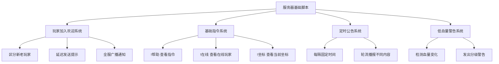
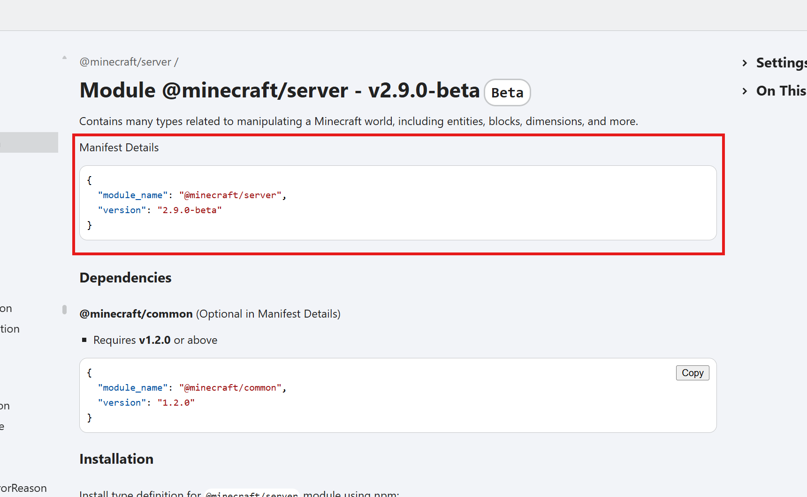
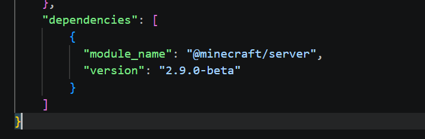
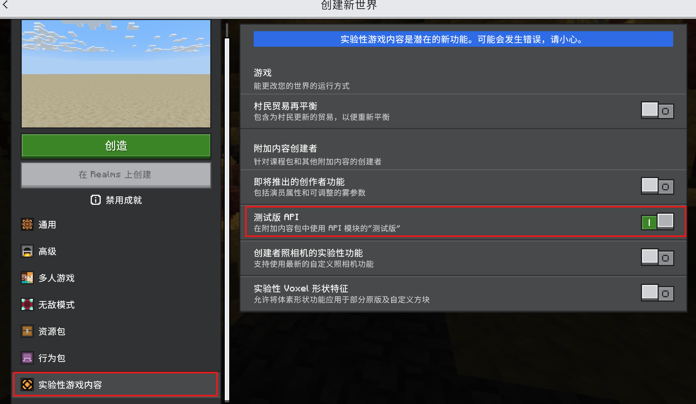
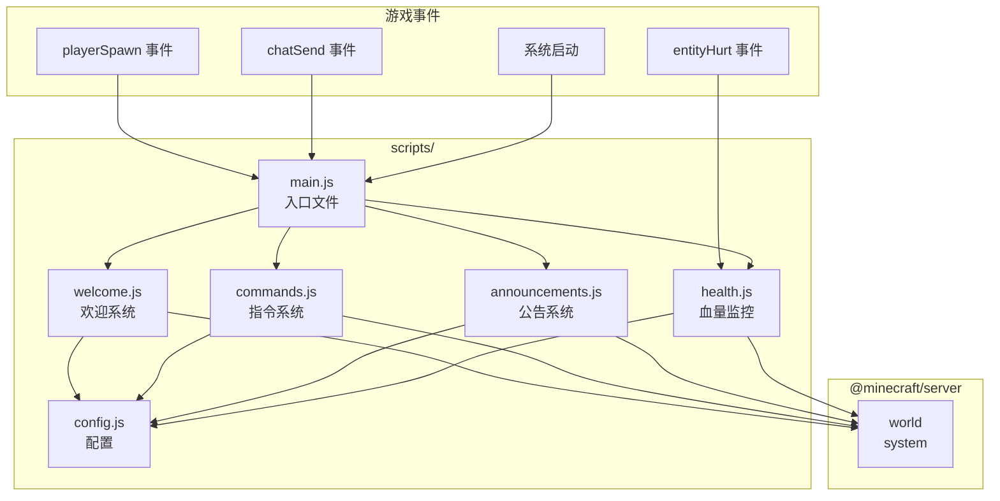

# 2.4 第一个脚本：Hello Minecraft

## 前言：从"能跑"到"真正有用"

在 2.1 节中，我们写了人生中第一个 Script API 脚本：

```js
import { world } from "@minecraft/server";
world.sendMessage("脚本加载成功！");
```

它确实能跑，但除了证明环境配置正确之外，没有任何实际用途。

从这一节开始，我们要写真正有意义的代码。这一节会带你从零构建一个功能完整的"服务器基础脚本"，它将综合运用第一章学到的所有 JavaScript 基础，以及目前掌握的 API 知识。

更重要的是，通过这个过程，你会第一次真正感受到：**代码是如何和游戏世界产生交互的。**

---

## 2.4.1 我们要做什么

这一节要构建的脚本，包含以下几个功能：



功能不算复杂，但足够覆盖一个真实服务器脚本的基本形态。完成这个脚本之后，你对 Script API 的整体使用方式会有一个完整的感性认识。

:::warning
 截至目前，由于 Mojang 始终没有将 `chatSend` 事件从测试版移出。由于自定义命令功能相对复杂，故本教程主要使用了 `chatSend` 作为伪命令进行教学。**为了确保代码不报错，请在开始教程前进行如下操作**：
 1. 前往[此网站](https://jaylydev.github.io/scriptapi-docs/latest/modules/_minecraft_server-1.html)，复制网站中的 Manifest Details 内容。
 
 2. 打开之前创建行为包的 `manifest.json` 文件，将 `dependencies` 字段的内容替换为刚才复制的 Manifest Details 内容。
 
 3. 创建一个新世界，并在实验性游戏内容中开启"**测试版API**"
 
 设置完即可正常查看后续教程。
 **注：务必确保版本号是最新版本号，切勿直接复制上图的版本号！**
:::
---

## 2.4.2 搭建项目结构

在 2.1 节创建的行为包基础上，我们来整理项目结构。按照 2.3 节学到的模块化思想，把不同功能分到不同文件里：

```
my_first_script/
├── manifest.json
└── scripts/
    ├── main.js          ← 入口文件
    ├── config.js        ← 全局配置
    ├── welcome.js       ← 欢迎系统
    ├── commands.js      ← 指令系统
    ├── announcements.js ← 公告系统
    └── health.js        ← 血量监控系统
```

先把所有文件创建好（内容先留空），然后一个一个来填充。

---

## 2.4.3 config.js：集中管理配置

良好的脚本设计习惯之一，是把所有"可能需要调整的数值"集中放在一个配置文件里。这样当你需要修改某个参数时，不需要在代码里到处搜索，改这一个文件就够了。

```js title="scripts/config.js"
// =============================================
// 全局配置文件
// 修改这里的值来调整脚本的行为，不需要改其他文件
// =============================================

// 欢迎系统配置
export const WELCOME_CONFIG = {
    // 玩家加入后延迟发送提示信息的时间（单位：刻，20刻 = 1秒）
    tipDelay: 60,
    // 发送给新玩家的欢迎标题
    newPlayerTitle: "初次欢迎",
    // 发送给回归玩家的欢迎标题
    returningPlayerTitle: "欢迎回来",
};

// 指令系统配置
export const COMMAND_CONFIG = {
    // 指令前缀，玩家发送的消息必须以此开头才会被识别为指令
    prefix: "!",
};

// 公告系统配置
export const ANNOUNCEMENT_CONFIG = {
    // 公告播报的间隔（单位：刻）
    interval: 2400,   // 2400刻 = 约2分钟
    // 轮播的公告列表，按顺序循环播报
    messages: [
        "欢迎来到服务器！请遵守服务器规则。",
        "有问题？输入 !帮助 查看可用指令。",
        "请文明游戏，共同维护良好的游戏环境。",
        "记得定期备份你的重要建筑坐标！",
    ],
};

// 血量监控配置
export const HEALTH_CONFIG = {
    // 危险血量阈值，低于此值发出严重警告
    dangerThreshold: 4,
    // 警告血量阈值，低于此值发出普通提示
    warningThreshold: 10,
};
```

:::tip
把配置集中管理的另一个好处是：当你把脚本分享给别人时，其他人只需要阅读 `config.js` 就能了解这个脚本有哪些可以自定义的参数，而不需要读懂所有的业务逻辑代码。
:::

---

## 2.4.4 welcome.js：欢迎系统

欢迎系统需要完成三件事：区分新老玩家、向玩家发送个性化欢迎消息、向全服广播加入通知。

```js title="scripts/welcome.js"
import { world, system } from "@minecraft/server";
import { WELCOME_CONFIG } from "./config.js";

// 记录曾经加入过的玩家名单
// 使用 Set 因为我们只需要判断"是否加入过"，不需要存储其他数据
const knownPlayers = new Set();

// =============================================
// 内部工具函数（不导出，仅在本模块内使用）
// =============================================

// 根据玩家是否是新玩家，生成不同的私信消息
function buildPrivateMessage(playerName, isNewPlayer) {
    if (isNewPlayer) {
        return [
            `欢迎你，${playerName}！这是你第一次加入本服务器。`,
            `输入 ${COMMAND_CONFIG_PREFIX}帮助 可以查看所有可用指令。`,
            "祝你游戏愉快！",
        ];
    }
    return [`欢迎回来，${playerName}！`];
}

// 生成全服广播的加入通知
function buildAnnouncement(playerName, isNewPlayer) {
    if (isNewPlayer) {
        return `新玩家 ${playerName} 第一次加入了服务器，欢迎他！`;
    }
    return `${playerName} 回来了！`;
}

// 暂存指令前缀，避免在函数里直接引用 config 造成循环依赖
const COMMAND_CONFIG_PREFIX = "!";

// =============================================
// 导出函数
// =============================================

// 处理玩家加入的完整欢迎流程
export function handlePlayerJoin(player, initialSpawn) {
    // 只在玩家首次加入（不是死亡重生）时触发完整欢迎流程
    if (!initialSpawn) return;

    const name = player.name;
    const isNewPlayer = !knownPlayers.has(name);

    // 把玩家记录到已知列表
    knownPlayers.add(name);

    // 立刻广播加入通知
    world.sendMessage(buildAnnouncement(name, isNewPlayer));

    // 立刻发送第一条私信
    const messages = buildPrivateMessage(name, isNewPlayer);
    player.sendMessage(messages[0]);

    // 延迟发送后续提示，避免消息一次性涌出来
    if (messages.length > 1) {
        system.runTimeout(() => {
            // 在延迟执行时，玩家可能已经离线
            // 后续章节会学习如何更严谨地处理这种情况
            // 目前先用简单的方式处理
            for (let i = 1; i < messages.length; i++) {
                player.sendMessage(messages[i]);
            }
        }, WELCOME_CONFIG.tipDelay);
    }
}
```

:::note
你注意到代码里的注释了吗：

```js
// 在延迟执行时，玩家可能已经离线
// 后续章节会学习如何更严谨地处理这种情况
```

这是真实开发中需要考虑的边界情况——玩家在延迟执行的时间段内可能已经退出游戏，此时对一个离线玩家调用 `sendMessage` 会发生什么？

在学习阶段，我们先把这个问题记下来，不过度纠结。等到第三章深入学习玩家对象时，会有完整的解决方案。这种"先跑通，再完善"的思路在实际开发中非常正常。
:::

---

## 2.4.5 commands.js：指令系统

指令系统监听玩家的聊天消息，当消息以指令前缀开头时，解析并执行对应的操作。

```js title="scripts/commands.js"
import { world } from "@minecraft/server";
import { COMMAND_CONFIG } from "./config.js";

// =============================================
// 各个指令的处理函数
// =============================================

// !帮助 指令
function handleHelp(player) {
    const helpText = [
        "=== 可用指令列表 ===",
        `${COMMAND_CONFIG.prefix}帮助   - 显示此帮助信息`,
        `${COMMAND_CONFIG.prefix}在线   - 查看当前在线玩家`,
        `${COMMAND_CONFIG.prefix}坐标   - 查看你当前的坐标`,
    ].join("\n");

    player.sendMessage(helpText);
}

// !在线 指令
function handleOnline(player) {
    const players = world.getPlayers();
    const count = players.length;
    const names = players.map(p => p.name).join("、");

    player.sendMessage(`当前在线（${count} 人）：${names}`);
}

// !坐标 指令
function handleLocation(player) {
    // location 是一个包含 x、y、z 属性的对象
    const { x, y, z } = player.location;

    // Math.floor 向下取整，让坐标显示为整数
    const formattedLocation =
        `X: ${Math.floor(x)}, Y: ${Math.floor(y)}, Z: ${Math.floor(z)}`;

    player.sendMessage(`你当前的坐标：${formattedLocation}`);
}

// =============================================
// 指令路由表
// 把指令名称映射到对应的处理函数
// 要添加新指令时，只需在这里加一行，不需要改其他代码
// =============================================
const commandMap = {
    "帮助": handleHelp,
    "在线": handleOnline,
    "坐标": handleLocation,
};

// =============================================
// 导出函数
// =============================================

// 处理玩家发送的聊天消息，判断是否是指令
export function handleChatMessage(player, message) {
    const prefix = COMMAND_CONFIG.prefix;

    // 不是以指令前缀开头，不处理
    if (!message.startsWith(prefix)) return;

    // 去掉前缀，得到指令名称（同时去除首尾空格）
    const commandName = message.slice(prefix.length).trim();

    // 在指令路由表里查找对应的处理函数
    const handler = commandMap[commandName];

    if (handler) {
        // 找到了，执行这个指令
        handler(player);
    } else {
        // 没找到，提示玩家
        player.sendMessage(
            `未知指令："${commandName}"。输入 ${prefix}帮助 查看可用指令。`
        );
    }
}
```

这里使用了一个"**路由表**"的设计模式，把指令名称和处理函数的映射关系用一个对象来管理，代替了一大堆 `if...else if`：

```js
// 不推荐的写法：用 if...else if 处理指令
if (commandName === "帮助") {
    handleHelp(player);
} else if (commandName === "在线") {
    handleOnline(player);
} else if (commandName === "坐标") {
    handleLocation(player);
} else {
    // ...
}

// 推荐的写法：路由表
const commandMap = {
    "帮助": handleHelp,
    "在线": handleOnline,
    "坐标": handleLocation,
};
const handler = commandMap[commandName];
if (handler) handler(player);
```

路由表的好处是：添加新指令时，只需要在 `commandMap` 对象里加一行，不需要修改任何判断逻辑。代码的扩展性大大提高。

---

## 2.4.6 announcements.js：公告系统

公告系统每隔一段时间，从公告列表里取出下一条播报，循环往复。

```js title="scripts/announcements.js"
import { world, system } from "@minecraft/server";
import { ANNOUNCEMENT_CONFIG } from "./config.js";

// =============================================
// 导出函数
// =============================================

// 启动定时公告系统，返回定时任务的 ID（便于后续取消）
export function startAnnouncementSystem() {
    const messages = ANNOUNCEMENT_CONFIG.messages;

    // 如果公告列表为空，不启动
    if (messages.length === 0) {
        console.log("[公告系统] 公告列表为空，系统未启动。");
        return null;
    }

    // 当前播报到第几条公告（从 0 开始）
    let currentIndex = 0;

    const intervalId = system.runInterval(() => {
        // 获取当前在线玩家数量
        const playerCount = world.getPlayers().length;

        // 没有玩家在线时，跳过播报（但计数器仍然推进）
        if (playerCount === 0) {
            currentIndex = (currentIndex + 1) % messages.length;
            return;
        }

        // 播报当前公告
        const message = messages[currentIndex];
        world.sendMessage(`[公告] ${message}`);

        // 推进到下一条，到末尾后回到开头（取余实现循环）
        currentIndex = (currentIndex + 1) % messages.length;

    }, ANNOUNCEMENT_CONFIG.interval);

    console.log("[公告系统] 已启动，播报间隔：" +
        `${ANNOUNCEMENT_CONFIG.interval} 刻。`);

    return intervalId;
}
```

这里有一个值得注意的技巧：用取余运算实现循环下标。

```js
// 假设 messages 有 4 条（下标 0、1、2、3）
currentIndex = (currentIndex + 1) % messages.length;

// 当 currentIndex 是 3 时：(3 + 1) % 4 = 0，回到开头
// 当 currentIndex 是 0 时：(0 + 1) % 4 = 1，继续往下
// 这样就实现了永远不会越界的循环下标
```

---

## 2.4.7 health.js：血量监控系统

血量监控系统在实体受伤时触发，检查受伤的是否是玩家，并根据当前血量发出不同级别的警告。

```js title="scripts/health.js"
import { world } from "@minecraft/server";
import { HEALTH_CONFIG } from "./config.js";

// =============================================
// 内部工具函数
// =============================================

// 获取玩家当前血量
function getPlayerHealth(player) {
    const healthComponent = player.getComponent("minecraft:health");

    // 如果组件不存在（某些特殊情况下可能发生），返回满血值作为默认值
    if (!healthComponent) return 20;

    return healthComponent.currentValue;
}

// 根据血量生成对应级别的警告消息
function buildHealthWarning(health) {
    if (health <= HEALTH_CONFIG.dangerThreshold) {
        return {
            level: "danger",
            playerMsg: `危险！你的血量极低（${health} / 20），请立即撤退或寻找庇护！`,
            broadcastMsg: null,  // 严重时才全服广播，这里暂时不广播
        };
    }

    if (health <= HEALTH_CONFIG.warningThreshold) {
        return {
            level: "warning",
            playerMsg: `注意：你的血量偏低（${health} / 20），请尽快补充血量。`,
            broadcastMsg: null,
        };
    }

    // 血量正常，不需要警告
    return null;
}

// =============================================
// 导出函数
// =============================================

// 注册血量监控事件
export function registerHealthMonitor() {
    world.afterEvents.entityHurt.subscribe((event) => {
        const entity = event.hurtEntity;

        // 只处理玩家受伤的情况
        if (entity.typeId !== "minecraft:player") return;

        const health = getPlayerHealth(entity);

        // 血量为 0 说明玩家死亡，死亡时的提示交给其他系统处理
        if (health <= 0) return;

        // 获取警告信息
        const warning = buildHealthWarning(health);

        // 没有警告（血量正常）则直接返回
        if (!warning) return;

        // 向玩家发送警告
        entity.sendMessage(warning.playerMsg);

        // 如果有全服广播消息，发送给所有人
        if (warning.broadcastMsg) {
            world.sendMessage(warning.broadcastMsg);
        }
    });

    console.log("[血量监控] 已启动。");
}
```

---

## 2.4.8 main.js：把所有模块组合起来

入口文件是整个脚本的起点，它的职责只有一个：把各个模块组装起来，启动整个系统。

```js title="scripts/main.js"
import { world } from "@minecraft/server";
import { handlePlayerJoin } from "./welcome.js";
import { handleChatMessage } from "./commands.js";
import { startAnnouncementSystem } from "./announcements.js";
import { registerHealthMonitor } from "./health.js";

// =============================================
// 注册游戏事件
// =============================================

// 玩家加入事件
world.afterEvents.playerSpawn.subscribe(({ player, initialSpawn }) => {
    handlePlayerJoin(player, initialSpawn);
});

// 聊天消息事件
world.afterEvents.chatSend.subscribe(({ sender, message }) => {
    handleChatMessage(sender, message);
});

// =============================================
// 启动各个系统
// =============================================

startAnnouncementSystem();
registerHealthMonitor();

// =============================================
// 脚本启动完成
// =============================================

console.log("[脚本] 服务器脚本已启动。");
world.sendMessage("[服务器] 脚本系统已加载完毕。");
```

注意 `main.js` 有多简洁——它不包含任何业务逻辑，只是把各个系统连接在一起。这正是入口文件应该有的样子。

---

## 2.4.9 完整代码回顾

让我们用一张图来回顾整个脚本的模块依赖关系和数据流向：



---

## 2.4.10 进入游戏测试

现在把代码都写好之后，让我们进入 Minecraft 验证每个功能。

**测试清单：**

进入世界后，按照以下步骤逐一测试：

第一步，验证启动消息。进入世界时，聊天栏应该出现：

```
[服务器] 脚本系统已加载完毕。
```

第二步，验证欢迎系统。如果这是你第一次用这个世界加载这个脚本：

```
新玩家 你的名字 第一次加入了服务器，欢迎他！
欢迎你，你的名字！这是你第一次加入本服务器。
```

退出再进入，应该变成：

```
你的名字 回来了！
欢迎回来，你的名字！
```
:::note
由于目前是单人游戏，退出重进类似于重启服务器，因此你接收到的可能仍然是“新玩家”的信息。你可以通过使用第二名玩家退出重进的方式来看出差异。有关此类防止服务器关闭后玩家都变为新玩家的处理将在后续章节中介绍。
:::
第三步，验证指令系统。在聊天栏输入以下指令，观察返回结果：

```
!帮助
!在线
!坐标
!不存在的指令
```
:::note
注意是英文感叹号！
:::
第四步，验证公告系统。等待约2分钟，应该看到公告消息出现。如果不想等，可以把 `config.js` 里的 `interval` 临时改为 `100`（5秒），测试完再改回来。

第五步，验证血量监控。在生存模式下用指令给自己造成伤害，或者直接跳进岩浆里，观察是否收到血量警告：

```
/damage @s 15
```

:::tip
在测试脚本时，有一个非常实用的技巧：打开 Minecraft 的内容日志界面（`ctrl`+`H`），你可以看到所有 `console.log` 的输出，以及任何脚本错误的详细信息。

如果某个功能没有按预期工作，先看内容日志里有没有报错，报错信息通常会明确告诉你是哪个文件的哪一行出了什么问题。
:::

---

## 2.4.11 常见问题排查

在运行这个脚本时，可能遇到以下几类问题：

**问题一：进入世界后没有任何消息**

可能原因：
- 行为包没有正确激活
- `manifest.json` 的 `entry` 路径写错了
- 脚本有语法错误导致加载失败

排查方法：检查内容日志，看是否有加载错误的提示。

**问题二：部分功能正常，部分功能不工作**

可能原因：
- 某个模块文件有错误，导致该模块的导出失败
- `import` 路径写错了，文件没有被正确导入

排查方法：查看内容日志，错误信息通常会指出具体是哪个文件的哪一行。

**问题三：指令没有反应**

可能原因：
- 没有使用 beta 版 API
- `COMMAND_CONFIG.prefix` 和你输入的前缀不一致
- `chatSend` 事件在某些情况下可能有特殊行为

排查方法：在 `handleChatMessage` 函数开头加一行 `console.log`，确认函数是否被调用：

```js title="scripts/commands.js" {2}
export function handleChatMessage(player, message) {
    console.log(`[调试] 收到消息：${message}`);  // 临时调试用
    const prefix = COMMAND_CONFIG.prefix;
    // ...
}
```

**问题四：血量警告没有触发**

可能原因：
- `entityHurt` 事件的触发条件可能和预期不同
- `getComponent("minecraft:health")` 在某些实体上返回 `null`

排查方法：同样在事件处理函数开头加 `console.log` 确认事件是否触发。

---

## 2.4.12 小改进：让脚本更健壮

在测试过程中，你可能注意到一些可以改进的地方。下面是几个简单但有效的改进方向，可以作为额外的练习：

**改进一：防止指令被日志记录**

当玩家输入指令时，这条消息会出现在聊天栏，所有人都能看到。有些服务器会希望指令是"静默"的。这涉及到 `beforeEvents`，我们会在第四章详细介绍。

**改进二：指令冷却时间**

防止玩家短时间内反复发送指令。可以用 `Map` 记录每个玩家上次使用指令的时间：

```js title="scripts/commands.js"
// 记录每个玩家上次使用指令的时间（游戏刻）
const lastCommandTime = new Map();
const COMMAND_COOLDOWN = 20;  // 指令冷却时间（刻）

export function handleChatMessage(player, message) {
    const prefix = COMMAND_CONFIG.prefix;
    if (!message.startsWith(prefix)) return;

    // 检查冷却时间
    // 注意：system.currentTick 获取当前游戏刻
    // 这里暂时用简化处理，完整实现在后续章节介绍
    const commandName = message.slice(prefix.length).trim();
    const handler = commandMap[commandName];

    if (handler) {
        handler(player);
    } else {
        player.sendMessage(
            `未知指令："${commandName}"。输入 ${prefix}帮助 查看可用指令。`
        );
    }
}
```

**改进三：公告系统支持随机顺序**

修改公告系统，让公告以随机顺序播放，而不是固定顺序：

```js title="scripts/announcements.js（改进片段）"
// 把 currentIndex 的推进逻辑改为随机选取
const nextIndex = Math.floor(Math.random() * messages.length);
```

这些改进留给你自己尝试完成，是非常好的练习。

---

## 本节知识总结

这一节我们完成了一个结构完整的多文件脚本项目。回顾涉及的核心知识点：

| 知识点 | 在本节中的体现 |
|--------|--------------|
| 模块化设计 | 把功能拆分到 config、welcome、commands、announcements、health 五个模块 |
| 配置集中管理 | `config.js` 统一存储所有可调整的参数 |
| 事件订阅 | `playerSpawn`、`chatSend`、`entityHurt` 三个事件的使用 |
| 延迟执行 | `system.runTimeout` 用于延迟发送提示消息 |
| 定时任务 | `system.runInterval` 用于定时播报公告 |
| Set 的应用 | `knownPlayers` 记录已加入玩家，避免重复欢迎 |
| 取余循环下标 | 公告系统中的 `(index + 1) % length` 实现循环播报 |
| 路由表模式 | `commandMap` 用对象映射代替 `if...else if` 处理指令 |
| 组件系统初探 | `getComponent("minecraft:health")` 获取血量数据 |

---

## 课后练习

**练习1：** 在现有指令系统的基础上，添加一个 `!时间` 指令，向玩家显示当前世界的游戏时间。提示：可以使用 `world.getTimeOfDay()` 方法获取当前时间（返回值是 0-24000 的整数，0 是正午，6000 是日落，12000 是午夜），然后把这个数字转换成更友好的描述（早晨/上午/下午/夜晚）。

**练习2：** 修改血量监控系统，当玩家血量低于 `dangerThreshold` 时，除了发送私信之外，还向全服广播一条警告，格式为 `"[警告] 玩家 [名字] 血量极低，请附近的玩家前往支援！"`。注意：要修改 `health.js` 里的 `buildHealthWarning` 函数和调用它的逻辑，让 `broadcastMsg` 字段在需要时有值。

**练习3（挑战题）：** 尝试给公告系统添加一个"暂停/恢复"功能：新增两个指令 `!暂停公告` 和 `!恢复公告`（只有管理员才能使用，可以用 `player.playerPermissionLevel===2` 来判断是否是管理员）。当公告被暂停时，`runInterval` 的回调函数应该检测到这个状态并跳过播报。思考应该用什么数据结构来存储这个状态，以及如何让指令系统和公告系统共享这个状态。

---

> **下一节预告：2.5 脚本的生命周期与执行时机**
>
> 在这一节里，我们的脚本在世界加载时自动执行了一些初始化操作，比如注册事件、启动定时任务。但你有没有想过：脚本究竟是什么时候开始运行的？它能在游戏完全加载之前做些什么吗？不同的代码放在不同的位置，执行时机有什么区别？下一节我们将深入了解脚本的生命周期，这对于写出行为正确、时序可靠的脚本至关重要。