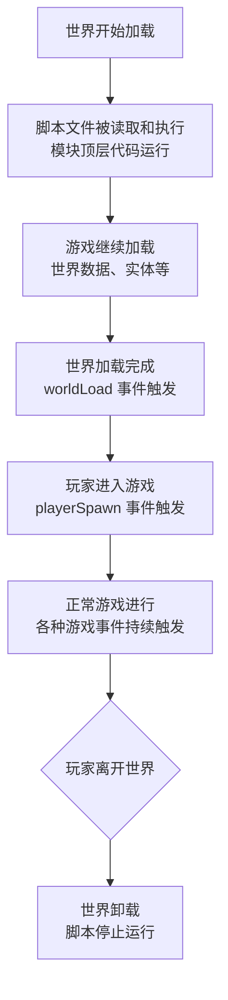
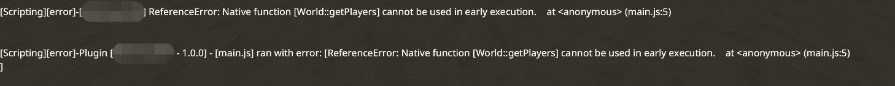
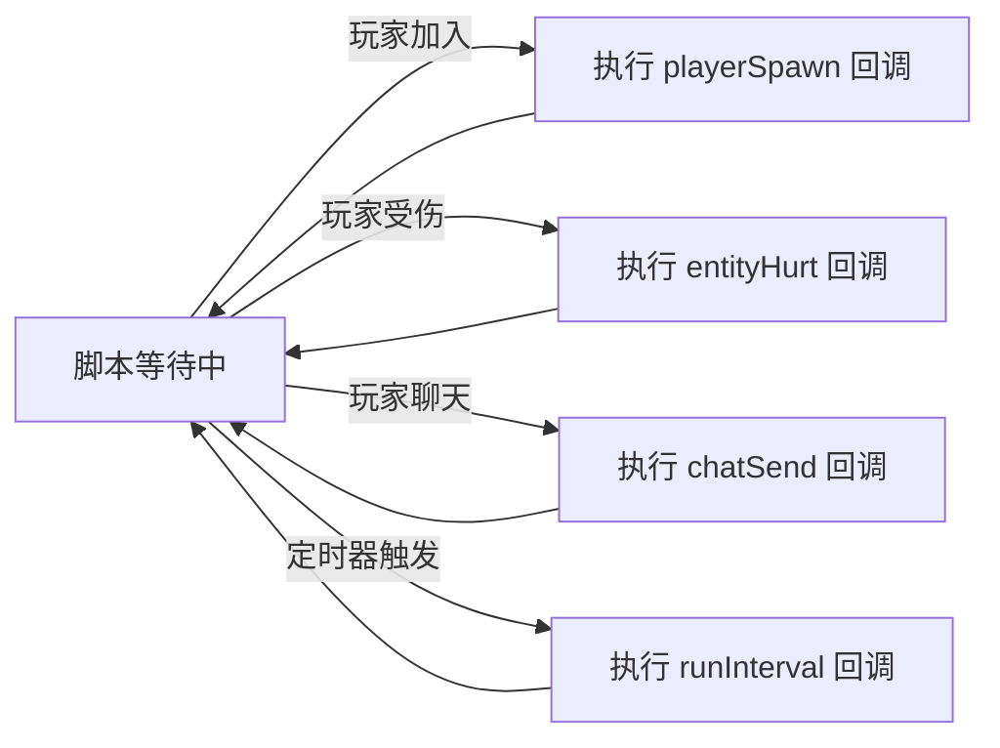
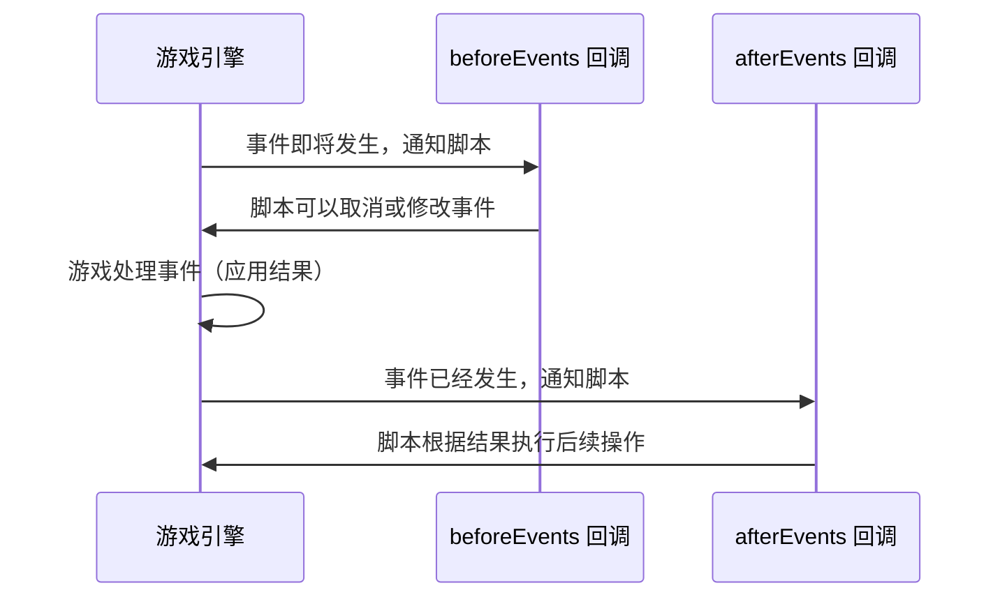
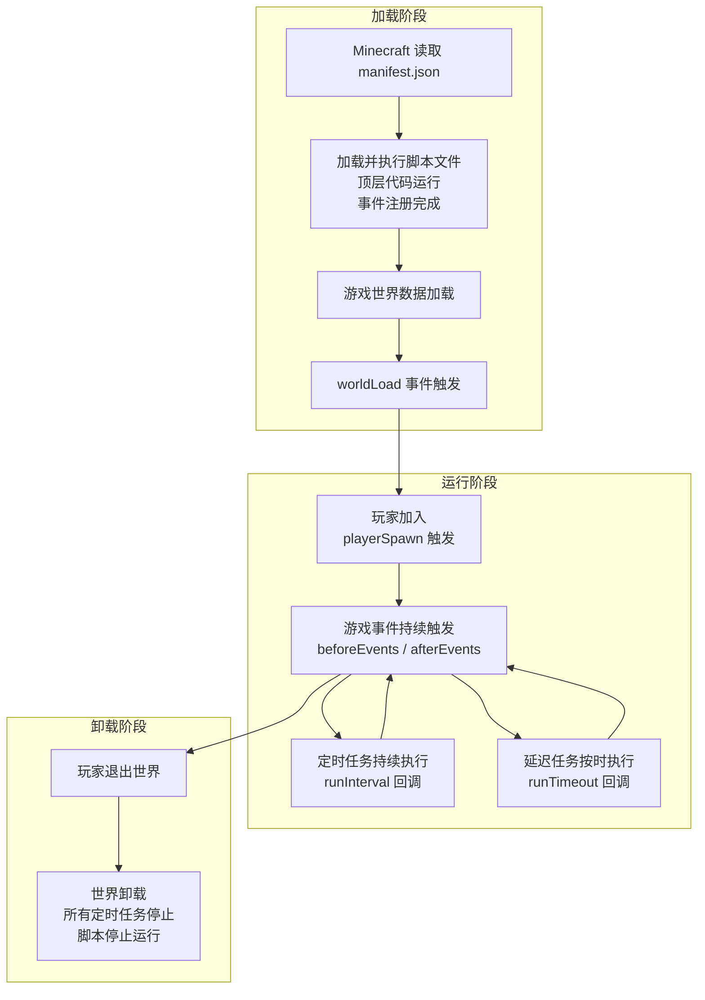

# 2.5 脚本的生命周期与执行时机

## 前言：代码在什么时候运行？

在前几节中，我们已经写了不少代码。但有一个问题始终没有正面回答：**这些代码究竟是什么时候开始运行的？**

你可能会想：不就是进入世界的时候吗？但实际情况比这复杂得多。

想象一下进入一个 Minecraft 世界的完整过程：游戏先加载世界数据，再加载实体，再加载玩家，最后把画面呈现给你。这个过程中的每一个阶段，游戏的状态是不同的。如果你的脚本在世界数据还没加载完时，就试图访问某个玩家的信息，会发生什么？

这就是**生命周期**的意义：了解代码在整个游戏流程中的执行时机，让你能在正确的时间做正确的事，避免因为"时机不对"而产生的奇怪问题。

---

## 2.5.1 什么是脚本生命周期

脚本的生命周期，就是一个脚本从被加载到最终卸载的完整过程。

:::note
本教程只介绍 2.0.0 版本后的脚本生命周期，不涉及 1.x.x 版本内容，因此部分 1.x.x 版本脚本的格式可能与此教程略有不同
:::
用一张图来看整体流程：



这个流程里有几个关键时间点，每个时间点能做的事情和限制都不同。

---

## 2.5.2 第一阶段：模块顶层代码的执行

当 Minecraft 加载你的行为包时，第一件事是读取并执行脚本的入口文件（`main.js`）。执行的内容就是文件的**顶层代码**——也就是不在任何函数或事件回调里的代码。

来看一个例子：

```js title="scripts/main.js"
import { world } from "@minecraft/server";    // 第1行：导入模块

// 第2行：顶层变量声明，立刻执行
const startTime = Date.now();

// 第3行：顶层函数定义，立刻执行（但函数体里的代码不执行）
function greet() {
    console.log("这行不会现在执行");
}

// 第4行：顶层代码，立刻执行
console.log("脚本开始加载");

// 第5行：注册事件，立刻执行（注册本身是立刻的，但回调不是）
world.afterEvents.playerSpawn.subscribe(({ player }) => {
    // 这里的代码不是现在执行，而是等玩家加入时才执行
    player.sendMessage("欢迎！");
});

// 第6行：顶层代码，立刻执行
console.log("事件注册完毕");
```

脚本被加载时，第1到第6行的顶层代码**按顺序立刻执行**，输出：

```
脚本开始加载
事件注册完毕
```

而 `player.sendMessage("欢迎！")` 不会现在执行，它等待玩家真正加入游戏的那一刻才触发。

:::warning
顶层代码在脚本加载时立刻运行，但此时**世界还没有完全初始化**。这意味着在顶层代码里，很多涉及游戏世界状态的操作是不安全的。执行此类代码游戏会抛出错误。

```js title="scripts/main.js"
import { world } from "@minecraft/server";

// 错误。此时世界可能还没初始化完成
// 这行代码会报错
const players = world.getPlayers();
console.log(players.length);  

// 正确：注册事件是顶层代码里最主要的合法操作
world.afterEvents.playerSpawn.subscribe(({ player }) => {
    // 在这里访问世界状态才是安全的
    const allPlayers = world.getPlayers();
    console.log(allPlayers.length);
});
```


简单记住这个原则：**顶层代码只做"注册"和"初始化配置"，不做"访问游戏世界状态"的操作。**
:::

---

## 2.5.3 第二阶段：worldLoad 事件

脚本加载完毕、世界数据也准备就绪之后，Minecraft 会触发一个特殊的事件：`worldLoad`。
:::warning
`worldInitialize`事件已在 2.0.0 版本被移除。请使用 `worldLoad` 事件。
:::
这是脚本可以安全地进行"世界级别初始化操作"的最早时机——此时世界已经准备好了，但玩家还没进来。

```js title="scripts/main.js"
import { world } from "@minecraft/server";

// 监听世界初始化事件
world.afterEvents.worldLoad.subscribe(() => {
    // 此时世界已经加载完毕，可以安全地执行初始化操作
    console.log("世界初始化完成，开始执行初始化逻辑");

    // 例如：注册自定义方块的相关逻辑
    // 例如：从动态属性读取持久化数据
    // 例如：设置世界的某些状态
});
```

:::note
`worldLoad` 是一个只会触发一次的事件。每次世界加载时触发一次，之后不会再触发。这使它非常适合用来执行"只需要做一次的初始化操作"。

和顶层代码不同，`worldLoad` 回调里可以安全地访问世界数据，因为此时世界已经真正准备好了。
:::

---

## 2.5.4 第三阶段：玩家加入与游戏进行

世界初始化之后，玩家开始陆续加入。从这个阶段开始，各种游戏事件会持续触发，脚本进入了"正常工作"状态。

这个阶段的执行模型是事件驱动的：脚本本身不会主动"跑"，而是安静地等待，一旦某个事件发生，对应的回调函数就被调用，执行完毕后脚本再次进入等待状态。



这就是为什么脚本不会让 Minecraft 卡住——脚本本身只在事件触发时短暂地"醒来"执行一段代码，然后立刻"睡回去"等待下一个事件。

---

## 2.5.5 system.runInterval 与游戏刻的关系

在第三阶段，除了事件驱动的代码之外，还有一种主动执行的方式：`system.runInterval`。

理解它的执行时机，需要先理解 Minecraft 的游戏刻（Tick）是什么。

**游戏刻（Game Tick）** 是 Minecraft 游戏逻辑更新的基本单位。在正常情况下，游戏每秒执行 20 次更新，每次更新就是一个游戏刻（1 刻 ≈ 50 毫秒）。

```
时间轴：
│──刻1──│──刻2──│──刻3──│──刻4──│──...──│──刻20──│  ← 1秒
   50ms     50ms    50ms    50ms            50ms
```

`system.runInterval(callback, interval)` 的含义是：**每隔 `interval` 个游戏刻，在下一个刻的开始时执行一次 `callback`。**

```js
// 每 20 刻执行一次，即约每秒执行一次
system.runInterval(() => {
    console.log("每秒执行一次");
}, 20);

// 每 1 刻执行一次，即每个游戏刻都执行
system.runInterval(() => {
    // 小心！这会每秒执行 20 次，性能开销较大
    console.log("每刻执行一次");
}, 1);
```

:::warning
每刻都执行的代码（`interval` 设为 1）会在每秒运行 20 次。如果这段代码有比较重的计算逻辑，会明显影响游戏性能，甚至导致游戏卡顿。

在实际开发中，应该根据功能的实时性需求合理设置间隔：
- 需要实时响应（如碰撞检测）：1-5 刻
- 需要较快更新（如状态监控）：20 刻（1秒）
- 周期性任务（如公告、积分）：200 刻以上

**不要把所有东西都设成每刻执行。**
:::

---

## 2.5.6 执行时机对比：三种代码的区别

现在我们来对比三种常见代码结构的执行时机：

```js title="scripts/main.js"
import { world, system } from "@minecraft/server";

// ===== 类型一：顶层代码 =====
// 执行时机：脚本文件被加载时，立刻执行，只执行一次
// 适合做：变量初始化、注册事件、启动定时任务
console.log("A: 我在脚本加载时执行");
const config = { maxPlayers: 20 };


// ===== 类型二：事件回调 =====
// 执行时机：对应的游戏事件触发时执行，可能执行零次或多次
// 适合做：响应具体的游戏行为
world.afterEvents.playerSpawn.subscribe(({ player }) => {
    console.log(`B: 我在 ${player.name} 加入时执行`);
});


// ===== 类型三：定时回调 =====
// 执行时机：每隔指定的游戏刻执行一次，持续执行
// 适合做：周期性检查、定时任务
system.runInterval(() => {
    console.log("C: 我每20刻执行一次");
}, 20);


// ===== 顶层代码继续 =====
// 注意：这行仍然是顶层代码，在 A 之后立刻执行
// 不需要等待上面的事件注册"完成"——注册本身是瞬时的
console.log("D: 我也在脚本加载时执行，在 A 之后");
```

如果有一个玩家进入了游戏，输出的顺序是：

```
A: 我在脚本加载时执行
D: 我也在脚本加载时执行，在 A 之后
（游戏继续加载...）
C: 我每20刻执行一次
C: 我每20刻执行一次
C: 我每20刻执行一次
（玩家加入游戏...）
B: 我在 Steve 加入时执行
C: 我每20刻执行一次
...（C 继续每20刻执行）
```
让我们来梳理一下为什么会按上面这样的顺序输出：

首先，顶层的代码A会在世界初始化后就开始加载。此时游戏世界还未正式开始加载。随后代码B与C被系统明确，并在后续游戏加载后执行。而D与A类似，会首先加载。在世界加载完毕后，C就会开始执行。随后玩家顺利进入游戏，B执行。
:::tip
如果对同步与异步仍有疑惑，可以返回 1.7 章节重新了解。
:::
---

## 2.5.7 一个常见的时序错误


**错误场景：** 想在脚本启动时获取所有在线玩家，并给他们发消息。

```js title="scripts/main.js（错误写法）"
import { world } from "@minecraft/server";

// 错误！脚本加载时，玩家还没进入游戏
// getPlayers() 强行访问会抛出错误。
const players = world.getPlayers();
for (const player of players) {
    player.sendMessage("脚本已加载！");  // 这行永远不会执行
}
```

这段代码不会有任何效果。因为脚本加载时，世界里没有任何玩家。

**正确做法一：** 如果想在每个玩家加入时通知他，使用事件：

```js title="scripts/main.js（正确写法一）"
import { world } from "@minecraft/server";

world.afterEvents.playerSpawn.subscribe(({ player, initialSpawn }) => {
    if (!initialSpawn) return;
    player.sendMessage("脚本已加载，欢迎加入！");
});
```

**正确做法二：** 如果想在脚本加载后通知当时已经在线的玩家，用 `worldLoad` 事件：

```js title="scripts/main.js（正确写法二）"
import { world } from "@minecraft/server";

world.afterEvents.worldLoad.subscribe(() => {
    // 在世界初始化完成后，玩家可能已经在线了（热重载场景）
    const players = world.getPlayers();
    for (const player of players) {
        player.sendMessage("脚本已加载！");
    }
});
```

---

## 2.5.8 beforeEvents 与 afterEvents：时机的两个层次

你可能注意到，Script API 里的事件分为两个命名空间：

- `world.beforeEvents`：在游戏处理这个事件**之前**触发
- `world.afterEvents`：在游戏处理这个事件**之后**触发

这两者的执行时机有本质区别：



**`beforeEvents` 的特殊能力：取消事件**

`beforeEvents` 的回调函数接收到的事件对象，某些情况下有一个 `cancel` 属性，把它设置为 `true` 可以阻止游戏处理这个事件：

```js title="scripts/main.js"
import { world } from "@minecraft/server";

// 阻止玩家破坏特定方块（保护区域的简单实现）
world.beforeEvents.playerBreakBlock.subscribe((event) => {
    const block = event.block;
    const player = event.player;

    // 如果方块是基岩，阻止破坏
    if (block.typeId === "minecraft:bedrock") {
        event.cancel = true;
        // 注意：在 beforeEvents 回调里，不能直接调用会修改世界状态的操作
        // sendMessage 在这里受到限制，需要配合 system.run 使用
        // 我们会在第四章详细介绍这个限制
    }
});
```

:::warning
在 `beforeEvents` 的回调函数里，有一个重要限制：**不能直接调用会修改游戏世界状态的 API**（例如修改方块类型）。

这是因为在 `beforeEvents` 阶段，游戏引擎还没有完成这次事件的处理，此时直接修改世界状态可能导致逻辑冲突。

如果你需要在 `beforeEvents` 里执行修改操作，需要把它包裹在 `system.run()` 里，推迟到下一个游戏刻执行：

```js
world.beforeEvents.playerBreakBlock.subscribe((event) => {
    event.cancel = true;

    // 用 system.run 把修改操作推迟到下一刻
    system.run(()=> {
        event.block.setType("minecraft:air");
    });
});
```

我们会在第四章对 `beforeEvents` 进行完整介绍，现阶段先了解这个限制的存在即可。
:::

---

## 2.5.9 system.run：在下一刻执行

除了 `runTimeout` 和 `runInterval`，还有一个更简单的异步工具：`system.run`。

它的作用是：**把一段代码推迟到下一个游戏刻执行**，不需要指定间隔时间。

```js
import { system } from "@minecraft/server";

// 立刻执行
console.log("现在执行");

// 推迟到下一刻
system.run(() => {
    console.log("下一刻执行");
});

// 立刻执行
console.log("也是现在执行");
```

输出顺序：

```
现在执行
也是现在执行
（下一个游戏刻）
下一刻执行
```

`system.run` 最常见的用途就是在 `beforeEvents` 里推迟执行修改操作，确保不会和游戏引擎的处理流程冲突。

---

## 2.5.10 脚本的完整生命周期时序图

把这一节所有的概念整合在一起，用一张完整的时序图来展示脚本从加载到卸载的全过程：



---

## 2.5.11 实战：利用生命周期写更可靠的初始化代码

综合这一节的知识，来改进我们在 2.4 节写的脚本，让初始化逻辑更符合生命周期的规范：

```js title="scripts/main.js"
import { world, system } from "@minecraft/server";
import { handlePlayerJoin } from "./welcome.js";
import { handleChatMessage } from "./commands.js";
import { startAnnouncementSystem } from "./announcements.js";
import { registerHealthMonitor } from "./health.js";

// =============================================
// 顶层代码：只做注册和配置，不访问世界状态
// =============================================

// 记录脚本加载时间（这是安全的，只是记录一个时间戳）
const scriptLoadTime = Date.now();
console.log("[脚本] 开始加载...");

// 注册游戏事件（注册本身是安全的顶层操作）
world.afterEvents.playerSpawn.subscribe(({ player, initialSpawn }) => {
    handlePlayerJoin(player, initialSpawn);
});

world.afterEvents.chatSend.subscribe(({ sender, message }) => {
    handleChatMessage(sender, message);
});

// =============================================
// 世界初始化完成后，执行需要访问世界状态的操作
// =============================================

world.afterEvents.worldLoad.subscribe(() => {
    console.log("[脚本] 世界初始化完成，开始启动各系统...");

    // 启动定时任务（在世界准备好之后启动更安全）
    startAnnouncementSystem();
    registerHealthMonitor();

    // 计算从脚本加载到世界初始化完成的时间
    const initDuration = Date.now() - scriptLoadTime;
    console.log(`[脚本] 所有系统启动完毕（耗时 ${initDuration}ms）`);

    // 此时可以安全地访问世界状态
    // 例如：从动态属性加载持久化数据（第八章会学习）
    // loadPersistentData();
});

console.log("[脚本] 事件注册完毕，等待世界初始化...");
```

和 2.4 节的版本相比，这个版本把 `startAnnouncementSystem()` 和 `registerHealthMonitor()` 从顶层代码移到了 `worldLoad` 回调里。对于这两个函数来说，两种写法实际效果差别不大，但把"需要世界准备好才能工作的代码"放在 `worldLoad` 里是更好的习惯，也更不容易在复杂场景下出现时序问题。

---

## 本节知识总结

| 执行时机 | 代码位置 | 适合做什么 | 注意事项 |
|----------|----------|------------|----------|
| 脚本加载时（立刻） | 模块顶层代码 | 变量初始化、注册事件 | 不要访问世界状态 |
| 世界初始化完成后 | `worldLoad` 回调 | 读取持久化数据、启动系统 | 只触发一次 |
| 玩家/事件触发时 | `afterEvents` 回调 | 响应游戏行为 | 可以自由访问世界状态 |
| 事件处理之前 | `beforeEvents` 回调 | 拦截和取消事件 | 不能直接修改世界状态 |
| 每隔固定时间 | `runInterval` 回调 | 周期性任务 | 注意性能，合理设置间隔 |
| 延迟一次 | `runTimeout` 回调 | 延迟执行操作 | 注意玩家可能已离线 |
| 下一个游戏刻 | `system.run` 回调 | 推迟执行，解决时序冲突 | 常用于 beforeEvents 里 |

---

## 课后练习

**练习1：** 在 2.4 节的脚本基础上，添加对 `worldLoad` 事件的监听，在世界初始化完成时用 `console.log` 输出一条记录初始化耗时的日志（参考本节 2.5.11 的写法）。进入游戏后，在内容日志里验证这条日志确实在事件注册完毕的日志之后输出。

**练习2：** 写一段代码来验证 `beforeEvents` 和 `afterEvents` 的执行顺序。监听同一个事件（比如 `playerBreakBlock`）的 `before` 和 `after` 版本，在两个回调里分别输出不同的日志，然后在游戏里触发这个事件，观察日志的输出顺序是否和你预期的一致。

**练习3（思考题）：** 假设你的脚本在 `worldLoad` 回调里，从某个持久化存储读取了玩家积分数据，并存储在一个 `Map` 里。同时，脚本的顶层代码注册了 `playerSpawn` 事件，在玩家加入时读取这个 `Map` 里的数据。

思考一下：`worldLoad` 和 `playerSpawn` 谁先触发？玩家加入时，积分 `Map` 是否已经加载完毕？这个时序是否可靠？如果在单人世界和多人服务器上行为不同，你该如何保证数据在被使用前已经加载完毕？

---

> **下一节预告：2.6 小结**
>
> 这一节是第二章的最后一节。我们将对整个"Script API 基础架构"章节做一次完整的回顾，把开发环境搭建、清单文件配置、模块系统、第一个脚本、生命周期这五个部分串联成一个完整的知识体系，为后续章节做好准备。