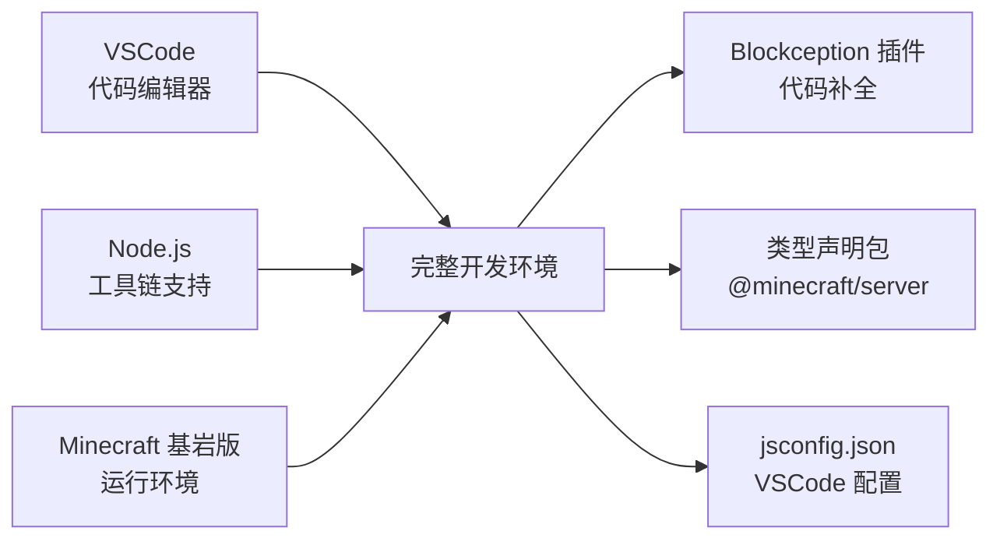
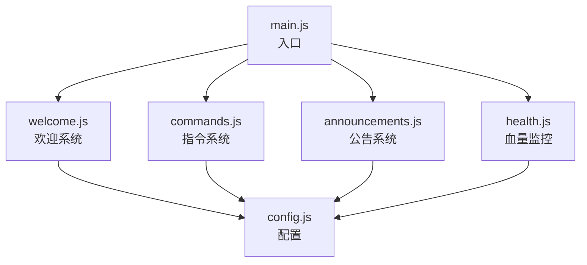
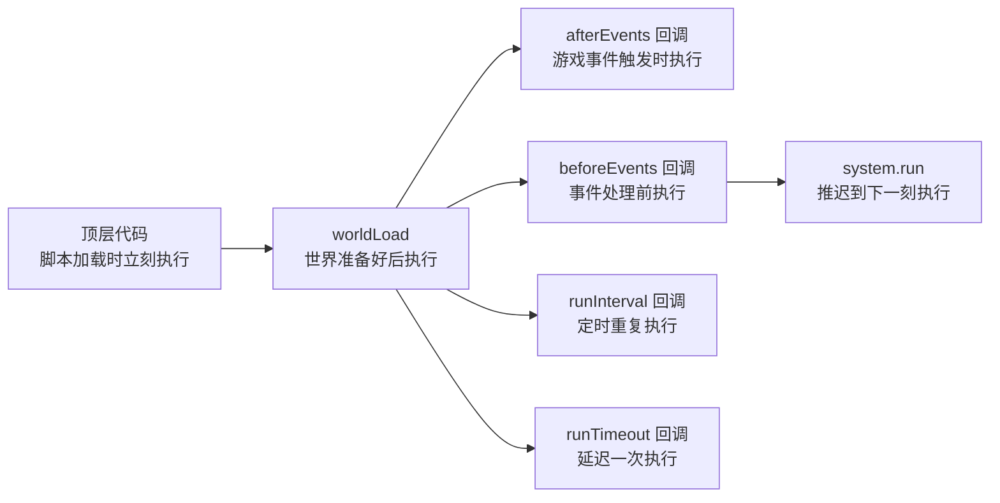
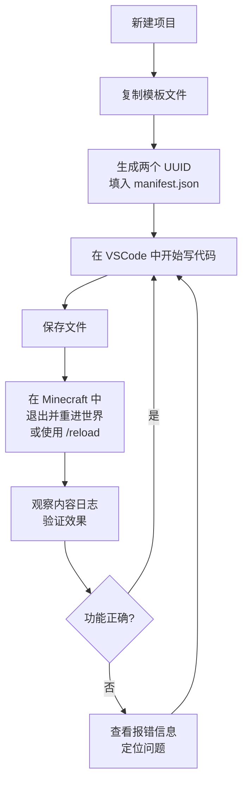

# 2.6 小结

## 前言：第二章走了多远

从搭建开发环境，到写出第一个有实际功能的脚本，再到理解代码的执行时机——第二章覆盖了从零开始进行 Script API 开发所需的全部基础设施知识。

这些内容可能不如后面"给玩家传送"、"生成实体"这类操作那么直观有趣，但它们是一切有意义的脚本开发的前提。就像建房子必须先打地基，地基越扎实，后面盖的楼才越稳。

这一节我们来做一次系统性的回顾，并给出一些可以直接复用的模板，让你在开始新项目时不必从零摸索。

---

## 2.6.1 第二章知识回顾

### 2.1 开发环境搭建

你搭建了一套完整的 Script API 开发环境，理解了每个工具的作用：



**核心要点：**
- 行为包放在 `development_behavior_packs` 目录下
- 每次修改脚本后，需要退出并重新进入世界（或使用 `/reload`）
- 内容日志是调试脚本最重要的工具，开发时必须开启

---

### 2.2 清单文件详解

你完全理解了 `manifest.json` 的每一个字段：

```json title="manifest.json"
{
    "format_version": 2,                          // 固定为 2
    "header": {
        "name": "行为包名称",
        "description": "行为包描述",
        "uuid": "第一个UUID",                      // 行为包的唯一标识
        "version": [1, 0, 0],                     // 数组格式的版本号
        "min_engine_version": [1, 21, 0]          // 最低游戏版本要求
    },
    "modules": [
        {
            "type": "script",                     // 脚本模块固定为 script
            "language": "javascript",             // 固定为 javascript
            "uuid": "第二个UUID",                  // 不能和 header 的 UUID 相同
            "entry": "scripts/main.js",           // 脚本入口文件路径
            "version": [1, 0, 0]
        }
    ],
    "dependencies": [
        {
            "module_name": "@minecraft/server",   // 依赖官方 API 模块
            "version": "2.8.0"                   // 字符串格式的版本号
        }
    ]
}
```

**最容易犯错的地方：**
- 两个 UUID 必须不同，且必须是有效格式
- `header.version` 用数组，`dependencies.version` 用字符串
- `entry` 路径区分大小写，且必须包含 `.js` 后缀

---

### 2.3 模块系统与 import

你学会了用 `import` 和 `export` 把代码组织到多个文件中：

```js
// 导出
export const CONFIG = { maxPlayers: 20 };
export function formatName(name) { return `[${name}]`; }
export default class PlayerManager { ... }

// 导入
import PlayerManager from "./PlayerManager.js";
import { CONFIG, formatName } from "./config.js";
import { world } from "@minecraft/server";
```

**核心原则：**
- 自己的文件之间用相对路径
- 官方模块用模块名，不需要路径
- Script API 只支持 ES Module（`import/export`），不支持 `require`
- 避免循环依赖，模块依赖关系应该是单向的

---

### 2.4 第一个脚本

你构建了一个包含五个模块的完整脚本项目：



**学到的重要模式：**
- 路由表模式：用对象映射代替大量 `if...else if`
- 配置集中管理：把可调整的参数放在单独的配置文件
- 职责分离：每个模块只做一件事
- 取余循环下标：`(index + 1) % length` 实现不越界的循环

---

### 2.5 脚本的生命周期与执行时机

你理解了代码在不同时机的执行规律：



**核心原则：**
- 顶层代码只做注册和初始化配置，不访问世界状态
- `worldLoad` 是安全执行世界级初始化操作的最早时机
- `beforeEvents` 里不能直接修改世界状态，需要用 `system.run` 包裹
- 合理设置 `runInterval` 的间隔，避免不必要的性能开销

---

## 2.6.2 标准项目模板

下面提供一套可以直接用于新项目的完整模板。每次新建 Script API 项目时，直接复制这套文件，替换其中需要自定义的部分即可。

**目录结构：**

```
my_project/
├── manifest.json
└── scripts/
    ├── main.js
    └── config.js
```

**manifest.json 模板：**

```json title="manifest.json"
{
    "format_version": 2,
    "header": {
        "name": "项目名称",
        "description": "项目描述",
        "uuid": "替换为第一个UUID",
        "version": [1, 0, 0],
        "min_engine_version": [1, 21, 0]
    },
    "modules": [
        {
            "type": "script",
            "language": "javascript",
            "uuid": "替换为第二个UUID",
            "entry": "scripts/main.js",
            "version": [1, 0, 0]
        }
    ],
    "dependencies": [
        {
            "module_name": "@minecraft/server",
            "version": "2.8.0"
        }
    ]
}
```

**config.js 模板：**

```js title="scripts/config.js"
// =============================================
// 全局配置
// 在这里集中管理所有可调整的参数
// =============================================

export const CONFIG = {
    // 在这里添加你的配置项
    // 示例：
    // commandPrefix: "!",
    // announcementInterval: 2400,
};
```

**main.js 模板：**

```js title="scripts/main.js"
import { world, system } from "@minecraft/server";

// =============================================
// 顶层代码：注册事件，不访问世界状态
// =============================================

// 在这里注册你的事件监听器
// world.afterEvents.playerSpawn.subscribe(({ player }) => { ... });
// world.afterEvents.chatSend.subscribe(({ sender, message }) => { ... });

// =============================================
// 世界初始化完成后执行
// =============================================

world.afterEvents.worldLoad.subscribe(() => {
    // 在这里执行需要世界准备好才能进行的初始化
    // 例如：启动定时任务、加载持久化数据

    console.log("[脚本] 初始化完成。");
});

console.log("[脚本] 加载完毕，等待世界初始化...");
```

---

## 2.6.3 开发流程速查

日常开发时的完整工作流：



---

## 2.6.4 常见问题速查表

整理第二章中所有值得记住的注意事项：

| 问题 | 原因 | 解决方案 |
|------|------|----------|
| 行为包在游戏里看不到 | manifest.json 格式错误或 UUID 无效 | 检查 JSON 格式，重新生成 UUID |
| 脚本加载后没有任何输出 | 入口文件路径写错，或未开启内容日志 | 核对 `entry` 字段，开启内容日志 |
| `import` 报错 | 文件相对路径错误，或文件不存在 | 检查路径和文件名（区分大小写） |
| 顶层代码获取不到玩家 | 脚本加载时玩家还未进入游戏 | 移到 `playerSpawn` 事件里 |
| `beforeEvents` 里修改世界报错 | 该阶段不允许直接修改世界状态 | 用 `system.run()` 包裹修改操作 |
| 两个 UUID 不能相同 | `header` 和 `modules` 的 UUID 重复 | 分别生成两个不同的 UUID |
| 依赖版本格式错误 | `@minecraft/server` 版本用了数组格式 | 改为字符串格式，如 `"2.8.0"` |
| 修改代码后没有效果 | 没有重新加载脚本 | 退出世界重进，或使用 `/reload` |
| `require` 报错 | Script API 不支持 CommonJS | 改用 `import/export` |
| `runInterval` 卡顿 | 间隔设置过小，执行频率过高 | 根据实际需求合理设置间隔 |

---

## 2.6.5 第二章与第三章的衔接

完成了第二章的学习，你已经具备了：

- 独立搭建开发环境的能力
- 读写 `manifest.json` 的能力
- 用模块系统组织多文件项目的能力
- 理解事件驱动编程和生命周期的能力
- 写出结构清晰的完整脚本的能力

但你可能也注意到，在 2.4 节的脚本里，有些地方我们用得比较粗糙，留下了一些"后续改进"的注释。比如：

```js
// 在延迟执行时，玩家可能已经离线
// 后续章节会学习如何更严谨地处理这种情况
```

```js
// 获取玩家血量
const healthComponent = player.getComponent("minecraft:health");
// getComponent 是什么？它返回什么？还有哪些组件？
```

这些"留白"是刻意的——因为要真正搞清楚玩家对象、组件系统、实体系统，需要专门的一章来讲。

**第三章：世界与玩家**，将带你深入了解 `world` 对象和 `player` 对象，包括：

- `world` 对象能做什么，有哪些属性和方法
- 如何获取、过滤在线玩家
- 玩家对象上有哪些属性：名字、坐标、维度、游戏模式
- 如何向玩家发送不同类型的消息：聊天消息、标题、动作栏
- 玩家的组件系统是什么，常用组件有哪些
- 如何安全地处理"玩家可能已离线"的情况

从第三章开始，你会真正进入到 Script API 的核心功能区域，写出越来越有趣的游戏逻辑。

---

## 2.6.6 给自己的检查清单

在继续第三章之前，用这个清单来确认自己对第二章的掌握程度：

**环境与配置**
- [ ] 能够独立创建一个新的行为包项目，不需要看教程
- [ ] 知道 UUID 是什么，知道去哪里生成，知道为什么需要两个不同的
- [ ] 能够正确配置 `manifest.json` 的每个字段，包括版本号格式的区别
- [ ] 知道如何安装类型声明包，以及它的作用

**模块系统**
- [ ] 能够区分命名导出和默认导出，知道各自的导入语法
- [ ] 理解模块依赖应该是单向的，知道循环依赖是什么

**脚本结构**
- [ ] 能够把功能拆分到合理的多个文件，而不是全塞进 `main.js`
- [ ] 知道配置集中管理的意义和做法
- [ ] 能够在脚本里正确使用路由表模式处理指令

**生命周期**
- [ ] 知道顶层代码、`worldLoad`、事件回调、`runInterval` 各自的执行时机
- [ ] 理解为什么不应该在顶层代码里访问世界状态
- [ ] 知道 `beforeEvents` 和 `afterEvents` 的区别
- [ ] 知道为什么 `beforeEvents` 里不能直接修改世界，以及如何解决

如果以上所有条目都能自信地打勾，说明第二章的内容已经真正掌握了，可以继续前进。如果有某些条目还不确定，回到对应的章节再看一遍，不要急着往前走。

---

> **第三章预告：世界与玩家**
>
> 从下一章开始，我们正式进入 Script API 的核心功能区。第一站是 `world` 对象和 `player` 对象——它们是你在 Script API 开发中打交道最频繁的两个对象，几乎所有有意义的操作都从这里开始。你将第一次真正深入了解 Minecraft 的游戏世界是如何通过 API 暴露给脚本的，以及如何用代码精确地控制玩家的每一个状态。