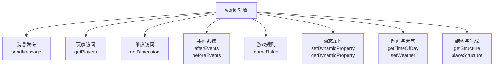

# 3.1 world 对象：访问游戏世界的入口

## 前言：一切的起点

在前两章中，我们多次写过这样一行代码：

```js
import { world } from "@minecraft/server";
```

然后用 `world.sendMessage()`、`world.getPlayers()`、`world.afterEvents` 等等。但我们从来没有认真停下来问一句：**`world` 到底是什么？**

`world` 是 Script API 中最重要的对象，没有之一。它是你访问整个 Minecraft 游戏世界的总入口。玩家、实体、方块、维度、事件、游戏规则——要触达这些东西，几乎都要从 `world` 开始。

把 `world` 想象成一栋大楼的大堂：你不需要在大堂里做所有的事，但你必须先经过大堂，才能找到通往各个楼层的电梯。

这一节我们来系统地认识 `world` 对象，搞清楚它能做什么，以及它的各个功能入口在哪里。

---

## 3.1.1 world 对象的整体结构

`world` 是一个全局单例对象，整个脚本运行期间只有一个，代表当前正在运行的 Minecraft 世界。

它的功能可以分为以下几个大类：



这一节会覆盖其中最核心、最常用的几个功能。其他功能（比如动态属性、结构）会在后续对应的章节里详细介绍。

---

## 3.1.2 发送消息：world.sendMessage

`world.sendMessage()` 是你已经用了很多次的方法，但有一些细节还没有正式讲过。

**基本用法：**

```js title="scripts/main.js"
import { world } from "@minecraft/server";

// 向所有在线玩家发送一条消息
world.sendMessage("这条消息所有人都能看到。");
```

**发送带格式的消息：**

Minecraft 支持在消息里使用格式代码来改变文字颜色和样式。格式代码用 `§` 符号加一个字母或数字来表示：

```js title="scripts/main.js"
import { world } from "@minecraft/server";

// §a 是绿色，§c 是红色，§r 是重置格式
world.sendMessage("§a这是绿色文字§r，这是普通文字，§c这是红色文字§r。");

// §l 是加粗，§o 是斜体
world.sendMessage("§l这是加粗文字§r，§o这是斜体文字§r。");
```

常用的格式代码：

| 代码 | 效果 | 代码 | 效果 |
|------|------|------|------|
| `§0` | 黑色 | `§8` | 深灰色 |
| `§1` | 深蓝色 | `§9` | 蓝色 |
| `§2` | 深绿色 | `§a` | 绿色 |
| `§3` | 深青色 | `§b` | 青色 |
| `§4` | 深红色 | `§c` | 红色 |
| `§5` | 深紫色 | `§d` | 粉色 |
| `§6` | 金色 | `§e` | 黄色 |
| `§7` | 灰色 | `§f` | 白色 |
| `§l` | 加粗 | `§o` | 斜体 |
| `§n` | 下划线 | `§m` | 删除线 |
| `§r` | 重置格式 | `§k` | 随机字符（乱码效果） |

:::tip
在代码里输入 `§` 符号，可以直接复制粘贴，或者用 Unicode 转义写法 `\u00A7`：

```js
// 两种写法等效
world.sendMessage("§a绿色文字");
world.sendMessage("\u00A7a绿色文字");
```

如果你要频繁使用格式代码，可以在 `config.js` 里定义一组颜色常量：

```js title="scripts/config.js"
export const COLOR = {
    green:  "§a",
    red:    "§c",
    yellow: "§e",
    gold:   "§6",
    white:  "§f",
    reset:  "§r",
    bold:   "§l",
};
```

然后这样使用：

```js
import { COLOR } from "./config.js";
world.sendMessage(`${COLOR.green}操作成功！${COLOR.reset}`);
```
:::


---

## 3.1.3 获取玩家：world.getPlayers

`world.getPlayers()` 返回当前所有在线玩家的数组。我们在第一章的循环部分已经多次使用了它，这里来看更完整的用法。

**基本用法：**

```js title="scripts/main.js"
import { world } from "@minecraft/server";

const players = world.getPlayers();
console.log(`当前在线玩家数：${players.length}`);

for (const player of players) {
    console.log(`- ${player.name}`);
}
```
因为返回的是数组，所以上述代码的 `players` 变量里可能长这样：`[玩家对象1, 玩家对象2, 玩家对象3]`
:::note
请注意，玩家对象是一个**对象**，而并非简单的玩家名称。如果要获取玩家名称，可能需要写为 `玩家对象1.name`。
:::

**带过滤条件的获取：**

`getPlayers()` 可以接受一个可选的过滤器对象，让你只获取满足特定条件的玩家，而不需要获取全部再用 `filter` 筛选：

```js title="scripts/main.js"
import { world, GameMode } from "@minecraft/server";

// 只获取创造模式的玩家
const creativePlayers = world.getPlayers({
    gameMode: GameMode.creative
});

// 只获取名字叫 "Steve" 的玩家
const stevePlayers = world.getPlayers({
    name: "Steve"
});

// 只获取拥有特定标签的玩家（标签系统在后续章节介绍）
const vipPlayers = world.getPlayers({
    tags: ["vip"]
});

// 只获取距离某个坐标 50 格以内的玩家
const nearbyPlayers = world.getPlayers({
    location: { x: 0, y: 64, z: 0 },
    maxDistance: 50
});
```

过滤器可以组合使用，多个条件同时满足才会被返回：

```js title="scripts/main.js"
import { world, GameMode } from "@minecraft/server";

// 获取创造模式下、距离原点100格以内的玩家
const filteredPlayers = world.getPlayers({
    gameMode: GameMode.creative,
    location: { x: 0, y: 64, z: 0 },
    maxDistance: 100
});
```

:::note
`world.getPlayers()` 返回的是调用时那一刻的快照。如果在你处理这个列表的过程中有玩家退出，列表里那个玩家对象可能会失效。

这个问题在处理逻辑简单、执行时间极短的代码里不需要担心，但如果你在列表上做耗时较长的操作（比如套了好几层循环），就需要注意。我们会在 3.3 节讲如何更安全地处理玩家对象。
:::

---

## 3.1.4 访问维度：world.getDimension

Minecraft 的世界由多个**维度（Dimension）**构成：主世界、地狱、末地。每个维度是一个独立的空间，有自己的方块、实体和物理规则。许多与方块有关的操作都要经过 `.getDimension` 才可进行。

`world.getDimension()` 用于获取指定维度的对象：

```js title="scripts/main.js"
import { world } from "@minecraft/server";

// 获取三个维度的对象
const overworld = world.getDimension("overworld");   // 主世界
const nether    = world.getDimension("nether");      // 地狱
const theEnd    = world.getDimension("the_end");     // 末地
```

维度对象有自己的方法，比如获取方块、生成实体等。这些操作都是在**指定维度的坐标空间里**进行的：

```js title="scripts/main.js"
import { world } from "@minecraft/server";

const overworld = world.getDimension("overworld");

// 在主世界坐标 (0, 64, 0) 生成一只猪
overworld.spawnEntity("minecraft:pig", { x: 0, y: 64, z: 0 });

// 获取主世界坐标 (100, 64, 100) 的方块
const block = overworld.getBlock({ x: 100, y: 64, z: 100 });
console.log(block?.typeId);   // 输出方块类型 ID
```

我们会在第六章详细介绍维度和方块操作。这里先了解 `getDimension` 的存在和基本用法。

---

## 3.1.5 时间控制：getTimeOfDay 与 setTimeOfDay

`world` 对象提供了读取和修改游戏时间的方法：

```js title="scripts/main.js"
import { world } from "@minecraft/server";

// 获取当前游戏时间（0 到 24000 的整数）
const currentTime = world.getTimeOfDay();
console.log(`当前游戏时间：${currentTime}`);

// 常见时间点对应的数值
// 0     → 日出（早晨6点）
// 6000  → 正午
// 12000 → 日落（傍晚18点）
// 18000 → 午夜
// 24000 → 第二天日出

// 把游戏时间设置为正午（6000）
world.setTimeOfDay(6000);
```

把时间数值转换成更易读的描述：

```js title="scripts/utils.js"
export function getTimePeriod(timeOfDay) {
    if (timeOfDay < 1000)  return "黎明";
    if (timeOfDay < 6000)  return "上午";
    if (timeOfDay < 9000)  return "下午";
    if (timeOfDay < 12000) return "傍晚";
    if (timeOfDay < 18000) return "深夜";
    return "凌晨";
}
```

```js title="scripts/main.js"
import { world } from "@minecraft/server";
import { getTimePeriod } from "./utils.js";

world.afterEvents.chatSend.subscribe(({ sender, message }) => {
    if (message === "!时间") {
        const time = world.getTimeOfDay();
        const period = getTimePeriod(time);
        sender.sendMessage(`当前时间：${period}（${time} / 24000）`);
    }
});
```

---

## 3.1.6 天气控制：setWeather

`world` 对象可以控制当前世界的天气：

```js title="scripts/main.js"
import { world, WeatherType } from "@minecraft/server";

// 设置天气，第二个参数是持续时间（游戏刻）
world.setWeather(WeatherType.Clear, 6000);    // 晴天，持续约5分钟
world.setWeather(WeatherType.Rain, 2400);     // 下雨，持续约2分钟
world.setWeather(WeatherType.Thunder, 1200);  // 雷暴，持续约1分钟
```

`WeatherType` 是一个枚举，需要从 `@minecraft/server` 导入：

```js
import { world, WeatherType } from "@minecraft/server";
```

一个简单的天气控制指令：

```js title="scripts/commands.js"
import { world, WeatherType } from "@minecraft/server";

export function handleWeatherCommand(player, args) {
    const weatherMap = {
        "晴天": WeatherType.Clear,
        "下雨": WeatherType.Rain,
        "雷暴": WeatherType.Thunder,
    };

    const weatherType = weatherMap[args];

    if (!weatherType) {
        player.sendMessage("用法：!天气 <晴天|下雨|雷暴>");
        return;
    }

    world.setWeather(weatherType, 6000);
    world.sendMessage(`${player.name} 把天气改成了${args}。`);
}
```

---

## 3.1.7 游戏规则：world.gameRules

游戏规则控制世界的各种基础行为，比如是否开启 PvP、是否保留死亡物品、是否有昼夜更替等。Script API 允许你读取和修改这些规则：

```js title="scripts/main.js"
import { world } from "@minecraft/server";

// 读取游戏规则
const isPvpEnabled = world.gameRules.pvp;
const keepInventory = world.gameRules.keepInventory;
const doDaylightCycle = world.gameRules.doDaylightCycle;

console.log(`PvP 开启：${isPvpEnabled}`);
console.log(`保留物品：${keepInventory}`);
console.log(`昼夜更替：${doDaylightCycle}`);

// 修改游戏规则
world.gameRules.keepInventory = true;    // 开启死亡不掉落
world.gameRules.doDaylightCycle = false; // 关闭昼夜更替
world.gameRules.pvp = false;             // 关闭 PvP
```

常用的游戏规则：

| 规则名 | 类型 | 含义 |
|--------|------|------|
| `pvp` | boolean | 玩家之间是否可以互相伤害 |
| `keepInventory` | boolean | 死亡后是否保留物品 |
| `doDaylightCycle` | boolean | 是否有昼夜更替 |
| `doWeatherCycle` | boolean | 是否有天气变化 |
| `doMobSpawning` | boolean | 是否生成怪物 |
| `doFireTick` | boolean | 火焰是否会蔓延 |
| `naturalRegeneration` | boolean | 是否自然回血 |
| `showCoordinates` | boolean | 是否显示坐标 |
| `randomTickSpeed` | number | 随机刻速度 |

:::warning
修改游戏规则会影响整个世界，对所有玩家生效。在多人游戏中修改这些规则时要谨慎，确保这是你有意为之的行为，而不是在某个事件回调里不小心触发的。

特别要注意 `randomTickSpeed`——如果把这个值设得过高，可能导致游戏严重卡顿。
:::

---

## 3.1.8 事件系统的入口

`world` 对象上的 `afterEvents` 和 `beforeEvents` 是整个事件系统的入口，我们在前几章已经大量使用过了。这里做一个完整的分类概览：

```js title="scripts/main.js"
import { world } from "@minecraft/server";

// ===== afterEvents：事件发生后触发 =====

// 玩家相关
world.afterEvents.playerSpawn.subscribe(...);          // 玩家进入世界
world.afterEvents.playerLeave.subscribe(...);          // 玩家离开世界
world.afterEvents.playerInteractWithBlock.subscribe(...); // 玩家与方块交互
world.afterEvents.playerInteractWithEntity.subscribe(...); // 玩家与实体交互

// 实体相关
world.afterEvents.entityHurt.subscribe(...);           // 实体受伤
world.afterEvents.entityDie.subscribe(...);            // 实体死亡
world.afterEvents.entitySpawn.subscribe(...);          // 实体生成

// 方块相关
world.afterEvents.playerBreakBlock.subscribe(...);     // 玩家破坏方块
world.afterEvents.playerPlaceBlock.subscribe(...);     // 玩家放置方块
world.afterEvents.blockExplode.subscribe(...);         // 方块被爆炸破坏

// 聊天与交互
world.afterEvents.chatSend.subscribe(...);             // 玩家发送聊天
world.afterEvents.itemUse.subscribe(...);              // 玩家使用物品

// ===== beforeEvents：事件发生前触发（可以取消） =====

world.beforeEvents.playerBreakBlock.subscribe(...);    // 玩家即将破坏方块
world.beforeEvents.playerPlaceBlock.subscribe(...);    // 玩家即将放置方块
world.beforeEvents.chatSend.subscribe(...);            // 玩家即将发送聊天
world.beforeEvents.itemUse.subscribe(...);             // 玩家即将使用物品
```

第四章会对所有事件进行完整的分类讲解。这里先建立整体印象即可。

---

## 3.1.9 动态属性：持久化存储的入口

`world` 对象还提供了在世界级别存储持久化数据的能力，通过 `setDynamicProperty` 和 `getDynamicProperty` 实现：

```js title="scripts/main.js"
import { world } from "@minecraft/server";

// 存储数据（字符串、数字、布尔值）
world.setDynamicProperty("serverStartCount", 1);
world.setDynamicProperty("lastResetTime", "2024-01-01");
world.setDynamicProperty("isPvpEnabled", false);

// 读取数据
const count = world.getDynamicProperty("serverStartCount");
const lastReset = world.getDynamicProperty("lastResetTime");

console.log(`服务器已启动 ${count} 次`);
console.log(`上次重置时间：${lastReset}`);

// 删除数据
world.setDynamicProperty("lastResetTime", undefined);
```

动态属性存储的数据在世界关闭后仍然保留，下次加载世界时还能读取到。这是 Script API 实现数据持久化的主要手段。第八章会对此进行完整介绍。

---

## 3.1.10 实战：一个完整的 world 对象使用示例

把这一节的各个知识点综合起来，写一个"服务器信息查询"系统：

```js title="scripts/serverInfo.js"
import { world, WeatherType, GameMode } from "@minecraft/server";


// 获取当前时段的文字描述
function getTimePeriod(timeOfDay) {
    if (timeOfDay < 1000)  return "黎明";
    if (timeOfDay < 6000)  return "上午";
    if (timeOfDay < 9000)  return "下午";
    if (timeOfDay < 12000) return "傍晚";
    if (timeOfDay < 18000) return "深夜";
    return "凌晨";
}

// 获取某个游戏模式的玩家数量
function countPlayersByMode(gameMode) {
    return world.getPlayers({ gameMode }).length;
}

// 生成完整的服务器状态报告
export function getServerStatusReport() {
    const allPlayers = world.getPlayers();
    const timeOfDay = world.getTimeOfDay();
    const keepInventory = world.gameRules.keepInventory;
    const isPvp = world.gameRules.pvp;

    const survivalCount = countPlayersByMode(GameMode.Survival);
    const creativeCount = countPlayersByMode(GameMode.Creative);

    const lines = [
        "§l===== 服务器状态 =====§r",
        `§e在线人数：§f${allPlayers.length} 人`,
        `§e游戏时间：§f${getTimePeriod(timeOfDay)}（${timeOfDay}）`,
        `§e生存模式：§f${survivalCount} 人`,
        `§e创造模式：§f${creativeCount} 人`,
        `§ePvP 状态：§f${isPvp ? "§c开启" : "§a关闭"}§r`,
        `§e死亡不掉落：§f${keepInventory ? "§a开启" : "§c关闭"}§r`,
        "§l=====================§r",
    ];

    return lines.join("\n");
}
```

```js title="scripts/main.js"
import { world } from "@minecraft/server";
import { getServerStatusReport } from "./serverInfo.js";

world.afterEvents.chatSend.subscribe(({ sender, message }) => {
    if (message === "!状态") {
        const report = getServerStatusReport();
        sender.sendMessage(report);
    }
});
```

进入游戏后输入 `!状态`，就能看到一份带颜色格式的服务器状态报告。

---

## 本节知识总结

| 方法 / 属性 | 作用 | 示例 |
|-------------|------|------|
| `world.sendMessage(msg)` | 向所有玩家发送消息 | `world.sendMessage("公告")` |
| `world.getPlayers()` | 获取所有在线玩家数组 | `world.getPlayers()` |
| `world.getPlayers(filter)` | 获取满足条件的玩家 | `world.getPlayers({ gameMode: ... })` |
| `world.getDimension(id)` | 获取指定维度对象 | `world.getDimension("overworld")` |
| `world.getTimeOfDay()` | 获取当前游戏时间 | `world.getTimeOfDay()` |
| `world.setTimeOfDay(time)` | 设置游戏时间 | `world.setTimeOfDay(6000)` |
| `world.setWeather(type, duration)` | 设置天气 | `world.setWeather(WeatherType.Rain, 2400)` |
| `world.gameRules` | 访问和修改游戏规则 | `world.gameRules.keepInventory = true` |
| `world.afterEvents` | 事件系统入口（事件后） | `world.afterEvents.playerSpawn.subscribe(...)` |
| `world.beforeEvents` | 事件系统入口（事件前） | `world.beforeEvents.chatSend.subscribe(...)` |
| `world.setDynamicProperty(key, value)` | 存储持久化数据 | `world.setDynamicProperty("key", 42)` |
| `world.getDynamicProperty(key)` | 读取持久化数据 | `world.getDynamicProperty("key")` |
| `§` 格式代码 | 文字颜色和样式 | `"§a绿色§r普通"` |

---

## 课后练习

**练习1：** 扩展本节 3.1.10 中的服务器状态报告，加入"当前天气"和"昼夜更替是否开启"两项信息。你需要在 `config.js` 里用一个变量追踪当前天气状态，在使用 `setWeather` 时同步更新这个变量，然后在状态报告里读取它。

**练习2：** 实现一个 `!设置时间 <时段>` 指令，支持以下时段名称：`黎明`（0）、`正午`（6000）、`傍晚`（12000）、`午夜`（18000）。只有 OP 玩家（`player.playerPermissionLevel===2` 返回 `true`）才能使用这个指令，非 OP 玩家使用时提示"权限不足"。

**练习3（思考题）：** `world.getPlayers()` 返回的是当前所有在线玩家，但如果你在一个 `runInterval` 里每秒调用一次 `getPlayers()`，和把玩家列表存在一个变量里只调用一次，哪种方式更合适？两种方式各有什么优缺点？（提示：考虑玩家随时可能加入或离开的情况。）

---

> **下一节预告：3.2 获取与遍历玩家列表**
>
> 这一节我们从 `world` 对象的全局视角了解了访问玩家的方式。下一节将专门深入玩家列表的获取和处理：如何结合过滤器精确地找到目标玩家，如何在遍历玩家列表时安全地处理各种边界情况，以及如何用第一章学到的数组方法对玩家列表进行更复杂的操作。