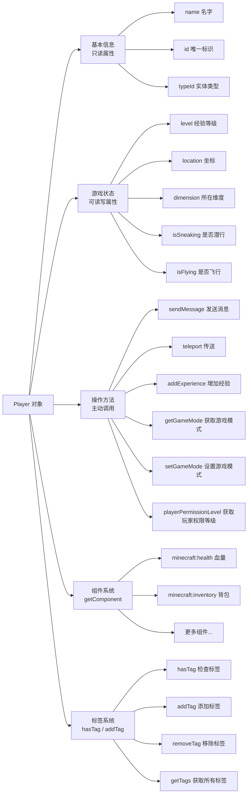

# 3.3 玩家对象的属性与方法

## 前言：认识玩家

在前两节中，我们学会了从 `world` 获取玩家列表，并对列表进行各种筛选和遍历操作。但每次操作的最终目标，都是拿到一个具体的**玩家对象（Player）**，然后对它做些什么。

玩家对象是 Script API 中你打交道最多的对象之一。它不只是一个数据容器，它代表了游戏世界里一个活生生的玩家——有名字、有位置、有状态、有能力，你可以读取它的信息，也可以对它执行操作。

这一节我们来系统地认识玩家对象上有哪些属性和方法，搞清楚每一个的含义和用法。

---

## 3.3.1 玩家对象的整体结构

先用一张图来建立整体印象：



组件系统和标签系统会在 3.6、3.7 两节详细介绍，这一节聚焦在基本信息、游戏状态和操作方法上。

---

## 3.3.2 基本信息属性

这些属性是玩家的"身份信息"，通常是只读的。

### name：玩家名字

```js title="scripts/main.js"
import { world } from "@minecraft/server";

world.afterEvents.playerSpawn.subscribe(({ player }) => {
    // name 是玩家的游戏内名字，字符串类型
    const name = player.name;
    console.log(`玩家名字：${name}`);

    // 名字可以直接用于字符串拼接
    player.sendMessage(`你好，${name}！`);
});
```

:::note
`player.name` 是玩家在游戏内显示的名字，对于正版账号来说就是微软账号的 Minecraft 用户名。这个名字在同一个服务器上是唯一的（同一时间不会有两个同名玩家在线），但在不同时间同一个名字可能对应不同的人（比如玩家改了名字）。

如果你需要一个真正永久唯一的标识符，应该使用下面介绍的 `id`。
:::

### id：唯一标识符

```js title="scripts/main.js"
import { world } from "@minecraft/server";

world.afterEvents.playerSpawn.subscribe(({ player }) => {
    // id 是玩家在这个世界里的唯一标识符，字符串类型
    const id = player.id;
    console.log(`玩家 ID：${id}`);
    // 输出类似：1234567890（具体格式取决于 API 版本）
});
```

`id` 是玩家在当前世界里的唯一数字标识，不同玩家的 `id` 不同，同一个玩家在同一个世界里的 `id` 始终相同。在需要跨越名字变更来稳定追踪玩家时，`id` 比 `name` 更可靠。

### typeId：实体类型 ID

```js title="scripts/main.js"
import { world } from "@minecraft/server";

world.afterEvents.entityHurt.subscribe((event) => {
    const entity = event.hurtEntity;

    // typeId 标识了这个实体的类型
    console.log(entity.typeId);

    // 玩家的 typeId 是固定的字符串
    if (entity.typeId === "minecraft:player") {
        console.log("受伤的是玩家");
    }
});
```

`typeId` 在事件处理里非常常用，因为很多事件同时对玩家和普通实体触发，需要用 `typeId` 来区分。

---

## 3.3.3 游戏状态属性

这些属性反映了玩家当前的游戏状态，部分可以直接读取，部分需要通过方法访问。

### level：经验等级

```js title="scripts/main.js"
import { world } from "@minecraft/server";

world.afterEvents.playerSpawn.subscribe(({ player }) => {
    // 读取经验等级
    const level = player.level;
    console.log(`${player.name} 的等级：${level}`);
});
```

### xpEarnedAtCurrentLevel 和 totalXpNeededForNextLevel

经验相关的两个属性：

```js title="scripts/main.js"
import { world } from "@minecraft/server";

world.afterEvents.playerSpawn.subscribe(({ player }) => {
    // 当前等级已积累的经验值
    const earned = player.xpEarnedAtCurrentLevel;
    // 升到下一级需要的总经验值
    const needed = player.totalXpNeededForNextLevel;

    const percentage = Math.round((earned / needed) * 100);
    player.sendMessage(
        `经验进度：${earned} / ${needed}（${percentage}%）`
    );
});
```

### location：当前坐标

```js title="scripts/main.js"
import { world } from "@minecraft/server";

world.afterEvents.playerSpawn.subscribe(({ player }) => {
    // location 是一个包含 x、y、z 的坐标对象
    const { x, y, z } = player.location;

    // 用 Math.floor 取整，让坐标显示更清晰
    player.sendMessage(
        `你的坐标：X=${Math.floor(x)}, Y=${Math.floor(y)}, Z=${Math.floor(z)}`
    );
});
```

`location` 和 `dimension` 会在 3.5 节详细介绍。

### isSneaking：是否正在潜行

```js title="scripts/main.js"
import { world } from "@minecraft/server";

world.afterEvents.playerSpawn.subscribe(({ player }) => {
    // isSneaking 是布尔值
    if (player.isSneaking) {
        player.sendMessage("你正在潜行。");
    }
});
```

### isFlying：是否正在飞行

```js title="scripts/main.js"
import { world } from "@minecraft/server";

// 在创造模式或旁观模式下，玩家可能正在飞行
world.afterEvents.playerSpawn.subscribe(({ player }) => {
    if (player.isFlying) {
        player.sendMessage("你正在飞行。");
    }
});
```

### isInWater、isOnGround 等状态属性

```js title="scripts/main.js"
import { world } from "@minecraft/server";

world.afterEvents.playerSpawn.subscribe(({ player }) => {
    console.log(`在地面上：${player.isOnGround}`);
    console.log(`在水中：${player.isInWater}`);
    console.log(`在熔岩中：${player.isInLava}`);
    console.log(`正在睡觉：${player.isSleeping}`);
    console.log(`正在游泳：${player.isSwimming}`);
    console.log(`正在爬行：${player.isCrawling}`);
    console.log(`正在跌落：${player.isFalling}`);
});
```

这些状态属性在很多游戏逻辑里非常有用，比如检测玩家是否踩到了危险区域、是否在水下需要补充氧气等。

Script API 还提供了非常多其它类型的属性。你可以通过[这里](https://jaylydev.github.io/scriptapi-docs/latest/classes/_minecraft_server.Player.html)查看

---

## 3.3.4 游戏模式：getGameMode 与 setGameMode

游戏模式需要通过方法来读取和设置，而不是直接访问属性：

```js title="scripts/main.js"
import { world, GameMode } from "@minecraft/server";

world.afterEvents.playerSpawn.subscribe(({ player }) => {
    // 获取当前游戏模式
    const mode = player.getGameMode();
    console.log(`游戏模式：${mode}`);

    // GameMode 枚举的四个值
    // GameMode.Survival   → "Survival"
    // GameMode.Creative   → "Creative"
    // GameMode.Adventure  → "Adventure"
    // GameMode.Spectator  → "Spectator"

    // 判断游戏模式
    if (mode === GameMode.Survival) {
        player.sendMessage("你在生存模式中。");
    }

    // 设置游戏模式
    player.setGameMode(GameMode.Creative);
    player.sendMessage("你的游戏模式已切换为创造模式。");
});
```

一个根据玩家游戏模式做不同处理的例子：

```js title="scripts/main.js"
import { world, GameMode } from "@minecraft/server";

function handlePlayerBasedOnMode(player) {
    const mode = player.getGameMode();
    const name = player.name;

    const modeDescriptions = {
        [GameMode.Survival]:  "生存",
        [GameMode.Creative]:  "创造",
        [GameMode.Adventure]: "冒险",
        [GameMode.Spectator]: "旁观",
    };

    const description = modeDescriptions[mode] ?? "未知";
    player.sendMessage(`${name}，你当前处于${description}模式。`);
}
```

---

## 3.3.5 获取权限等级：playerPermissionLevel

`playerPermissionLevel` 返回玩家目前权限等级。其中 `0` 为访客，`1` 为成员，`2` 为管理员，`3` 为自定义：

```js title="scripts/main.js"
import { world } from "@minecraft/server";

world.afterEvents.chatSend.subscribe(({ sender, message }) => {
    if (message === "!管理员指令") {
        // 检查权限
        if (!sender.playerPermissionLevel===2) {
            sender.sendMessage("§c权限不足！此指令仅限管理员使用。§r");
            return;
        }

        // 只有 OP 才能执行到这里
        sender.sendMessage("§a你已执行管理员指令。§r");
    }
});
```

在实际项目中，权限判断几乎是每个管理员指令的第一步。把它封装成一个工具函数会更方便：

```js title="scripts/playerUtils.js"
// 检查玩家是否有权限执行某个操作，没有权限则发送提示并返回 false
export function requireOp(player, actionDescription = "执行此操作") {
    if (player.playerPermissionLevel===2) return true;

    player.sendMessage(`§c权限不足！你没有权限${actionDescription}。§r`);
    return false;
}
```

```js title="scripts/commands.js"
import { requireOp } from "./playerUtils.js";

function handleKickCommand(sender, targetName) {
    if (!requireOp(sender, "踢出玩家")) return;

    // 只有 OP 才能执行到这里
    // ...踢出玩家的逻辑
}
```

---

## 3.3.6 经验操作：addExperience 与 addLevels

Script API 提供了直接操作玩家经验的方法：

```js title="scripts/main.js"
import { world } from "@minecraft/server";

world.afterEvents.playerSpawn.subscribe(({ player }) => {
    // 增加经验值（不是等级，而是原始经验值）
    player.addExperience(100);

    // 增加经验等级（正数增加，负数减少）
    player.addLevels(5);    // 加5级
    player.addLevels(-3);   // 减3级

    // 重置经验（清空所有经验和等级）
    player.resetLevel();
});
```

一个奖励系统的示例：

```js title="scripts/rewards.js"
import { world } from "@minecraft/server";

// 根据玩家完成的任务类型，发放对应的经验奖励
export function giveTaskReward(player, taskType) {
    const rewards = {
        "kill_monster": { exp: 50,  levels: 0, message: "击败怪物奖励 50 经验！" },
        "mine_diamond": { exp: 100, levels: 0, message: "挖到钻石奖励 100 经验！" },
        "build_house":  { exp: 0,   levels: 1, message: "完成建筑任务奖励 1 级！" },
    };

    const reward = rewards[taskType];
    if (!reward) return;

    if (reward.exp > 0)    player.addExperience(reward.exp);
    if (reward.levels > 0) player.addLevels(reward.levels);

    player.sendMessage(`§a${reward.message}§r`);
}
```

---

## 3.3.7 传送：teleport

`teleport` 是一个非常实用的方法，可以把玩家传送到指定坐标：

```js title="scripts/main.js"
import { world } from "@minecraft/server";

world.afterEvents.playerSpawn.subscribe(({ player }) => {
    // 基本传送：只指定坐标
    player.teleport({ x: 0, y: 64, z: 0 });
});
```

`teleport` 还支持更多参数，用于控制传送后的朝向和维度：

```js title="scripts/main.js"
import { world } from "@minecraft/server";

world.afterEvents.playerSpawn.subscribe(({ player }) => {
    // 传送时同时设置朝向（rotation）
    player.teleport(
        { x: 0, y: 64, z: 0 },
        {
            rotation: { x: 0, y: 90 }  // x 是俯仰角，y 是水平朝向（0=南，90=西，180=北，270=东）
        }
    );

    // 传送到不同维度
    const nether = world.getDimension("nether");
    player.teleport(
        { x: 0, y: 64, z: 0 },
        { dimension: nether }
    );
});
```

一个常用的传送工具函数集合：

```js title="scripts/teleportUtils.js"
import { world } from "@minecraft/server";

// 传送到固定的出生点
export function teleportToSpawn(player) {
    player.teleport({ x: 0, y: 64, z: 0 });
    player.sendMessage("已传送到出生点。");
}

// 传送到另一个玩家的位置
export function teleportToPlayer(player, targetName) {
    const target = world.getPlayers({ name: targetName })[0];

    if (!target) {
        player.sendMessage(`玩家 "${targetName}" 不在线。`);
        return false;
    }

    if (target.name === player.name) {
        player.sendMessage("你不能传送到自己。");
        return false;
    }

    player.teleport(target.location, { dimension: target.dimension });
    player.sendMessage(`已传送到 ${targetName} 的位置。`);
    target.sendMessage(`${player.name} 传送到了你的位置。`);
    return true;
}

// 传送玩家到指定坐标（带维度）
export function teleportTo(player, x, y, z, dimensionId = "overworld") {
    const dimension = world.getDimension(dimensionId);
    player.teleport({ x, y, z }, { dimension });
    player.sendMessage(
        `已传送到 (${Math.floor(x)}, ${Math.floor(y)}, ${Math.floor(z)})。`
    );
}
```

---

## 3.3.8 执行命令：runCommand

玩家对象提供了 `runCommand` 方法，可以让玩家以自己的身份执行一条 Minecraft 原版指令：

```js title="scripts/main.js"
import { world } from "@minecraft/server";

world.afterEvents.playerSpawn.subscribe(({ player }) => {
    // 以玩家身份执行原版指令
    // 注意：玩家执行指令会受到玩家权限的限制
    player.runCommand("effect @s speed 30 2");

    // 如果需要以管理员权限执行指令，用维度对象的 runCommand
    const overworld = world.getDimension("overworld");
    overworld.runCommand(`give ${player.name} diamond 1`);
});
```

:::warning
`runCommand` 是一个很方便但也很容易被滥用的方法。

使用 `runCommand` 执行原版指令有几个明显缺点：
- 性能比直接调用 API 方法差
- 指令字符串容易出现拼写错误，且错误在运行时才会发现
- 某些指令的执行结果难以在脚本里获取和处理

**原则：如果 Script API 提供了对应的方法，优先使用 API 方法，把 `runCommand` 作为最后手段。**

例如，给玩家发送消息应该用 `player.sendMessage()`，而不是 `player.runCommand("say ...")`；传送玩家应该用 `player.teleport()`，而不是 `player.runCommand("tp ...")`。
:::

---

## 3.3.9 标签系统：hasTag、addTag、removeTag

标签（Tag）是给玩家打上的自定义标记，可以用来标识玩家的角色、状态、权限等。标签是字符串，可以有多个：

```js title="scripts/main.js"
import { world } from "@minecraft/server";

world.afterEvents.playerSpawn.subscribe(({ player }) => {
    // 检查是否有某个标签
    if (player.hasTag("vip")) {
        player.sendMessage("欢迎回来，VIP 会员！");
    }

    // 添加标签
    player.addTag("member");
    player.addTag("online");

    // 移除标签
    player.removeTag("new_player");

    // 获取所有标签
    const tags = player.getTags();
    console.log(`${player.name} 的标签：${tags.join(", ")}`);
});
```

标签系统非常灵活，可以和过滤器结合，实现按标签筛选玩家：

```js title="scripts/main.js"
import { world } from "@minecraft/server";

// 给所有 VIP 玩家发送专属消息
const vipPlayers = world.getPlayers({ tags: ["vip"] });
vipPlayers.forEach(player => {
    player.sendMessage("§6[VIP] 感谢你的支持！§r");
});
```

一个基于标签的权限系统示例：

```js title="scripts/permissions.js"
// 定义权限标签
export const TAGS = {
    VIP:       "perm.vip",
    MODERATOR: "perm.moderator",
    ADMIN:     "perm.admin",
};

// 检查玩家是否有某个权限
export function hasPermission(player, tag) {
    return player.hasTag(tag) || player.playerPermissionLevel===2;
}

// 授予权限
export function grantPermission(player, tag) {
    if (player.hasTag(tag)) return false;  // 已有权限
    player.addTag(tag);
    return true;
}

// 撤销权限
export function revokePermission(player, tag) {
    if (!player.hasTag(tag)) return false;  // 没有权限
    player.removeTag(tag);
    return true;
}
```

---

## 3.3.10 属性的只读与可写

并不是所有属性都可以直接赋值修改。了解哪些属性是只读的，能帮你避免一类常见错误：

| 属性/方法 | 类型 | 是否可直接赋值 |
|-----------|------|---------------|
| `name` | string | 只读 |
| `id` | string | 只读 |
| `typeId` | string | 只读 |
| `level` | number | 只读（通过 `addLevels` 修改） |
| `location` | Vector3 | 只读（通过 `teleport` 修改） |
| `dimension` | Dimension | 只读（通过 `teleport` 修改） |
| `isSneaking` | boolean | 只读 |
| `isFlying` | boolean | 只读 |
| `isOnGround` | boolean | 只读 |
| `getGameMode()` | GameMode | 只读（通过 `setGameMode()` 修改） |

:::warning
尝试给只读属性赋值不会立刻报错（JavaScript 的特性），但修改不会生效，甚至可能在严格模式下抛出错误。

```js
// 这样写不会报错，但完全没有效果
player.name = "NewName";      // 不会改变玩家名字
player.level = 100;           // 不会改变玩家等级
player.location = { x: 0, y: 64, z: 0 };  // 不会传送玩家

// 正确的做法是使用对应的方法
player.addLevels(100 - player.level);   // 通过 addLevels 修改等级
player.teleport({ x: 0, y: 64, z: 0 }); // 通过 teleport 修改位置
```
:::

---

## 3.3.11 实战：综合属性读取与操作

把这一节的知识综合起来，写一个"玩家体检"系统：

```js title="scripts/playerInspector.js"
import { world, GameMode } from "@minecraft/server";

// 获取玩家游戏模式的中文描述
function getGameModeText(mode) {
    const modeMap = {
        [GameMode.Survival]:  "生存",
        [GameMode.Creative]:  "创造",
        [GameMode.Adventure]: "冒险",
        [GameMode.Spectator]: "旁观",
    };
    return modeMap[mode] ?? "未知";
}

// 获取玩家的当前状态标志
function getStatusFlags(player) {
    const flags = [];
    if (player.isSneaking) flags.push("潜行中");
    if (player.isFlying)   flags.push("飞行中");
    if (player.isInWater)  flags.push("在水中");
    if (player.isInLava)   flags.push("在熔岩中");
    if (player.isSleeping) flags.push("睡眠中");
    if (player.isSwimming) flags.push("游泳中");
    return flags.length > 0 ? flags.join("、") : "无特殊状态";
}

// 生成玩家完整的状态报告
export function generatePlayerReport(player) {
    const { x, y, z } = player.location;
    const mode = player.getGameMode();
    const tags = player.getTags();
    const health = player.getComponent("minecraft:health");
    const currentHealth = health?.currentValue ?? "未知";
    const maxHealth = health?.defaultValue ?? 20;

    const expProgress = player.totalXpNeededForNextLevel > 0
        ? Math.round((player.xpEarnedAtCurrentLevel / player.totalXpNeededForNextLevel) * 100)
        : 0;

    const lines = [
        `§l===== ${player.name} 的状态报告 =====§r`,
        `§e玩家 ID：§f${player.id}`,
        `§e游戏模式：§f${getGameModeText(mode)}`,
        `§e经验等级：§f${player.level} 级（进度 ${expProgress}%）`,
        `§e当前血量：§f${currentHealth} / ${maxHealth}`,
        `§e当前坐标：§f${Math.floor(x)}, ${Math.floor(y)}, ${Math.floor(z)}`,
        `§e所在维度：§f${player.dimension.id}`,
        `§e当前状态：§f${getStatusFlags(player)}`,
        `§e标签列表：§f${tags.length > 0 ? tags.join(", ") : "无"}`,
        `§eOP 权限：§f${player.playerPermissionLevel===2 ? "§a是§r" : "§c否§r"}`,
        "§l==================================§r",
    ];

    return lines.join("\n");
}
```

```js title="scripts/main.js"
import { world } from "@minecraft/server";
import { generatePlayerReport } from "./playerInspector.js";

world.afterEvents.chatSend.subscribe(({ sender, message }) => {
    // !我的状态：查看自己的状态
    if (message === "!我的状态") {
        sender.sendMessage(generatePlayerReport(sender));
        return;
    }

    // !查看 <名字>：OP 查看其他玩家的状态
    if (message.startsWith("!查看 ")) {
        if (!sender.playerPermissionLevel===2) {
            sender.sendMessage("§c权限不足。§r");
            return;
        }

        const targetName = message.slice("!查看 ".length).trim();
        const target = world.getPlayers({ name: targetName })[0];

        if (!target) {
            sender.sendMessage(`玩家 "${targetName}" 不在线。`);
            return;
        }

        sender.sendMessage(generatePlayerReport(target));
    }
});
```

进入游戏后输入 `!我的状态`，就能看到一份完整的个人状态报告。

---

## 本节知识总结

| 属性 / 方法 | 类型 | 说明 |
|-------------|------|------|
| `player.name` | string（只读） | 玩家名字 |
| `player.id` | string（只读） | 玩家唯一标识符 |
| `player.typeId` | string（只读） | 实体类型，玩家固定为 `"minecraft:player"` |
| `player.level` | number（只读） | 经验等级 |
| `player.xpEarnedAtCurrentLevel` | number（只读） | 当前等级已积累的经验 |
| `player.totalXpNeededForNextLevel` | number（只读） | 升级所需总经验 |
| `player.location` | Vector3（只读） | 当前坐标 |
| `player.dimension` | Dimension（只读） | 当前所在维度 |
| `player.isSneaking` | boolean（只读） | 是否正在潜行 |
| `player.isFlying` | boolean（只读） | 是否正在飞行 |
| `player.isOnGround` | boolean（只读） | 是否在地面上 |
| `player.isInWater` | boolean（只读） | 是否在水中 |
| `player.getGameMode()` | GameMode | 获取当前游戏模式 |
| `player.setGameMode(mode)` | void | 设置游戏模式 |
| `player.playerPermissionLevel` | number | 获取权限等级 |
| `player.addExperience(amount)` | number | 增加经验值，返回新总经验 |
| `player.addLevels(amount)` | number | 增减经验等级 |
| `player.resetLevel()` | void | 重置经验和等级 |
| `player.teleport(location, options?)` | void | 传送到指定位置 |
| `player.runCommand(command)` | CommandResult | 执行原版指令 |
| `player.hasTag(tag)` | boolean | 检查是否有某个标签 |
| `player.addTag(tag)` | boolean | 添加标签 |
| `player.removeTag(tag)` | boolean | 移除标签 |
| `player.getTags()` | string[] | 获取所有标签 |

---

## 课后练习

**练习1：** 实现一个 `!切换模式 <模式名>` 指令，支持"生存"、"创造"、"冒险"、"旁观"四种模式名称。只有 OP 才能切换别人的模式；非 OP 只能切换自己的模式，且只能在"生存"和"冒险"之间切换（不能给自己切换创造模式）。

**练习2：** 实现一个简单的 VIP 系统。当玩家加入时，检查他们是否有 `"vip"` 标签：有的话发送金色的专属欢迎消息，并给他们额外的 5 个经验等级作为奖励。同时实现 `!授予VIP <玩家名>` 和 `!撤销VIP <玩家名>` 两个 OP 指令，用于管理 VIP 标签。

**练习3（思考题）：** 在 3.3.8 中，我们提到"如果 Script API 提供了对应的方法，优先使用 API 方法"。但有些场景里，`runCommand` 确实是唯一或最简单的方案。思考以下几种操作，Script API 有没有直接的方法实现？如果没有，使用 `runCommand` 是合理的吗？
- 给玩家播放一个特定的声音
- 给玩家显示一个成就获取的弹出提示
- 在玩家周围生成烟花粒子效果

---

> **下一节预告：3.4 向玩家发送消息**
>
> 在这一节里，我们一直用 `player.sendMessage()` 向玩家发送普通的聊天消息。但 Minecraft 里的消息远不止聊天栏这一种形式——还有屏幕中央的大标题、副标题，以及底部动作栏的小提示。下一节我们将完整介绍向玩家传递信息的所有方式，让你的脚本能够在正确的场合用正确的方式和玩家沟通。