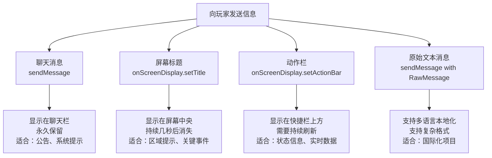
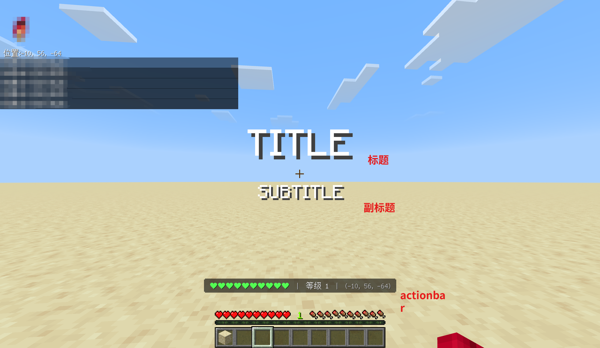
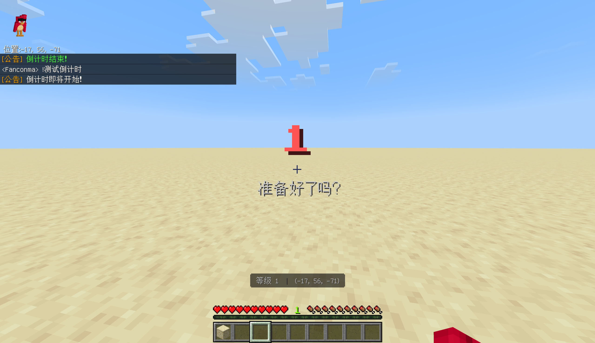

# 3.4 向玩家发送消息

## 前言：不只是聊天栏

到目前为止，我们向玩家发送信息只用过一种方式：`player.sendMessage()`。它把消息发送到聊天栏，简单直接。

但想象一下真实游戏里的各种提示场景：玩家进入一个新区域时，屏幕中央弹出的大标题"欢迎来到地狱"；玩家血量不足时，屏幕下方动作栏持续显示的"⚠ 血量极低"；或者关键剧情时刻，占满整个屏幕的标题文字。这些都不是聊天消息能做到的效果。

Minecraft Script API 提供了多种向玩家传递信息的方式，每种方式有不同的视觉效果和适用场景。这一节我们来完整地认识它们。

---

## 3.4.1 四种消息类型总览



---

## 3.4.2 sendMessage：聊天栏消息

`sendMessage` 是最基础的消息发送方式，消息会出现在聊天栏，并永久保留在聊天记录里。

**基本用法：**

```js title="scripts/main.js"
import { world } from "@minecraft/server";

world.afterEvents.playerSpawn.subscribe(({ player }) => {
    // 发送普通字符串
    player.sendMessage("欢迎来到服务器！");

    // 发送带格式代码的字符串
    player.sendMessage("§a§l欢迎来到服务器！§r");

    // 发送模板字符串
    const playerName = player.name;
    player.sendMessage(`欢迎，${playerName}！你的等级是 ${player.level}。`);
});
```

**world.sendMessage 与 player.sendMessage 的区别：**

```js title="scripts/main.js"
import { world } from "@minecraft/server";

// 向所有在线玩家发送（广播）
world.sendMessage("这条消息所有人都能看到！");

// 只向特定玩家发送
const target = world.getPlayers({ name: "Steve" })[0];
if (target) {
    target.sendMessage("这条消息只有 Steve 能看到。");
}
```

**多行消息：**

```js title="scripts/main.js"
import { world } from "@minecraft/server";

world.afterEvents.playerSpawn.subscribe(({ player }) => {
    // 用 \n 换行，实现多行消息
    player.sendMessage([
        "§l=== 服务器规则 ===§r",
        "1. 禁止破坏他人建筑",
        "2. 禁止使用作弊软件",
        "3. 文明用语，友善交流",
        "§7违规者将被封禁。§r",
    ].join("\n"));
    
    // 也可以这样
    player.sendMessage(
        §l=== 服务器规则 ===§r\n1. 禁止破坏他人建筑\n2. 禁止使用作弊软件\n3. 文明用语，友善交流\n§7违规者将被封禁。§r
        );
});
```

---

## 3.4.3 onScreenDisplay：屏幕显示系统

玩家对象上有一个 `onScreenDisplay` 属性，它是控制屏幕上各种显示元素的入口。

```js title="scripts/main.js"
import { world } from "@minecraft/server";

world.afterEvents.playerSpawn.subscribe(({ player }) => {
    // 通过 onScreenDisplay 访问屏幕显示功能
    const display = player.onScreenDisplay;

    // display 提供了两个主要方法：
    // setTitle      → 设置屏幕中央的大标题
    // setActionBar  → 设置动作栏（快捷栏上方）的文字
});
```

---

## 3.4.4 setTitle：屏幕中央标题

`setTitle` 在玩家屏幕中央显示一段大标题文字，几秒后自动消失。这是游戏里最醒目的消息形式，适合用于重要事件的提示。

**基本用法：**

```js title="scripts/main.js"
import { world } from "@minecraft/server";

world.afterEvents.playerSpawn.subscribe(({ player }) => {
    // 设置标题（显示在屏幕中央，字体较大）
    player.onScreenDisplay.setTitle("§6欢迎来到服务器！§r");
});
```

**带副标题和时间控制：**

`setTitle` 可以接受一个选项对象，用于设置副标题和显示时间：

```js title="scripts/main.js"
import { world } from "@minecraft/server";

world.afterEvents.playerSpawn.subscribe(({ player }) => {
    player.onScreenDisplay.setTitle("§6欢迎回来§r", {
        // 副标题，显示在主标题下方，字体稍小
        subtitle: `§f${player.name}，你已离开 3 天§r`,

        // 淡入时间（游戏刻）：标题从透明到完全显示的过渡时间
        fadeInDuration: 10,

        // 保持时间（游戏刻）：标题完全显示的持续时间
        stayDuration: 70,

        // 淡出时间（游戏刻）：标题从显示到完全消失的过渡时间
        fadeOutDuration: 20,
    });
});
```

时间参数的换算（20刻 = 1秒）：

| 参数 | 建议值（刻） | 对应时间 |
|------|------------|---------|
| `fadeInDuration` | 10 | 0.5秒 |
| `stayDuration` | 70 | 3.5秒 |
| `fadeOutDuration` | 20 | 1秒 |

以上是 Minecraft 原版标题的默认时长，用户体验上比较舒适。

**只更新副标题，不重置主标题：**

如果你想在不改变主标题的情况下更新副标题，可以单独使用 `updateSubtitle`：

```js title="scripts/main.js"
import { world, system } from "@minecraft/server";

world.afterEvents.playerSpawn.subscribe(({ player }) => {
    // 先设置主标题
    player.onScreenDisplay.setTitle("§c倒计时§r", {
        stayDuration: 100,
    });

    // 每秒更新副标题显示剩余时间
    let remaining = 5;
    const timerId = system.runInterval(() => {
        if (remaining <= 0) {
            system.clearRun(timerId);
            player.onScreenDisplay.setTitle("§a开始！§r");
            return;
        }

        // 只更新副标题，不重置主标题和计时
        player.onScreenDisplay.updateSubtitle(`§f${remaining} 秒后开始§r`);
        remaining--;
    }, 20);
});
```

:::tip
`setTitle` 每次调用都会重置标题的计时器。如果你在很短的时间内多次调用 `setTitle`，标题会持续"刷新"而不会消失，这在某些场景下是有意为之的行为（比如持续显示动态信息）。

但如果你希望标题只出现一次然后自然消失，就不要在 `stayDuration` 结束之前再次调用 `setTitle`。
:::

---

## 3.4.5 setActionBar：动作栏消息

动作栏（Action Bar）是显示在玩家快捷栏正上方的一行文字。它的特点是：

- 位置固定，不像聊天消息那样会被其他消息推上去
- 显示时间较短（约3秒），需要持续刷新才能保持显示
- 非常适合显示实时变化的状态信息

```js title="scripts/main.js"
import { world, system } from "@minecraft/server";

// 每秒刷新所有玩家的动作栏，显示实时坐标
system.runInterval(() => {
    for (const player of world.getPlayers()) {
        const { x, y, z } = player.location;
        player.onScreenDisplay.setActionBar(
            `§7坐标：§f${Math.floor(x)}, ${Math.floor(y)}, ${Math.floor(z)}`
        );
    }
}, 5);
```

**动作栏的典型应用——实时状态 HUD：**

```js title="scripts/hud.js"
import { world, system } from "@minecraft/server";

// 构建玩家的 HUD 信息字符串
function buildHudText(player) {
    const { x, y, z } = player.location;
    const health = player.getComponent("minecraft:health");
    const currentHealth = Math.ceil(health?.currentValue ?? 20);
    const maxHealth = health?.defaultValue ?? 20;

    // 根据血量选择颜色
    let healthColor = "§a";  // 绿色（血量充足）
    if (currentHealth <= 10) healthColor = "§e";  // 黄色（血量一般）
    if (currentHealth <= 6)  healthColor = "§c";  // 红色（血量低）

    // 用心形符号显示血量（每个 ❤ 代表2点血量）
    const hearts = Math.ceil(currentHealth / 2);
    const heartDisplay = "❤".repeat(hearts);

    const coord = `(${Math.floor(x)}, ${Math.floor(y)}, ${Math.floor(z)})`;

    return `${healthColor}${heartDisplay}§r  §7|§r  §f等级 ${player.level}§r  §7|§r  §7${coord}§r`;
}

// 启动 HUD 系统
export function startHudSystem() {
    system.runInterval(() => {
        for (const player of world.getPlayers()) {
            player.onScreenDisplay.setActionBar(buildHudText(player));
        }
    }, 20);   // 每秒刷新一次
}
```

```js title="scripts/main.js"
import { world } from "@minecraft/server";
import { startHudSystem } from "./hud.js";

world.afterEvents.worldLoad.subscribe(() => {
    startHudSystem();
});
```

:::note
动作栏消息大约3秒后会自动消失。如果你想让它持续显示，需要每隔不超过3秒调用一次 `setActionBar`。上面的例子每20刻（1秒）刷新一次，完全足够保持持续显示。

但也不要刷新得太频繁，每刻都刷新（interval 为 1）是没有必要的，视觉上和每秒刷新没有区别，却白白浪费了性能。
:::

---

## 3.4.6 标题、副标题与动作栏的位置关系

用一张示意图来直观理解三种屏幕显示元素的位置：


聊天栏消息（sendMessage）显示在左上角，向上堆叠


---

## 3.4.7 RawMessage：结构化消息

`sendMessage` 除了接受普通字符串，还接受一种叫做 **RawMessage** 的结构化消息对象。RawMessage 支持多语言本地化、变量插值等高级功能。

基本结构如下：

```js title="scripts/main.js"
import { world } from "@minecraft/server";

world.afterEvents.playerSpawn.subscribe(({ player }) => {
    // 普通文本的 RawMessage
    player.sendMessage({
        text: "这是一条 RawMessage 消息"
    });

    // 带变量插值的 RawMessage
    player.sendMessage({
        translate: "commands.give.success.single",
        with: ["1", "minecraft:diamond", player.name]
    });
});
```

RawMessage 的几种类型：

```js title="scripts/main.js"
import { world } from "@minecraft/server";

world.afterEvents.playerSpawn.subscribe(({ player }) => {
    // 类型1：纯文本
    const textMsg = {
        text: "普通文本消息"
    };

    // 类型2：翻译键（使用游戏内置的本地化字符串）
    const translateMsg = {
        translate: "death.attack.generic",
        with: { rawtext: [{ text: player.name }] }
    };

    // 类型3：多段拼接
    const compoundMsg = {
        rawtext: [
            { text: "§a欢迎，§r" },
            { text: player.name },
            { text: "§a！你的等级是 §r" },
            { text: String(player.level) },
            { text: "§a 级。§r" },
        ]
    };

    player.sendMessage(compoundMsg);
});
```

:::note
对于大多数日常开发场景，使用普通字符串（包括格式代码）完全足够，不需要用 RawMessage。

RawMessage 主要在以下情况下有价值：
- 你的插件需要支持多语言（使用 `translate` 键配合语言文件）
- 消息内容需要使用游戏内置的本地化字符串（如死亡消息、成就文字）
- 需要在消息里嵌入计分板的值或其他动态游戏数据

在本教程的大多数示例里，我们使用普通字符串，必要时才引入 RawMessage。
:::

---

## 3.4.8 根据场景选择合适的消息类型

不同的消息类型有不同的适用场景，下面给出一个选择指南：

| 场景 | 推荐方式 | 原因 |
|------|----------|------|
| 系统公告、规则通知 | `sendMessage` | 永久保留在聊天记录，玩家可以回滚查看 |
| 玩家加入欢迎 | `setTitle` + `sendMessage` | 标题醒目，聊天记录作为补充 |
| 进入新区域提示 | `setTitle` | 视觉冲击强，适合场景切换 |
| 操作成功/失败反馈 | `sendMessage` | 简单直接，不打扰游戏体验 |
| 实时状态显示（血量、坐标） | `setActionBar` | 不占用聊天栏，实时更新 |
| 倒计时 | `setTitle` + `updateSubtitle` | 直观，视觉效果好 |
| 游戏开始/结束 | `setTitle` | 全屏显示，足够醒目 |
| 警告（血量极低） | `sendMessage` 或 `setActionBar` | 根据紧急程度选择 |
| 调试信息 | `console.log` | 不影响玩家体验 |

---

## 3.4.9 实战：综合消息系统

把这一节所有的消息类型综合起来，构建一个完整的消息管理模块：

```js title="scripts/messageSystem.js"
import { world, system } from "@minecraft/server";

// =============================================
// 聊天消息
// =============================================

// 向单个玩家发送系统消息（带统一格式前缀）
export function sendSystemMessage(player, message) {
    player.sendMessage(`§8[系统]§r ${message}`);
}

// 向所有玩家广播（带统一格式）
export function broadcast(message) {
    world.sendMessage(`§6[公告]§r ${message}`);
}

// 向所有 OP 发送管理员消息
export function sendToOps(message) {
    for (const player of world.getPlayers()) {
        if (player.playerPermissionLevel === 2) {
            player.sendMessage(`§c[管理]§r ${message}`);
        }
    }
}

// 向指定玩家发送错误提示
export function sendError(player, message) {
    player.sendMessage(`§c[错误] ${message}§r`);
}

// 向指定玩家发送成功提示
export function sendSuccess(player, message) {
    player.sendMessage(`§a[成功] ${message}§r`);
}

// =============================================
// 屏幕标题
// =============================================

// 显示标准进入区域的标题提示
export function showAreaTitle(player, areaName, subtitle = "") {
    player.onScreenDisplay.setTitle(`§l${areaName}§r`, {
        subtitle: subtitle ? `§7${subtitle}§r` : "",
        fadeInDuration: 10,
        stayDuration: 60,
        fadeOutDuration: 20,
    });
}

// 显示游戏开始标题
export function showGameStart(player, gameName) {
    player.onScreenDisplay.setTitle(`§a§l游戏开始！§r`, {
        subtitle: `§f${gameName}§r`,
        fadeInDuration: 5,
        stayDuration: 40,
        fadeOutDuration: 15,
    });
}

// 显示游戏结束标题（胜利或失败）
export function showGameEnd(player, isWinner) {
    if (isWinner) {
        player.onScreenDisplay.setTitle("§6§l胜利！§r", {
            subtitle: "§f恭喜你赢得了比赛！§r",
            fadeInDuration: 10,
            stayDuration: 80,
            fadeOutDuration: 20,
        });
    } else {
        player.onScreenDisplay.setTitle("§c§l失败§r", {
            subtitle: "§7再接再厉！§r",
            fadeInDuration: 10,
            stayDuration: 80,
            fadeOutDuration: 20,
        });
    }
}

// 向所有玩家显示倒计时标题
export function showCountdown(seconds, onComplete) {
    let remaining = seconds;

    const timerId = system.runInterval(() => {
        const players = world.getPlayers();

        if (remaining > 0) {
            // 根据剩余秒数选择颜色
            const color = remaining <= 3 ? "§c" : "§e";

            for (const player of players) {
                player.onScreenDisplay.setTitle(
                    `${color}§l${remaining}§r`,
                    {
                        subtitle: "§7准备好了吗？§r",
                        fadeInDuration: 2,
                        stayDuration: 18,
                        fadeOutDuration: 2,
                    }
                );
            }

            remaining--;
        } else {
            system.clearRun(timerId);

            for (const player of players) {
                player.onScreenDisplay.setTitle("§a§l开始！§r", {
                    fadeInDuration: 5,
                    stayDuration: 30,
                    fadeOutDuration: 10,
                });
            }

            if (onComplete) onComplete();
        }
    }, 20);

    return timerId;
}

// =============================================
// 动作栏
// =============================================

// 向单个玩家的动作栏发送一次性消息（约3秒后消失）
export function showActionBarMessage(player, message) {
    player.onScreenDisplay.setActionBar(message);
}

// 启动持续显示的 HUD
export function startHud(formatFn) {
    return system.runInterval(() => {
        for (const player of world.getPlayers()) {
            player.onScreenDisplay.setActionBar(formatFn(player));
        }
    }, 20);
}
```

在主文件里组合使用这些函数：

```js title="scripts/main.js"
import { world } from "@minecraft/server";
import {
    sendSystemMessage,
    broadcast,
    showAreaTitle,
    showGameStart,
    showCountdown,
    startHud,
} from "./messageSystem.js";

// 启动 HUD：显示实时坐标和等级
world.afterEvents.worldLoad.subscribe(() => {
    startHud((player) => {
        const { x, y, z } = player.location;
        return `§7等级 ${player.level}§r  §8|§r  §7(${Math.floor(x)}, ${Math.floor(y)}, ${Math.floor(z)})§r`;
    });
});

// 玩家加入时显示欢迎标题
world.afterEvents.playerSpawn.subscribe(({ player, initialSpawn }) => {
    if (!initialSpawn) return;

    showAreaTitle(player, "欢迎来到服务器", "输入 !帮助 查看可用指令");
    sendSystemMessage(player, `你好，${player.name}！欢迎加入。`);
    broadcast(`§e${player.name}§r 加入了游戏。`);
});

// 指令处理
world.afterEvents.chatSend.subscribe(({ sender, message }) => {
    if (message === "!测试倒计时") {
        // 检查是否是 OP（正确的做法）
        if (sender.playerPermissionLevel !== 2) {
            sendSystemMessage(sender, "§c权限不足。§r");
            return;
        }

        broadcast("倒计时即将开始！");
        showCountdown(5, () => {
            broadcast("§a倒计时结束！§r");
        });
    }
});
```

太好了！你现在已经掌握怎样发送各样的消息了！

---


## 本节知识总结

| 方法 | 效果位置 | 持续时间 | 适用场景 |
|------|----------|----------|----------|
| `player.sendMessage(text)` | 聊天栏 | 永久 | 系统消息、公告、反馈 |
| `world.sendMessage(text)` | 所有人的聊天栏 | 永久 | 全服广播 |
| `player.onScreenDisplay.setTitle(text, options?)` | 屏幕中央 | 数秒后消失 | 区域提示、游戏事件 |
| `player.onScreenDisplay.updateSubtitle(text)` | 主标题下方 | 随主标题 | 倒计时、动态副标题 |
| `player.onScreenDisplay.setActionBar(text)` | 快捷栏上方 | 约3秒，需刷新 | 实时状态、HUD |
| `§` 格式代码 | 任意位置 | 随消息 | 颜色、加粗、斜体 |

---

## 课后练习

**练习1：** 实现一个"区域检测"系统。用 `system.runInterval` 每秒检查所有玩家的坐标，当玩家进入 X 坐标大于 100 的区域时，用 `setTitle` 显示"你已进入危险区域"，并持续用 `setActionBar` 显示"⚠ 危险区域"的红色警告。当玩家离开该区域时，清除动作栏消息（可以发送一个空字符串）。

**练习2：** 实现一个完整的倒计时指令 `!倒计时 <秒数>`，只有 OP 才能使用（使用 `playerPermissionLevel === 2` 判断）。倒计时期间，每秒更新所有玩家屏幕上的标题显示剩余秒数，剩余3秒时颜色变红，倒计时结束后向全服广播"时间到！"。

**练习3（思考题）：** `setActionBar` 需要持续刷新才能保持显示，这意味着如果你同时有多个系统都想往动作栏写内容（比如 HUD 系统和区域警告系统），它们会互相覆盖，只有最后一次调用的内容会显示出来。思考一下，如何设计一套机制，让多个系统能够"协作"地共享动作栏的显示权？（提示：考虑优先级队列或消息合并的思路。）

---

> **下一节预告：3.5 玩家的坐标与维度**
>
> 在这一节的 HUD 示例里，我们已经用到了 `player.location` 来获取坐标。但坐标系统远不止这么简单——不同维度之间的坐标如何换算？如何判断玩家是否进入了某个区域？如何计算两个玩家之间的距离？下一节我们将深入学习 Minecraft 的坐标系统和维度系统，让你能够精确地掌握游戏世界里的空间信息。