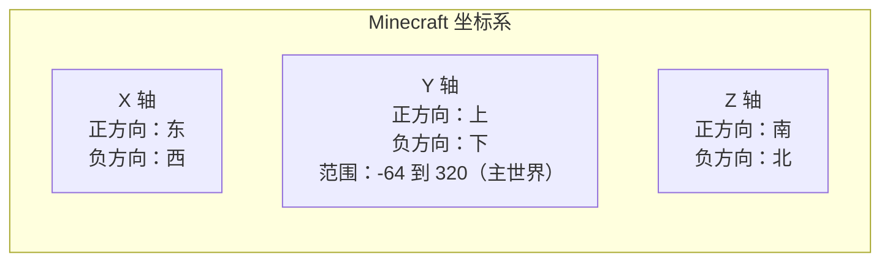

# 3.5 玩家的坐标与维度

## 前言：游戏世界里的"空间感"

在 Minecraft 里，每一个方块、每一个实体、每一个玩家都处于空间中的某个位置。这个位置由三个数字描述：X、Y、Z 坐标。而不同的维度（主世界、地狱、末地）又各自拥有独立的坐标空间。

听起来很简单，但在实际开发中，坐标相关的操作往往比想象中复杂：判断玩家是否在某个矩形区域内、计算两点之间的距离、处理维度之间的坐标换算、在正确的维度里执行操作……这些都需要对坐标和维度系统有清晰的理解。

这一节我们来系统地学习 Script API 中的坐标与维度，为后续涉及空间操作的功能打好基础。

---

## 3.5.1 坐标系统基础

Minecraft 使用标准的三维直角坐标系：



在脚本里，坐标用一个包含 `x`、`y`、`z` 三个属性的对象表示，类型叫做 `Vector3`，样子类似`{x: 10, y: 10, z: 10}`：

```js title="scripts/main.js"
import { world } from "@minecraft/server";

world.afterEvents.playerSpawn.subscribe(({ player }) => {
    // location 就是一个 Vector3 对象
    const location = player.location;

    console.log(location.x);  // X 坐标（东西方向）
    console.log(location.y);  // Y 坐标（高度）
    console.log(location.z);  // Z 坐标（南北方向）

    // 用解构赋值一次性取出三个值
    const { x, y, z } = player.location;
    console.log(`坐标：(${x}, ${y}, ${z})`);
});
```

---

## 3.5.2 获取和格式化坐标

在开发中，坐标的获取和格式化是最基础的操作，建议封装成工具函数：

```js title="scripts/vectorUtils.js"
// 格式化坐标为可读字符串
export function formatLocation(location, decimals = 0) {
    if (decimals === 0) {
        return `(${Math.floor(location.x)}, ${Math.floor(location.y)}, ${Math.floor(location.z)})`;
    }
    const factor = Math.pow(10, decimals);
    const rx = Math.round(location.x * factor) / factor;
    const ry = Math.round(location.y * factor) / factor;
    const rz = Math.round(location.z * factor) / factor;
    return `(${rx}, ${ry}, ${rz})`;
}

// 计算两个坐标之间的直线距离
export function getDistance(locA, locB) {
    const dx = locA.x - locB.x;
    const dy = locA.y - locB.y;
    const dz = locA.z - locB.z;
    return Math.sqrt(dx * dx + dy * dy + dz * dz);
}

// 计算忽略 Y 轴的水平距离（更常用，避免高度差干扰）
export function getHorizontalDistance(locA, locB) {
    const dx = locA.x - locB.x;
    const dz = locA.z - locB.z;
    return Math.sqrt(dx * dx + dz * dz);
}

// 计算两个坐标的中点
export function getMidpoint(locA, locB) {
    return {
        x: (locA.x + locB.x) / 2,
        y: (locA.y + locB.y) / 2,
        z: (locA.z + locB.z) / 2,
    };
}

// 检查两个坐标是否相同（整数精度）
export function isSameBlock(locA, locB) {
    return Math.floor(locA.x) === Math.floor(locB.x)
        && Math.floor(locA.y) === Math.floor(locB.y)
        && Math.floor(locA.z) === Math.floor(locB.z);
}
```

---

## 3.5.3 区域判断：玩家是否在某个范围内

区域判断是实际开发中最高频的坐标操作之一，用于领地保护、触发区域、传送门检测等场景。

### 矩形区域（AABB）

最简单的区域形状是轴对齐包围盒（AABB），即一个平行于坐标轴的矩形区域，由两个对角坐标定义：

```js title="scripts/vectorUtils.js"
// 检查坐标是否在矩形区域内
// min 和 max 分别是区域的最小和最大角坐标
export function isInBoundingBox(location, min, max) {
    return location.x >= min.x && location.x <= max.x
        && location.y >= min.y && location.y <= max.y
        && location.z >= min.z && location.z <= max.z;
}

// 只检查水平范围（忽略 Y 轴），适合"进入某个区域"的判断
export function isInBoundingBoxXZ(location, min, max) {
    return location.x >= min.x && location.x <= max.x
        && location.z >= min.z && location.z <= max.z;
}
```

使用示例：

```js title="scripts/main.js"
import { world, system } from "@minecraft/server";
import { isInBoundingBox } from "./vectorUtils.js";

// 定义一个危险区域（岩浆湖附近）
const DANGER_ZONE = {
    min: { x: -50, y: 0,  z: -50 },
    max: { x: 50,  y: 64, z: 50  },
};

// 追踪玩家是否在危险区域内（避免反复触发提示）
const playerInDangerZone = new Set();

system.runInterval(() => {
    for (const player of world.getPlayers()) {
        const inZone = isInBoundingBox(player.location, DANGER_ZONE.min, DANGER_ZONE.max);
        const wasInZone = playerInDangerZone.has(player.name);

        if (inZone && !wasInZone) {
            // 刚进入危险区域
            playerInDangerZone.add(player.name);
            player.onScreenDisplay.setTitle("§c⚠ 危险区域§r", {
                subtitle: "§7小心熔岩！§r",
                fadeInDuration: 5,
                stayDuration: 40,
                fadeOutDuration: 10,
            });
        } else if (!inZone && wasInZone) {
            // 刚离开危险区域
            playerInDangerZone.delete(player.name);
            player.sendMessage("§a你已离开危险区域。§r");
        }

        // 在危险区域内持续显示动作栏警告
        if (inZone) {
            player.onScreenDisplay.setActionBar("§c⚠ 危险区域 — 小心熔岩！§r");
        }
    }
}, 10);  // 每半秒检查一次（10刻）
```

### 球形区域（圆形范围）

用距离判断来实现球形区域检测：

```js title="scripts/vectorUtils.js"
// 检查坐标是否在以 center 为圆心、radius 为半径的球形区域内
export function isInSphere(location, center, radius) {
    return getDistance(location, center) <= radius;
}

// 检查坐标是否在以 center 为圆心、radius 为半径的圆柱形区域内（忽略Y轴）
export function isInCylinder(location, center, radius) {
    return getHorizontalDistance(location, center) <= radius;
}
```

---

## 3.5.4 玩家朝向：rotation

除了坐标，玩家还有一个朝向属性 `rotation`，描述玩家视角的方向：

```js title="scripts/main.js"
import { world } from "@minecraft/server";

world.afterEvents.playerSpawn.subscribe(({ player }) => {
    // rotation 包含两个角度值
    const rotation = player.getRotation();

    // x：俯仰角（pitch），范围 -90 到 90
    // -90 = 正上方，0 = 水平，90 = 正下方
    console.log(`俯仰角：${rotation.x}`);

    // y：偏航角（yaw），范围 -180 到 180
    // 0 = 朝南，90 = 朝西，-90 = 朝东，±180 = 朝北
    console.log(`偏航角：${rotation.y}`);
});
```

把偏航角转换成方向描述：

```js title="scripts/vectorUtils.js"
// 根据偏航角返回玩家面朝的方向名称
export function getFacingDirection(yaw) {
    // 归一化到 0-360 范围
    const normalized = ((yaw % 360) + 360) % 360;

    if (normalized >= 315 || normalized < 45)  return "南";
    if (normalized >= 45  && normalized < 135) return "西";
    if (normalized >= 135 && normalized < 225) return "北";
    return "东";
}
```

```js title="scripts/main.js"
import { world } from "@minecraft/server";
import { getFacingDirection } from "./vectorUtils.js";

world.afterEvents.chatSend.subscribe(({ sender, message }) => {
    if (message === "!朝向") {
        const rotation = sender.getRotation();
        const direction = getFacingDirection(rotation.y);
        sender.sendMessage(`你当前朝向：${direction}（偏航角：${Math.round(rotation.y)}°）`);
    }
});
```

---

## 3.5.5 维度系统

Minecraft 世界由三个维度组成，每个维度是独立的空间：

| 维度 ID | 名称 | 特点 |
|---------|------|------|
| `"overworld"` | 主世界 | Y 范围 -64 到 320 |
| `"nether"` | 地狱 | Y 范围 0 到 128，坐标缩放比 1:8 |
| `"the_end"` | 末地 | Y 范围 0 到 255 |

### 获取玩家所在维度

```js title="scripts/main.js"
import { world } from "@minecraft/server";

world.afterEvents.playerSpawn.subscribe(({ player }) => {
    // dimension 是一个 Dimension 对象
    const dimension = player.dimension;

    // dimension.id 是维度的字符串 ID
    console.log(`玩家所在维度：${dimension.id}`);

    // 根据维度做不同处理
    switch (dimension.id) {
        case "overworld":
            player.sendMessage("你在主世界。");
            break;
        case "nether":
            player.sendMessage("§c你在地狱，小心危险！§r");
            break;
        case "the_end":
            player.sendMessage("§5你在末地，注意末影龙！§r");
            break;
    }
});
```

### 获取维度对象

除了从玩家身上获取当前维度，也可以直接通过 `world.getDimension()` 获取任意维度：

```js title="scripts/main.js"
import { world } from "@minecraft/server";

const overworld = world.getDimension("overworld");
const nether    = world.getDimension("nether");
const theEnd    = world.getDimension("the_end");

// 维度对象可以用于在该维度执行各种操作
// 比如在主世界坐标 (0, 64, 0) 生成一只猪
overworld.spawnEntity("minecraft:pig", { x: 0, y: 64, z: 0 });
```

### 维度间传送

把玩家传送到不同的维度，需要在 `teleport` 的选项里指定目标维度：

```js title="scripts/teleportUtils.js"
import { world } from "@minecraft/server";

// 把玩家传送到地狱
export function sendToNether(player) {
    const nether = world.getDimension("nether");

    // 地狱坐标是主世界坐标的 1/8
    const netherX = player.location.x / 8;
    const netherZ = player.location.z / 8;

    player.teleport(
        { x: netherX, y: 64, z: netherZ },
        { dimension: nether }
    );

    player.sendMessage("§c你已传送到地狱！§r");
}

// 把玩家传送回主世界
export function sendToOverworld(player) {
    const overworld = world.getDimension("overworld");

    // 从地狱回主世界，坐标乘以 8
    let targetX = player.location.x;
    let targetZ = player.location.z;

    if (player.dimension.id === "nether") {
        targetX *= 8;
        targetZ *= 8;
    }

    player.teleport(
        { x: targetX, y: 64, z: targetZ },
        { dimension: overworld }
    );

    player.sendMessage("§a你已传送回主世界！§r");
}

// 传送到末地的固定位置（末地传送通常到达固定点）
export function sendToEnd(player) {
    const theEnd = world.getDimension("the_end");
    player.teleport(
        { x: 0, y: 64, z: 0 },
        { dimension: theEnd }
    );
    player.sendMessage("§5你已传送到末地！§r");
}
```

---

## 3.5.6 地狱坐标换算

地狱和主世界之间有一个特殊的坐标缩放关系：**主世界的 8 格 = 地狱的 1 格**。这是 Minecraft 里利用地狱传送门快速旅行的原理。

在脚本里处理这个换算：

```js title="scripts/vectorUtils.js"
const NETHER_SCALE = 8;

// 主世界坐标 → 地狱坐标
export function overworldToNether(location) {
    return {
        x: location.x / NETHER_SCALE,
        y: location.y,   // Y 轴不缩放
        z: location.z / NETHER_SCALE,
    };
}

// 地狱坐标 → 主世界坐标
export function netherToOverworld(location) {
    return {
        x: location.x * NETHER_SCALE,
        y: location.y,
        z: location.z * NETHER_SCALE,
    };
}

// 根据玩家当前维度，计算在另一个维度的对应坐标
export function getCorrespondingLocation(player) {
    const loc = player.location;

    if (player.dimension.id === "overworld") {
        return {
            location: overworldToNether(loc),
            dimensionId: "nether",
        };
    }

    if (player.dimension.id === "nether") {
        return {
            location: netherToOverworld(loc),
            dimensionId: "overworld",
        };
    }

    // 末地没有对应关系
    return null;
}
```

---

## 3.5.7 实战：完整的坐标与维度工具系统

把这一节所有的知识综合起来，构建一个实用的坐标与维度管理系统：

```js title="scripts/spatialSystem.js"
import { world, system } from "@minecraft/server";

// =============================================
// 基础数学工具
// =============================================

export function getDistance(locA, locB) {
    const dx = locA.x - locB.x;
    const dy = locA.y - locB.y;
    const dz = locA.z - locB.z;
    return Math.sqrt(dx * dx + dy * dy + dz * dz);
}

export function getHorizontalDistance(locA, locB) {
    const dx = locA.x - locB.x;
    const dz = locA.z - locB.z;
    return Math.sqrt(dx * dx + dz * dz);
}

export function formatLocation(location) {
    return `(${Math.floor(location.x)}, ${Math.floor(location.y)}, ${Math.floor(location.z)})`;
}

// =============================================
// 区域定义与检测
// =============================================

// 创建一个矩形区域对象
export function createRegion(name, min, max, dimensionId = "overworld") {
    return { name, min, max, dimensionId };
}

// 检查玩家是否在指定区域内（包含维度检查）
export function isPlayerInRegion(player, region) {
    if (player.dimension.id !== region.dimensionId) return false;

    const { x, y, z } = player.location;
    return x >= region.min.x && x <= region.max.x
        && y >= region.min.y && y <= region.max.y
        && z >= region.min.z && z <= region.max.z;
}

// =============================================
// 区域事件系统
// =============================================

// 存储区域定义和玩家的区域状态
const registeredRegions = [];
const playerRegionState = new Map();  // Map<playerName, Set<regionName>>

// 注册一个区域，当玩家进出时触发回调
export function registerRegion(region, onEnter, onLeave) {
    registeredRegions.push({ region, onEnter, onLeave });
}

// 启动区域检测系统
export function startRegionDetection(intervalTicks = 10) {
    system.runInterval(() => {
        for (const player of world.getPlayers()) {
            const name = player.name;

            // 确保这个玩家有状态记录
            if (!playerRegionState.has(name)) {
                playerRegionState.set(name, new Set());
            }

            const currentRegions = playerRegionState.get(name);

            for (const { region, onEnter, onLeave } of registeredRegions) {
                const inRegion = isPlayerInRegion(player, region);
                const wasInRegion = currentRegions.has(region.name);

                if (inRegion && !wasInRegion) {
                    currentRegions.add(region.name);
                    if (onEnter) onEnter(player, region);
                } else if (!inRegion && wasInRegion) {
                    currentRegions.delete(region.name);
                    if (onLeave) onLeave(player, region);
                }
            }
        }
    }, intervalTicks);
}

// 清理离线玩家的状态
export function cleanupPlayerState(playerName) {
    playerRegionState.delete(playerName);
}

// =============================================
// 距离相关工具
// =============================================

// 找出距离某个位置最近的玩家
export function getNearestPlayer(location, dimensionId) {
    const players = world.getPlayers().filter(
        p => p.dimension.id === dimensionId
    );

    if (players.length === 0) return null;

    return players.reduce((nearest, player) => {
        const distToNearest = getDistance(nearest.location, location);
        const distToCurrent = getDistance(player.location, location);
        return distToCurrent < distToNearest ? player : nearest;
    });
}

// 获取某个坐标附近（指定半径内）的所有玩家
export function getPlayersInRadius(location, radius, dimensionId) {
    return world.getPlayers().filter(player => {
        if (player.dimension.id !== dimensionId) return false;
        return getDistance(player.location, location) <= radius;
    });
}
```

在主文件里使用区域系统：

```js title="scripts/main.js"
import { world } from "@minecraft/server";
import {
    createRegion,
    registerRegion,
    startRegionDetection,
    cleanupPlayerState,
    formatLocation,
    getDistance,
} from "./spatialSystem.js";

// 定义游戏区域
const SPAWN_REGION = createRegion(
    "spawn",
    { x: -20, y: 60, z: -20 },
    { x: 20,  y: 80, z: 20  },
    "overworld"
);

const NETHER_FORTRESS = createRegion(
    "nether_fortress",
    { x: 100, y: 40, z: 100 },
    { x: 200, y: 120, z: 200 },
    "nether"
);

// 注册区域事件
registerRegion(
    SPAWN_REGION,
    // 进入出生点区域
    (player) => {
        player.onScreenDisplay.setTitle("§a出生点§r", {
            subtitle: "§7安全区域§r",
            fadeInDuration: 5,
            stayDuration: 40,
            fadeOutDuration: 10,
        });
        player.sendMessage("§a你进入了出生点保护区。§r");
    },
    // 离开出生点区域
    (player) => {
        player.sendMessage("§7你离开了出生点保护区，注意安全！§r");
    }
);

registerRegion(
    NETHER_FORTRESS,
    (player) => {
        player.onScreenDisplay.setTitle("§c地狱要塞§r", {
            subtitle: "§7充满危险…§r",
            fadeInDuration: 5,
            stayDuration: 60,
            fadeOutDuration: 15,
        });
    },
    (player) => {
        player.sendMessage("你离开了地狱要塞区域。");
    }
);

// 启动区域检测
world.afterEvents.worldLoad.subscribe(() => {
    startRegionDetection(10);
});

// 玩家离开时清理状态
world.afterEvents.playerLeave.subscribe(({ playerName }) => {
    cleanupPlayerState(playerName);
});

// 坐标相关指令
world.afterEvents.chatSend.subscribe(({ sender, message }) => {
    if (message === "!坐标") {
        const loc = sender.location;
        const dim = sender.dimension.id;
        sender.sendMessage(
            `当前位置：${formatLocation(loc)}\n维度：${dim}`
        );
    }

    if (message.startsWith("!距离 ")) {
        const targetName = message.slice("!距离 ".length).trim();
        const target = world.getPlayers({ name: targetName })[0];

        if (!target) {
            sender.sendMessage(`玩家 "${targetName}" 不在线。`);
            return;
        }

        if (target.dimension.id !== sender.dimension.id) {
            sender.sendMessage("你们不在同一个维度，无法计算距离。");
            return;
        }

        const dist = getDistance(sender.location, target.location);
        sender.sendMessage(
            `你与 ${targetName} 的距离：${Math.round(dist)} 格`
        );
    }
});
```

---

## 本节知识总结

| 概念 | API / 写法 | 说明 |
|------|-----------|------|
| 获取玩家坐标 | `player.location` | 返回 `{ x, y, z }` 对象 |
| 获取玩家朝向 | `player.getRotation()` | 返回 `{ x: 俯仰角, y: 偏航角 }` |
| 获取所在维度 | `player.dimension` | 返回 Dimension 对象 |
| 获取维度 ID | `player.dimension.id` | `"overworld"` / `"nether"` / `"the_end"` |
| 获取指定维度 | `world.getDimension("overworld")` | 返回 Dimension 对象 |
| 跨维度传送 | `player.teleport(loc, { dimension })` | 需要传入目标维度对象 |
| 坐标取整 | `Math.floor(location.x)` | 获取方块坐标 |
| 计算距离 | 勾股定理 | `Math.sqrt(dx²+dy²+dz²)` |
| 矩形区域判断 | 三轴范围判断 | `x >= min.x && x <= max.x && ...` |
| 球形区域判断 | 距离判断 | `getDistance(loc, center) <= radius` |
| 地狱坐标换算 | 主世界 ÷ 8 = 地狱 | 地狱传送门的核心原理 |

---

## 课后练习

**练习1：** 实现一个 `!传送到 <玩家名>` 指令，把发起者传送到目标玩家的位置。需要处理以下情况：目标玩家不在线、目标就是自己、目标和发起者在不同维度（跨维度传送应该能正常工作）。传送成功后，双方都收到一条提示消息。

**练习2：** 在 `spatialSystem.js` 的基础上，添加一个"禁区"功能：定义一个矩形区域，当非 OP 玩家（`player.playerPermissionLevel !== 2`）进入这个区域时，立刻把他们传送回进入前的位置，并发送"此区域禁止进入"的提示。提示：你需要在检测到玩家进入禁区之前，记录他们上一刻的安全位置。

**练习3（思考题）：** 在 3.5.7 中，我们实现了主世界和地狱之间的坐标换算。但实际上 Minecraft 原版的传送门系统比这复杂得多——它会寻找目标维度里最近的已有传送门，或者在合适的位置新建一个。思考一下：如果要用 Script API 实现一个"智能传送门"（优先找最近的已有传送门，找不到再直接按比例换算坐标传送），大概需要哪些步骤？目前我们学到的 API 能支持哪些部分？

---

> **下一节预告：3.6 玩家的组件系统**
>
> 在这一节和之前的几节里，我们多次用到了 `player.getComponent("minecraft:health")` 来获取玩家的血量，但每次都是蜻蜓点水，没有深入解释。下一节我们将正式介绍 Script API 的**组件系统**——这是 API 中管理实体属性的核心机制，理解了组件系统，你才能真正自由地读取和控制玩家（以及所有实体）的各种属性。