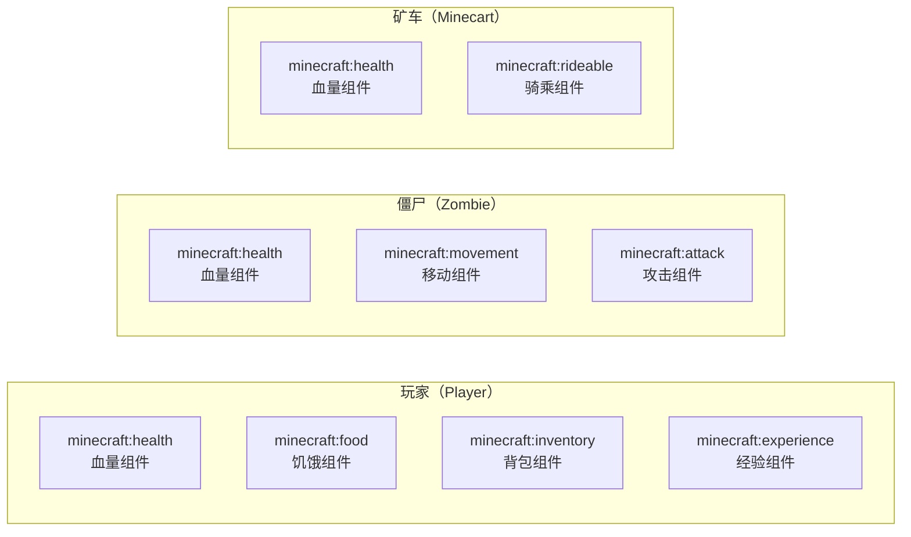
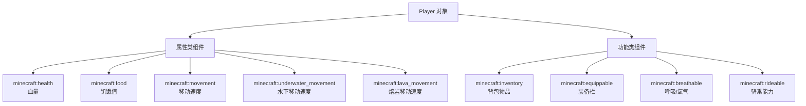

# 3.6 玩家的组件系统

## 前言：属性是如何被管理的

在前几节里，每当需要获取玩家血量时，我们都会写这样一行：

```js
const health = player.getComponent("minecraft:health").currentValue;
```

你可能一直有一个疑问：为什么不像获取名字那样直接写 `player.health`？为什么要通过 `getComponent` 这个方法，传入一个字符串来获取？

这背后是 Script API 的一个核心设计：**组件系统（Component System）**。

理解组件系统，是更好掌握API的关键一步。这一节我们来彻底搞清楚组件系统是什么，为什么这样设计，以及如何正确地使用它。

---

## 3.6.1 为什么需要组件系统

先从设计角度来理解这个问题。

Minecraft 世界里有数以百计的实体：玩家、僵尸、末影龙、矿车、画、盔甲架……它们有一些共同的属性（比如都有位置），但也有各自独特的属性（玩家有背包，矿车有轨道速度，末影龙有特殊的攻击模式）。

如果用传统的面向对象方式设计，可能会给每种实体创建一个类，然后把所有属性直接放在类上。但这会导致：
- 实体类型过多：几百种实体，几百个类
- 属性交叉复杂：很多属性是多种实体共享的，但不是全部实体都有
- 难以扩展：添加新实体或新属性都很麻烦

**组件系统的思路不同：** 把每一种"能力"或"属性"封装成一个独立的组件，实体只需要"挂载"它实际拥有的组件。



玩家、僵尸和矿车都有血量组件，但背包组件只有玩家有，骑乘组件只有矿车有。这种"按需挂载"的设计比继承关系更灵活，也更容易维护。

---

## 3.6.2 getComponent：获取组件

访问组件通过 `getComponent(componentId)` 方法：

```js title="scripts/main.js"
import { world } from "@minecraft/server";

world.afterEvents.playerSpawn.subscribe(({ player }) => {
    // 传入组件 ID（字符串），获取对应的组件对象
    const healthComponent = player.getComponent("minecraft:health");

    // 如果实体没有这个组件，返回 undefined
    if (!healthComponent) {
        console.log("玩家没有血量组件？这不应该发生。");
        return;
    }

    console.log(healthComponent.currentValue);  // 当前血量
});
```

:::warning
`getComponent` 返回的值可能是 `undefined`，这发生在实体没有挂载该组件的情况下。

**永远不要假设组件一定存在，每次获取后都要检查。**

```js
// 不推荐的写法：如果组件不存在，直接报错
const health = player.getComponent("minecraft:health").currentValue;

// 安全写法一：先检查
const healthComp = player.getComponent("minecraft:health");
if (healthComp) {
    console.log(healthComp.currentValue);
}

// 安全写法二：用可选链操作符 ?.
const health = player.getComponent("minecraft:health")?.currentValue ?? 20;
```

可选链操作符 `?.` 的含义是：如果左边的值是 `null` 或 `undefined`，整个表达式返回 `undefined` 而不是报错。配合 `??` 提供默认值，是处理组件的最简洁方式。
:::

---

## 3.6.3 组件的结构：属性与方法

每个组件对象上都有一些属性和方法，用于读取数据或执行操作。不同的组件有不同的属性和方法，但有几个是所有组件共有的：

```js title="scripts/main.js"
import { world } from "@minecraft/server";

world.afterEvents.playerSpawn.subscribe(({ player }) => {
    const healthComp = player.getComponent("minecraft:health");
    if (!healthComp) return;

    // 所有属性组件共有的属性
    console.log(healthComp.currentValue);    // 当前值
    console.log(healthComp.defaultValue);    // 默认值（初始值）
    console.log(healthComp.effectiveMax);    // 有效最大值（受效果影响后的上限）
    console.log(healthComp.effectiveMin);    // 有效最小值（通常是 0）
});
```

---

## 3.6.4 EntityAttributeComponent：数值属性组件的基类

血量、移动速度等数值型属性组件，都继承自 `EntityAttributeComponent`，共享相同的属性结构。

除了上面提到的四个属性，这类组件还提供了 `resetToDefaultValue` 和 `resetToMaxValue` 等方法：

```js title="scripts/main.js"
import { world } from "@minecraft/server";

world.afterEvents.playerSpawn.subscribe(({ player }) => {
    const healthComp = player.getComponent("minecraft:health");
    if (!healthComp) return;

    console.log(`当前血量：${healthComp.currentValue}`);
    console.log(`最大血量：${healthComp.effectiveMax}`);
    console.log(`默认血量：${healthComp.defaultValue}`);

    // 把当前值重置为默认值（满血）
    healthComp.resetToDefaultValue();
    console.log(`重置后：${healthComp.currentValue}`);

    // 把当前值设置为最大值
    healthComp.resetToMaxValue();

    // 直接设置当前值
    healthComp.setCurrentValue(10);
    console.log(`设置后：${healthComp.currentValue}`);
});
```

:::note
`setCurrentValue` 是设置血量最直接的方法，但它有一个限制：设置的值必须在 `effectiveMin` 和 `effectiveMax` 之间，超出范围的值会被截断到边界值。

另外，`setCurrentValue(0)` 并不会直接杀死玩家，它只是把血量数值设为 0。实际的死亡判定由游戏引擎在下一刻处理。
:::

---

## 3.6.5 hasComponent：检查组件是否存在

在访问组件之前，除了获取后判断是否为 `undefined`，还可以用 `hasComponent` 方法先检查：

```js title="scripts/main.js"
import { world } from "@minecraft/server";

world.afterEvents.entitySpawn.subscribe(({ entity }) => {
    // 检查实体是否有血量组件
    if (entity.hasComponent("minecraft:health")) {
        const health = entity.getComponent("minecraft:health");
        console.log(`${entity.typeId} 的血量：${health.currentValue}`);
    } else {
        console.log(`${entity.typeId} 没有血量组件`);
    }
});
```

在处理未知类型的实体时，`hasComponent` 是一个很好的前置检查手段，比直接获取再判断 `undefined` 更语义清晰。

---

## 3.6.6 玩家身上的主要组件

玩家对象上挂载了多种组件，下面按类别整理最常用的几个。详细的血量、饥饿等属性操作会在下一节（3.7）深入介绍，这里先建立整体认识。



---

## 3.6.7 minecraft:movement：移动速度组件

移动速度组件控制玩家（或实体）的移动速度：

```js title="scripts/main.js"
import { world } from "@minecraft/server";

world.afterEvents.playerSpawn.subscribe(({ player }) => {
    const movement = player.getComponent("minecraft:movement");
    if (!movement) return;

    console.log(`当前移动速度：${movement.currentValue}`);
    console.log(`默认移动速度：${movement.defaultValue}`);
    // 玩家默认移动速度约为 0.1

    // 加快速度（临时 buff 效果）
    movement.setCurrentValue(0.2);  // 双倍速度
    player.sendMessage("你的移动速度已提升！");

    // 恢复默认速度
    movement.resetToDefaultValue();
    player.sendMessage("移动速度已恢复正常。");
});
```

:::tip
直接修改 `movement` 组件的值会持续生效，直到你再次修改它。如果只是想给玩家临时的速度提升效果，使用药水效果（`player.addEffect`）会更合适，因为药水效果会自动在持续时间结束后失效。

但如果你需要精确控制某个玩家的永久移动速度（比如某些游戏模式里让所有人速度一致），直接修改组件值更合适。
:::

---

## 3.6.8 minecraft:breathable：呼吸/氧气组件

这个组件控制实体在水下的呼吸行为：

```js title="scripts/main.js"
import { world } from "@minecraft/server";

world.afterEvents.playerSpawn.subscribe(({ player }) => {
    const breathable = player.getComponent("minecraft:breathable");
    if (!breathable) return;

    // 氧气值（总量通常为 300）
    console.log(`当前氧气：${breathable.currentValue}`);
    console.log(`最大氧气：${breathable.effectiveMax}`);

    // 在某些特殊游戏模式里，可以修改氧气值
    breathable.setCurrentValue(breathable.effectiveMax);
    player.sendMessage("氧气已补满！");
});
```

---

## 3.6.9 minecraft:inventory：背包组件

背包组件提供了访问玩家背包物品的能力。这是一个功能型组件，和属性类组件的结构有所不同：

```js title="scripts/main.js"
import { world } from "@minecraft/server";

world.afterEvents.playerSpawn.subscribe(({ player }) => {
    const inventory = player.getComponent("minecraft:inventory");
    if (!inventory) return;

    // container 是一个容器对象，代表背包格子
    const container = inventory.container;
    if (!container) return;

    // 背包总格子数
    console.log(`背包大小：${container.size}`);

    // 遍历背包里的所有物品
    for (let i = 0; i < container.size; i++) {
        const item = container.getItem(i);

        if (item) {
            // item 是一个 ItemStack 对象
            console.log(`格子 ${i}：${item.typeId} x${item.amount}`);
        }
    }
});
```

背包操作在第七章（物品与背包）会有完整的专门介绍，这里先了解组件的基本结构。

---

## 3.6.10 minecraft:equippable：装备栏组件

装备栏组件用于访问和修改玩家的装备（头盔、胸甲、护腿、靴子、主手、副手）：

```js title="scripts/main.js"
import { world, EquipmentSlot } from "@minecraft/server";

world.afterEvents.playerSpawn.subscribe(({ player }) => {
    const equippable = player.getComponent("minecraft:equippable");
    if (!equippable) return;

    // EquipmentSlot 枚举定义了各个装备槽位
    // EquipmentSlot.Head      → 头盔
    // EquipmentSlot.Chest     → 胸甲
    // EquipmentSlot.Legs      → 护腿
    // EquipmentSlot.Feet      → 靴子
    // EquipmentSlot.Mainhand  → 主手
    // EquipmentSlot.Offhand   → 副手

    // 获取玩家头盔
    const helmet = equippable.getEquipment(EquipmentSlot.Head);
    if (helmet) {
        console.log(`玩家头盔：${helmet.typeId}`);
    } else {
        console.log("玩家没有佩戴头盔。");
    }

    // 获取主手物品
    const mainHand = equippable.getEquipment(EquipmentSlot.Mainhand);
    if (mainHand) {
        console.log(`主手物品：${mainHand.typeId}`);
    }
});
```

装备组件同样会在第七章详细介绍，这里建立基础认识即可。

---

## 3.6.11 组件 ID 的命名规律

你可能注意到，所有组件 ID 都以 `"minecraft:"` 开头，后面跟着组件的功能名称。这不是随机的，而是 Minecraft 的命名空间规范：

```
minecraft:health        → 血量
minecraft:food          → 饥饿
minecraft:movement      → 移动速度
minecraft:inventory     → 背包
minecraft:equippable    → 装备
minecraft:breathable    → 呼吸
```

这种命名空间规范的好处是：当你或别人添加自定义组件时，可以用自定义命名空间（比如 `myaddon:customcomp`）来避免和官方组件冲突。

---

## 3.6.12 为什么有些属性直接挂在玩家上，有些需要通过组件访问

你可能注意到，`player.name`、`player.level`、`player.location` 这些属性可以直接访问，而血量、饥饿值却需要通过组件。这个设计决策背后有一定的逻辑：

**直接属性：** 所有玩家都一定有的、且概念上"属于玩家本身"的信息。名字是玩家的标识，坐标是玩家的空间位置，等级是玩家的进度——这些是玩家对象的核心特征。

**组件属性：** 可以被各种实体共享、或者在不同情境下可能不存在的能力/属性。血量不只玩家有，实体也有；背包不只玩家有，某些实体（如驴）也有。通过组件系统统一管理，可以在任何实体上用同样的方式访问这些属性。

理解这个区别，能帮你在面对一个新的 API 属性时，快速判断它是直接属性还是组件属性：

```js
// 直接属性：玩家独有或概念上属于玩家本身
player.name
player.id
player.level
player.location
player.dimension
player.isSneaking

// 组件属性：通过 getComponent 访问
player.getComponent("minecraft:health")    // 血量
player.getComponent("minecraft:food")      // 饥饿
player.getComponent("minecraft:inventory") // 背包
```

---

## 3.6.13 实战：组件系统的综合应用

把这一节的知识综合起来，写一个实体信息检查工具：

```js title="scripts/entityInspector.js"
import { world, EquipmentSlot } from "@minecraft/server";

// =============================================
// 组件安全读取工具
// =============================================

// 安全地获取属性型组件的当前值
export function getComponentValue(entity, componentId, defaultValue = 0) {
    return entity.getComponent(componentId)?.currentValue ?? defaultValue;
}

// 安全地获取属性型组件的最大值
export function getComponentMax(entity, componentId, defaultValue = 0) {
    return entity.getComponent(componentId)?.effectiveMax ?? defaultValue;
}

// 安全地设置属性型组件的值
export function setComponentValue(entity, componentId, value) {
    const comp = entity.getComponent(componentId);
    if (!comp) return false;

    try {
        comp.setCurrentValue(value);
        return true;
    } catch (e) {
        console.warn(`设置组件 ${componentId} 失败：${e}`);
        return false;
    }
}

// =============================================
// 玩家状态读取
// =============================================

// 获取玩家的完整属性快照
export function getPlayerSnapshot(player) {
    const health   = player.getComponent("minecraft:health");
    const food     = player.getComponent("minecraft:food");
    const movement = player.getComponent("minecraft:movement");

    return {
        name:          player.name,
        health:        health?.currentValue ?? 0,
        maxHealth:     health?.effectiveMax ?? 20,
        food:          food?.currentValue ?? 0,
        maxFood:       food?.effectiveMax ?? 20,
        moveSpeed:     movement?.currentValue ?? 0.1,
        defaultSpeed:  movement?.defaultValue ?? 0.1,
        level:         player.level,
        isAdmin:       player.playerPermissionLevel === 2,
    };
}

// 格式化玩家快照为可读字符串
export function formatPlayerSnapshot(snapshot) {
    const healthPct = Math.round((snapshot.health / snapshot.maxHealth) * 100);
    const foodPct   = Math.round((snapshot.food   / snapshot.maxFood)   * 100);

    const speedStatus = snapshot.moveSpeed > snapshot.defaultSpeed
        ? "§a加速中§r"
        : snapshot.moveSpeed < snapshot.defaultSpeed
            ? "§c减速中§r"
            : "§7正常§r";

    return [
        `§l===== ${snapshot.name} 的属性快照 =====§r`,
        `§e血量：§f${snapshot.health.toFixed(1)} / ${snapshot.maxHealth} §7(${healthPct}%)§r`,
        `§e饥饿：§f${snapshot.food.toFixed(1)} / ${snapshot.maxFood} §7(${foodPct}%)§r`,
        `§e速度：§f${snapshot.moveSpeed.toFixed(3)} §7[${speedStatus}§7]§r`,
        `§e等级：§f${snapshot.level}§r`,
        `§e身份：§f${snapshot.isAdmin ? "§6管理员§r" : "§7普通玩家§r"}`,
        "§l=====================================§r",
    ].join("\n");
}

// =============================================
// 装备信息读取
// =============================================

// 获取玩家当前装备的文字描述
export function getEquipmentSummary(player) {
    const equippable = player.getComponent("minecraft:equippable");
    if (!equippable) return "无法读取装备信息。";

    const slots = [
        { slot: EquipmentSlot.Head,     label: "头盔" },
        { slot: EquipmentSlot.Chest,    label: "胸甲" },
        { slot: EquipmentSlot.Legs,     label: "护腿" },
        { slot: EquipmentSlot.Feet,     label: "靴子" },
        { slot: EquipmentSlot.Mainhand, label: "主手" },
        { slot: EquipmentSlot.Offhand,  label: "副手" },
    ];

    const lines = slots.map(({ slot, label }) => {
        const item = equippable.getEquipment(slot);
        const itemName = item ? item.typeId.replace("minecraft:", "") : "空";
        return `${label}：${item ? `§f${itemName}§r` : "§8空§r"}`;
    });

    return lines.join("\n");
}
```

在主文件中使用：

```js title="scripts/main.js"
import { world } from "@minecraft/server";
import {
    getPlayerSnapshot,
    formatPlayerSnapshot,
    getEquipmentSummary,
    setComponentValue,
} from "./entityInspector.js";

world.afterEvents.chatSend.subscribe(({ sender, message }) => {

    // !属性：查看自己的属性快照
    if (message === "!属性") {
        const snapshot = getPlayerSnapshot(sender);
        sender.sendMessage(formatPlayerSnapshot(snapshot));
        return;
    }

    // !装备：查看当前装备
    if (message === "!装备") {
        sender.sendMessage(
            "§l===== 当前装备 =====§r\n" +
            getEquipmentSummary(sender)
        );
        return;
    }

    // !满速：恢复移动速度（仅 OP）
    if (message === "!满速") {
        if (sender.playerPermissionLevel !== 2) {
            sender.sendMessage("§c权限不足。§r");
            return;
        }

        const movement = sender.getComponent("minecraft:movement");
        if (movement) {
            movement.resetToDefaultValue();
            sender.sendMessage("§a移动速度已恢复默认值。§r");
        }
        return;
    }
});
```

---

## 本节知识总结

| 概念 | 方法 / 属性 | 说明 |
|------|------------|------|
| 获取组件 | `entity.getComponent("组件ID")` | 返回组件对象或 `undefined` |
| 检查组件 | `entity.hasComponent("组件ID")` | 返回 `boolean` |
| 当前值 | `component.currentValue` | 属性当前的数值 |
| 默认值 | `component.defaultValue` | 属性的基础默认值 |
| 有效最大值 | `component.effectiveMax` | 受效果影响后的上限 |
| 有效最小值 | `component.effectiveMin` | 通常为 0 |
| 设置当前值 | `component.setCurrentValue(value)` | 直接设置数值 |
| 重置为默认 | `component.resetToDefaultValue()` | 恢复到默认值 |
| 重置为最大 | `component.resetToMaxValue()` | 设置为有效最大值 |
| 安全访问 | `entity.getComponent("...")?.currentValue ?? 默认值` | 用可选链防止报错 |
| 血量组件 | `"minecraft:health"` | 管理实体血量 |
| 饥饿组件 | `"minecraft:food"` | 管理玩家饥饿值 |
| 移动速度 | `"minecraft:movement"` | 管理移动速度 |
| 背包组件 | `"minecraft:inventory"` | 访问背包物品 |
| 装备组件 | `"minecraft:equippable"` | 访问和修改装备 |
| 呼吸组件 | `"minecraft:breathable"` | 管理氧气值 |

---

## 课后练习

**练习1：** 利用 `minecraft:movement` 组件，实现一个临时加速指令 `!加速 <秒数>`。玩家使用后，移动速度变为默认值的两倍，持续指定的秒数后自动恢复。使用 `system.runTimeout` 来处理恢复逻辑，并注意在恢复时检查玩家是否仍然在线（通过重新查找玩家名字）。

**练习2：** 写一个 `!背包统计` 指令，遍历玩家的背包，统计并输出以下信息：背包总格子数、已使用格子数（有物品的格子）、空格子数，以及背包里物品种类最多的前3种物品的名称和数量。

**练习3（思考题）：** 组件系统要求每次访问时都调用 `getComponent`，返回的组件对象是否可以安全地缓存起来，避免重复调用？比如这样：

```js
const healthComp = player.getComponent("minecraft:health");
// ... 很多刻之后 ...
// 此时 healthComp 还有效吗？
healthComp.currentValue;
```

思考一下：缓存的组件对象和在每次使用时重新调用 `getComponent` 相比，有什么风险？在什么情况下缓存是安全的，在什么情况下是不安全的？

---

> **下一节预告：3.7 血量、饥饿值与其他属性组件**
>
> 现在你已经理解了组件系统的整体架构和工作原理。下一节我们将深入到最常用的几个具体组件：血量（`minecraft:health`）、饥饿值（`minecraft:food`）和药水效果（`addEffect`）。这些是游戏玩法脚本中使用频率最高的属性操作，我们将结合真实的游戏场景，学习如何精确地控制这些属性。