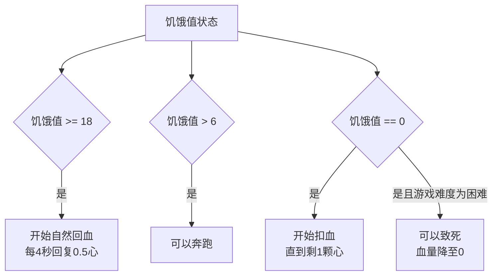

# 3.7 血量、饥饿值与其他属性组件

## 前言：精确控制玩家的生存状态

在上一节中，我们建立了对组件系统的整体认识。现在我们把目光聚焦在几个最重要、最常用的具体组件上。

血量和饥饿值是 Minecraft 生存机制的核心。几乎所有和"游戏玩法"相关的脚本，迟早都会需要读取或修改这两个属性——治疗玩家、惩罚玩家、实现自定义战斗系统、创造特殊的生存挑战……这些都离不开对血量和饥饿值的精确操控。

除此之外，这一节还会介绍药水效果系统，它是临时改变实体状态的最灵活手段。

---

## 3.7.1 血量组件：minecraft:health

血量组件是使用频率较高的组件。

### 读取血量

```js title="scripts/main.js"
import { world } from "@minecraft/server";

world.afterEvents.playerSpawn.subscribe(({ player }) => {
    const health = player.getComponent("minecraft:health");
    if (!health) return;

    // currentValue：当前血量
    // effectiveMax：有效最大血量（受效果影响，默认为 20）
    // defaultValue：默认最大血量（不受效果影响，固定为 20）
    // effectiveMin：有效最小血量（固定为 0）

    const current = health.currentValue;
    const max     = health.effectiveMax;
    const pct     = Math.round((current / max) * 100);

    player.sendMessage(`血量：${current.toFixed(1)} / ${max}（${pct}%）`);
});
```

### 修改血量

修改血量有三种方式，各有适用场景：

```js title="scripts/main.js"
import { world } from "@minecraft/server";

world.afterEvents.playerSpawn.subscribe(({ player }) => {
    const health = player.getComponent("minecraft:health");
    if (!health) return;

    // 方式一：setCurrentValue，直接设置为指定值
    // 值会被截断到 [effectiveMin, effectiveMax] 范围内
    health.setCurrentValue(10);    // 设置为半血
    health.setCurrentValue(0);     // 设置为 0（触发死亡判定）
    health.setCurrentValue(100);   // 超过最大值，实际设置为 effectiveMax

    // 方式二：resetToDefaultValue，恢复到默认最大值（满血）
    health.resetToDefaultValue();

    // 方式三：resetToMaxValue，设置为当前有效最大值（考虑效果加成）
    // 比如玩家有生命提升效果时，effectiveMax 可能是 24 或更高
    health.resetToMaxValue();
});
```

### 治疗玩家

治疗通常是"在当前值基础上增加"，而不是设置为固定值：

```js title="scripts/healthUtils.js"
import { world } from "@minecraft/server";

// 治疗玩家指定点数的血量
export function healPlayer(player, amount) {
    const health = player.getComponent("minecraft:health");
    if (!health) return;

    const newHealth = Math.min(
        health.currentValue + amount,
        health.effectiveMax    // 不超过最大血量
    );
    health.setCurrentValue(newHealth);
}

// 伤害玩家指定点数的血量
// 注意：这不是真正的"伤害"（不触发受伤动画和无敌帧）
// 只是直接修改血量数值
export function damagePlayer(player, amount) {
    const health = player.getComponent("minecraft:health");
    if (!health) return;

    const newHealth = Math.max(
        health.currentValue - amount,
        0   // 不低于 0
    );
    health.setCurrentValue(newHealth);
}

// 让玩家满血
export function fullHeal(player) {
    const health = player.getComponent("minecraft:health");
    if (!health) return;
    health.resetToMaxValue();
}

// 获取血量百分比（0 到 1 之间的小数）
export function getHealthPercent(player) {
    const health = player.getComponent("minecraft:health");
    if (!health || health.effectiveMax === 0) return 1;
    return health.currentValue / health.effectiveMax;
}
```

:::warning
用 `setCurrentValue` 修改血量和游戏内真正的"伤害"是不同的：

- **真正的伤害**：触发受伤动画、无敌帧（短暂无法再次受伤）、伤害声音，可以被护甲和效果减免
- **直接修改血量**：只改数值，不触发任何视觉或音效反馈，不受护甲影响

如果你想模拟真实的伤害效果（带无敌帧），应该使用 `entity.applyDamage()` 方法而不是直接修改血量组件。

```js
// 真正的伤害，带无敌帧和视觉反馈
player.applyDamage(5);

// 直接修改血量，无任何附加效果
player.getComponent("minecraft:health")?.setCurrentValue(
    player.getComponent("minecraft:health").currentValue - 5
);
```

在实际开发中，根据需求选择合适的方式：治疗用 `setCurrentValue`，造成伤害用 `applyDamage`。
:::

### applyDamage：真实伤害

```js title="scripts/main.js"
import { world, EntityDamageCause } from "@minecraft/server";

world.afterEvents.playerSpawn.subscribe(({ player }) => {
    // 基本用法：对玩家造成 5 点伤害
    player.applyDamage(5);

    // 指定伤害来源类型（影响死亡消息和某些游戏逻辑）
    player.applyDamage(10, {
        cause: EntityDamageCause.fall   // 摔落伤害
    });

    // 指定攻击者（用于击杀统计）
    player.applyDamage(8, {
        cause: EntityDamageCause.entityAttack,
        damagingEntity: someEntity  // 造成伤害的实体
    });
});
```

常用的 `EntityDamageCause` 枚举值：

| 枚举值 | 含义 |
|--------|------|
| `EntityDamageCause.fall` | 摔落伤害 |
| `EntityDamageCause.fire` | 着火伤害 |
| `EntityDamageCause.fireTick` | 持续燃烧 |
| `EntityDamageCause.lava` | 熔岩伤害 |
| `EntityDamageCause.drowning` | 溺水伤害 |
| `EntityDamageCause.starve` | 饥饿伤害 |
| `EntityDamageCause.entityAttack` | 实体攻击 |
| `EntityDamageCause.magic` | 魔法伤害 |
| `EntityDamageCause.void` | 虚空伤害 |
| `EntityDamageCause.none` | 无特定原因 |

---

## 3.7.2 饥饿组件：minecraft:food

饥饿值控制玩家的饥饿状态，影响自然回血和某些行为能力。

### 读取饥饿值

```js title="scripts/main.js"
import { world } from "@minecraft/server";

world.afterEvents.playerSpawn.subscribe(({ player }) => {
    const food = player.getComponent("minecraft:food");
    if (!food) return;

    // 饥饿值范围：0 到 20
    console.log(`饥饿值：${food.currentValue} / ${food.effectiveMax}`);

    // 饱和度（saturation）是饥饿系统里的隐藏值
    // 它决定了在饥饿值开始下降之前"缓冲"多少
    // 可以通过组件读取饥饿值，但饱和度通常不直接暴露
});
```

### 修改饥饿值

```js title="scripts/foodUtils.js"

// 给玩家补充饥饿值
export function feedPlayer(player, amount) {
    const food = player.getComponent("minecraft:food");
    if (!food) return;

    const newFood = Math.min(
        food.currentValue + amount,
        food.effectiveMax
    );
    food.setCurrentValue(newFood);
}

// 让玩家挨饿（减少饥饿值）
export function starvePlayer(player, amount) {
    const food = player.getComponent("minecraft:food");
    if (!food) return;

    const newFood = Math.max(
        food.currentValue - amount,
        0
    );
    food.setCurrentValue(newFood);
}

// 填满饥饿值
export function fillFood(player) {
    const food = player.getComponent("minecraft:food");
    if (!food) return;
    food.resetToMaxValue();
}

// 获取饥饿百分比
export function getFoodPercent(player) {
    const food = player.getComponent("minecraft:food");
    if (!food || food.effectiveMax === 0) return 1;
    return food.currentValue / food.effectiveMax;
}
```

### 饥饿值对游戏的影响

饥饿值不只是一个数字，它直接影响玩家的多项能力：



这些机制在脚本里通常不需要手动处理（游戏引擎自动处理），但了解它们有助于你设计合理的游戏玩法。

---

## 3.7.3 药水效果：addEffect 与 getEffects

药水效果（Potion Effect）是临时改变实体属性的系统，提供了比直接修改组件值更灵活的临时状态控制方式。

### 添加效果：addEffect

```js title="scripts/main.js"
import { world } from "@minecraft/server";

world.afterEvents.playerSpawn.subscribe(({ player }) => {
    // 基本用法：addEffect(效果ID, 持续时间（刻）, 选项)
    player.addEffect("speed", 200, {
        amplifier: 1,     // 效果等级，0 = I级，1 = II级，以此类推
        showParticles: true,  // 是否显示粒子效果
    });

    // 持续时间 200 刻 = 约10秒
    // amplifier 0 = 速度I，1 = 速度II，2 = 速度III
});
```

:::note
`addEffect` 的持续时间参数单位是**游戏刻**，20刻 = 1秒。如果需要"永久"效果，可以传入一个很大的值，比如 `999999`（约14小时游戏时间）。

`amplifier` 参数从 0 开始，0 对应效果 I 级，1 对应 II 级，以此类推。大多数效果最高到 IV 级（amplifier = 3），超出范围的值在不同版本里行为不同，建议不要超过 3。
:::

### 常用效果 ID

| 效果 ID | 中文名 | 效果描述 |
|---------|--------|----------|
| `"speed"` | 速度 | 提升移动速度 |
| `"slowness"` | 缓慢 | 降低移动速度 |
| `"haste"` | 急迫 | 提升挖掘速度 |
| `"mining_fatigue"` | 挖掘疲劳 | 降低挖掘速度 |
| `"strength"` | 力量 | 提升近战伤害 |
| `"instant_health"` | 瞬间治疗 | 立刻回复血量（不计持续时间） |
| `"instant_damage"` | 瞬间伤害 | 立刻造成伤害 |
| `"jump_boost"` | 跳跃提升 | 提升跳跃高度 |
| `"nausea"` | 反胃 | 屏幕扭曲效果 |
| `"regeneration"` | 生命恢复 | 持续回血 |
| `"resistance"` | 抗性提升 | 降低受到的伤害 |
| `"fire_resistance"` | 防火 | 免疫火焰和熔岩伤害 |
| `"water_breathing"` | 水下呼吸 | 可以在水下无限呼吸 |
| `"invisibility"` | 隐身 | 使实体隐形 |
| `"blindness"` | 失明 | 遮挡视野 |
| `"night_vision"` | 夜视 | 在黑暗中也能看清 |
| `"hunger"` | 饥饿 | 加速饥饿值下降 |
| `"weakness"` | 虚弱 | 降低近战伤害 |
| `"poison"` | 中毒 | 持续扣血（不会致死） |
| `"wither"` | 凋零 | 持续扣血（可以致死） |
| `"absorption"` | 伤害吸收 | 提供额外的黄色血量 |
| `"saturation"` | 饱和 | 快速填满饥饿值 |
| `"levitation"` | 漂浮 | 缓慢上升 |
| `"slow_falling"` | 缓降 | 降低下落速度 |
| `"conduit_power"` | 导管能量 | 水下急迫+水下呼吸+夜视 |

### 读取当前效果：getEffects

```js title="scripts/main.js"
import { world } from "@minecraft/server";

world.afterEvents.playerSpawn.subscribe(({ player }) => {
    // 获取玩家身上所有活跃的效果
    const effects = player.getEffects();

    if (effects.length === 0) {
        player.sendMessage("你当前没有任何药水效果。");
        return;
    }

    const effectList = effects.map(effect => {
        // effect.typeId      → 效果 ID（字符串）
        // effect.amplifier   → 效果等级（从 0 开始）
        // effect.duration    → 剩余持续时间（刻）
        const durationSec = Math.round(effect.duration / 20);
        const levelText   = ["I", "II", "III", "IV"][effect.amplifier] ?? effect.amplifier + 1;
        return `${effect.typeId} ${levelText}（剩余 ${durationSec} 秒）`;
    });

    player.sendMessage(`当前效果：\n${effectList.join("\n")}`);
});
```

### 获取单个效果：getEffect

```js title="scripts/main.js"
import { world } from "@minecraft/server";

world.afterEvents.playerSpawn.subscribe(({ player }) => {
    // 获取特定效果，如果不存在则返回 undefined
    const speedEffect = player.getEffect("speed");

    if (speedEffect) {
        console.log(`速度效果等级：${speedEffect.amplifier + 1}`);
        console.log(`剩余时间：${Math.round(speedEffect.duration / 20)} 秒`);
    } else {
        console.log("玩家没有速度效果。");
    }
});
```

### 移除效果：removeEffect

```js title="scripts/main.js"
import { world } from "@minecraft/server";

world.afterEvents.playerSpawn.subscribe(({ player }) => {
    // 移除特定效果
    player.removeEffect("poison");

    // 移除所有效果（遍历所有活跃效果逐一移除）
    const effects = player.getEffects();
    for (const effect of effects) {
        player.removeEffect(effect.typeId);
    }
});
```

---

## 3.7.4 效果工具函数示例

以下是一些效果工具函数示例：

```js title="scripts/effectUtils.js"
// =============================================
// 效果工具函数
// =============================================

// 给玩家一个临时的速度提升
export function giveSpeedBoost(player, durationSeconds, level = 1) {
    player.addEffect("speed", durationSeconds * 20, {
        amplifier: level - 1,  // 转换：等级 1 = amplifier 0
        showParticles: true,
    });
    player.sendMessage(`§a获得速度 ${["I","II","III","IV"][level-1] ?? level} 效果，持续 ${durationSeconds} 秒。§r`);
}

// 给玩家无限时间的夜视效果（用于特殊区域）
export function giveNightVision(player) {
    player.addEffect("night_vision", 999999, {
        amplifier: 0,
        showParticles: false,
    });
}

// 移除玩家的夜视效果
export function removeNightVision(player) {
    player.removeEffect("night_vision");
}

// 清除玩家所有负面效果
export function clearNegativeEffects(player) {
    const negativeEffects = [
        "slowness", "mining_fatigue", "nausea",
        "blindness", "hunger", "weakness",
        "poison", "wither", "levitation",
    ];

    let removed = 0;
    for (const effectId of negativeEffects) {
        if (player.getEffect(effectId)) {
            player.removeEffect(effectId);
            removed++;
        }
    }

    if (removed > 0) {
        player.sendMessage(`§a已清除 ${removed} 种负面效果。§r`);
    } else {
        player.sendMessage("§7你当前没有负面效果。§r");
    }
}

// 清除玩家所有效果
export function clearAllEffects(player) {
    const effects = player.getEffects();
    for (const effect of effects) {
        player.removeEffect(effect.typeId);
    }
    if (effects.length > 0) {
        player.sendMessage(`§a已清除全部 ${effects.length} 种药水效果。§r`);
    }
}

// 检查玩家是否有某个效果
export function hasEffect(player, effectId) {
    return player.getEffect(effectId) !== undefined;
}

// 治疗玩家（使用瞬间治疗效果，带视觉反馈）
export function healWithEffect(player, level = 1) {
    player.addEffect("instant_health", 1, {
        amplifier: level - 1,
        showParticles: true,
    });
}
```

---

## 3.7.5 实战：综合生存状态管理系统

把这一节所有的知识综合起来，构建一个完整的生存状态管理系统。这个系统会持续监控玩家状态，并在合适的时机进行干预：

```js title="scripts/survivalSystem.js"
import { world, system, EntityDamageCause } from "@minecraft/server";

// =============================================
// 配置
// =============================================

const CONFIG = {
    // 血量警告阈值
    healthDangerThreshold:  4,    // 低于此值：极度危险
    healthWarningThreshold: 8,    // 低于此值：偏低警告

    // 饥饿警告阈值
    foodWarningThreshold: 4,      // 低于此值：饥饿警告

    // 监控间隔（刻）
    monitorInterval: 40,          // 每2秒检查一次

    // 特殊区域治疗（出生点附近自动回血）
    spawnHealRadius:   10,
    spawnHealLocation: { x: 0, y: 64, z: 0 },
    spawnHealAmount:   1,         // 每次回复1点血量
};

// =============================================
// 内部工具
// =============================================

function getHealth(player) {
    return player.getComponent("minecraft:health")?.currentValue ?? 20;
}

function getMaxHealth(player) {
    return player.getComponent("minecraft:health")?.effectiveMax ?? 20;
}

function getFood(player) {
    return player.getComponent("minecraft:food")?.currentValue ?? 20;
}

function getDistance(locA, locB) {
    const dx = locA.x - locB.x;
    const dy = locA.y - locB.y;
    const dz = locA.z - locB.z;
    return Math.sqrt(dx * dx + dy * dy + dz * dz);
}

// 记录上一刻的状态，用于判断状态变化
const lastPlayerState = new Map();

// =============================================
// 状态检查函数
// =============================================

function checkHealth(player) {
    const health    = getHealth(player);
    const maxHealth = getMaxHealth(player);
    const pct       = Math.round((health / maxHealth) * 100);

    // 更新动作栏 HUD（与其他系统共享动作栏时，这里仅作示例）
    // 实际项目中建议使用统一的 HUD 管理系统

    if (health <= CONFIG.healthDangerThreshold) {
        player.onScreenDisplay.setActionBar(
            `§c⚠ 血量极低！${Math.ceil(health)} / ${maxHealth}（${pct}%）§r`
        );
        return "danger";
    }

    if (health <= CONFIG.healthWarningThreshold) {
        player.onScreenDisplay.setActionBar(
            `§e⚠ 血量偏低 ${Math.ceil(health)} / ${maxHealth}（${pct}%）§r`
        );
        return "warning";
    }

    return "normal";
}

function checkFood(player) {
    const food = getFood(player);

    if (food <= CONFIG.foodWarningThreshold) {
        return "warning";
    }

    return "normal";
}

function checkSpawnHeal(player) {
    const dist = getDistance(player.location, CONFIG.spawnHealLocation);

    if (dist <= CONFIG.spawnHealRadius) {
        const health    = getHealth(player);
        const maxHealth = getMaxHealth(player);

        if (health < maxHealth) {
            const newHealth = Math.min(health + CONFIG.spawnHealAmount, maxHealth);
            player.getComponent("minecraft:health")?.setCurrentValue(newHealth);
        }
    }
}

// =============================================
// 状态变化处理（只在状态改变时触发，避免刷屏）
// =============================================

function handleStateChange(player, newHealthStatus, newFoodStatus) {
    const name          = player.name;
    const lastState     = lastPlayerState.get(name) ?? {};
    const lastHealth    = lastState.healthStatus  ?? "normal";
    const lastFood      = lastState.foodStatus    ?? "normal";

    // 血量状态改变
    if (newHealthStatus !== lastHealth) {
        if (newHealthStatus === "danger") {
            player.sendMessage("§c[警告] 血量极低，请立即补充血量或寻找安全地点！§r");

            // 给全服 OP 发送警告
            for (const p of world.getPlayers()) {
                if (p.playerPermissionLevel === 2 && p.name !== name) {
                    p.sendMessage(`§c[系统] 玩家 ${name} 血量极低，请注意！§r`);
                }
            }
        } else if (newHealthStatus === "warning" && lastHealth === "normal") {
            player.sendMessage("§e[提示] 血量偏低，注意补充。§r");
        } else if (newHealthStatus === "normal" && lastHealth !== "normal") {
            player.sendMessage("§a[提示] 血量已恢复正常。§r");
        }
    }

    // 饥饿状态改变
    if (newFoodStatus !== lastFood) {
        if (newFoodStatus === "warning") {
            player.sendMessage("§e[提示] 你感到饥饿，请尽快进食。§r");
        } else if (newFoodStatus === "normal" && lastFood === "warning") {
            player.sendMessage("§a[提示] 饱腹状态已恢复。§r");
        }
    }

    // 更新记录
    lastPlayerState.set(name, {
        healthStatus: newHealthStatus,
        foodStatus:   newFoodStatus,
    });
}

// =============================================
// 导出函数
// =============================================

// 启动生存状态监控系统
export function startSurvivalMonitor() {
    system.runInterval(() => {
        for (const player of world.getPlayers()) {
            // 检查各项状态
            const healthStatus = checkHealth(player);
            const foodStatus   = checkFood(player);

            // 处理状态变化
            handleStateChange(player, healthStatus, foodStatus);

            // 出生点治疗
            checkSpawnHeal(player);
        }
    }, CONFIG.monitorInterval);

    console.log("[生存监控] 系统已启动。");
}

// 清理离线玩家的状态记录
export function cleanupPlayerSurvivalState(playerName) {
    lastPlayerState.delete(playerName);
}

// 手动治疗玩家（供其他模块调用）
export function healPlayer(player, amount, showEffect = true) {
    const health = player.getComponent("minecraft:health");
    if (!health) return;

    const newHealth = Math.min(health.currentValue + amount, health.effectiveMax);
    health.setCurrentValue(newHealth);

    if (showEffect) {
        player.addEffect("instant_health", 1, {
            amplifier: 0,
            showParticles: true,
        });
    }
}
```

在主文件中启动：

```js title="scripts/main.js"
import { world } from "@minecraft/server";
import {
    startSurvivalMonitor,
    cleanupPlayerSurvivalState,
    healPlayer,
} from "./survivalSystem.js";

world.afterEvents.worldLoad.subscribe(() => {
    startSurvivalMonitor();
});

// 玩家离开时清理状态
world.afterEvents.playerLeave.subscribe(({ playerName }) => {
    cleanupPlayerSurvivalState(playerName);
});

// 治疗指令
world.afterEvents.chatSend.subscribe(({ sender, message }) => {
    if (message === "!治疗") {
        healPlayer(sender, 20);
        sender.sendMessage("§a已为你补满血量！§r");
        return;
    }

    if (message.startsWith("!治疗 ") && sender.playerPermissionLevel === 2) {
        const targetName = message.slice("!治疗 ".length).trim();
        const target = world.getPlayers({ name: targetName })[0];

        if (!target) {
            sender.sendMessage(`玩家 "${targetName}" 不在线。`);
            return;
        }

        healPlayer(target, 20);
        target.sendMessage(`§a管理员 ${sender.name} 为你补满了血量！§r`);
        sender.sendMessage(`§a已治疗玩家 ${targetName}。§r`);
    }
});
```

---

## 本节知识总结

| 功能 | API | 说明 |
|------|-----|------|
| 读取当前血量 | `health.currentValue` | 浮点数，范围 0 到 effectiveMax |
| 读取最大血量 | `health.effectiveMax` | 受效果影响的上限，默认 20 |
| 设置血量 | `health.setCurrentValue(value)` | 直接设置，超范围被截断 |
| 满血 | `health.resetToMaxValue()` | 设置为 effectiveMax |
| 造成真实伤害 | `player.applyDamage(amount, options?)` | 带无敌帧和视觉反馈 |
| 读取饥饿值 | `food.currentValue` | 范围 0 到 20 |
| 设置饥饿值 | `food.setCurrentValue(value)` | 直接设置 |
| 添加效果 | `player.addEffect(id, duration, options)` | duration 单位为刻 |
| 读取所有效果 | `player.getEffects()` | 返回效果数组 |
| 读取单个效果 | `player.getEffect(id)` | 返回效果或 undefined |
| 移除效果 | `player.removeEffect(id)` | 移除指定效果 |
| 效果等级 | `effect.amplifier` | 0 = I级，1 = II级 |
| 效果剩余时间 | `effect.duration` | 单位为刻 |

---

## 课后练习

**练习1：** 实现一个"毒物挑战"游戏模式：用 `!毒物挑战` 指令（仅 OP）启动，给所有在线玩家添加持续的中毒效果（`poison`，II 级，持续 30 秒），同时每5秒给所有玩家随机补充 1 到 4 点血量（用 `Math.random()` 实现随机），使血量不会归零。30 秒后自动结束，清除中毒效果，并向全服广播挑战结果（所有存活的玩家名单）。

**练习2：** 实现一个"生命共享"系统：当任意一个玩家受伤时（监听 `entityHurt` 事件），所有其他在线玩家也受到同等量的一半伤害（使用 `applyDamage`）。注意要过滤掉非玩家实体，以及防止伤害触发连锁（比如用一个 `Set` 记录"当前正在处理的玩家"，避免递归触发）。

**练习3（思考题）：** 在 3.7.3 中，我们提到 `instant_health`（瞬间治疗）的 `amplifier` 每增加 1，治疗量会翻倍（I级治疗4点，II级治疗8点）。如果你需要给玩家精确补充 6 点血量，用 `instant_health` 效果是做不到的，只能用 `setCurrentValue`。

思考一下：在什么场景下应该优先使用效果系统（`addEffect`），在什么场景下应该直接修改组件值（`setCurrentValue`）？两种方式各自的优劣是什么？

---

> **下一节预告：3.8 小结**
>
> 第三章到这里已经覆盖了 `world` 对象、玩家列表操作、玩家属性、消息系统、坐标与维度、组件系统、血量与药水效果这七个主题。下一节我们将做一次完整的章节回顾，整理所有重要知识点，为第四章深入事件系统做好准备。