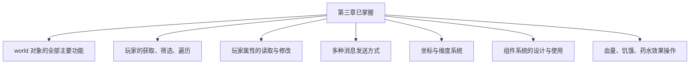

# 3.8 小结

## 前言：第三章走了多远

第三章是整个教程中内容最密集的章节之一。从 `world` 对象这个总入口，到玩家列表的精确获取，到玩家对象的属性与方法，到多种消息发送方式，到坐标与维度系统，到组件系统的设计理念，再到血量、饥饿值与药水效果的具体操作——这七节内容构成了 Script API 日常开发中使用最频繁的核心知识体系。

这一节我们来做一次系统性的回顾，把零散的知识点串联成完整的体系。

---

## 3.8.1 第三章知识回顾

### 3.1 world 对象

`world` 是访问游戏世界的总入口，提供了消息发送、玩家获取、维度访问、时间天气控制、游戏规则修改、数据持久化等核心能力：

```js title="scripts/回顾示例.js"
import { world, WeatherType, GameMode } from "@minecraft/server";

// 消息广播
world.sendMessage("§a全服公告§r");

// 获取玩家
const allPlayers    = world.getPlayers();
const survivalOnly  = world.getPlayers({ gameMode: GameMode.Survival });
const nearbyPlayers = world.getPlayers({ location: { x:0,y:64,z:0 }, maxDistance: 50 });

// 维度
const overworld = world.getDimension("overworld");

// 时间与天气
const time = world.getTimeOfDay();
world.setTimeOfDay(6000);
world.setWeather(WeatherType.Clear, 6000);

// 游戏规则
world.gameRules.keepInventory = true;
world.gameRules.pvp           = false;

// 持久化数据
world.setDynamicProperty("key", "value");
const value = world.getDynamicProperty("key");

// 事件
world.afterEvents.playerSpawn.subscribe(({ player }) => { ... });
world.beforeEvents.playerBreakBlock.subscribe((event) => { ... });
```

---

### 3.2 获取与遍历玩家列表

玩家列表操作的核心原则：每次需要最新列表时重新调用 `getPlayers()`，使用过滤器精确筛选，用数组方法处理结果：

```js title="scripts/回顾示例.js"
import { world } from "@minecraft/server";

// 按名字查找（最常用）
const player = world.getPlayers({ name: "Steve" })[0] ?? null;

// 数组方法处理玩家列表
const names      = world.getPlayers().map(p => p.name);
const lowHP      = world.getPlayers().filter(p =>
    p.getComponent("minecraft:health")?.currentValue < 10
);
const anyDanger  = world.getPlayers().some(p =>
    p.getComponent("minecraft:health")?.currentValue <= 4
);
const totalLevel = world.getPlayers().reduce((sum, p) => sum + p.level, 0);

// 安全处理延迟场景：只保存名字，延迟时重新查找
const playerName = player.name;
system.runTimeout(() => {
    const current = world.getPlayers({ name: playerName })[0];
    if (!current) return;  // 玩家已离线
    current.sendMessage("延迟消息");
}, 100);
```

---

### 3.3 玩家对象的属性与方法

玩家对象上直接挂载的属性和方法：

```js title="scripts/回顾示例.js"
// 基本信息（只读）
player.name                          // 名字
player.id                            // 唯一 ID
player.typeId                        // "minecraft:player"
player.level                         // 经验等级
player.playerPermissionLevel         // 权限等级（2 = OP）

// 状态属性（只读）
player.location                      // { x, y, z }
player.dimension                     // Dimension 对象
player.isSneaking                    // 是否潜行
player.isFlying                      // 是否飞行
player.isOnGround                    // 是否在地面
player.isInWater                     // 是否在水中

// 游戏模式
player.getGameMode()                 // 读取
player.setGameMode(GameMode.Survival) // 设置

// 权限判断
player.playerPermissionLevel === 2   // 是否是 OP

// 经验操作
player.addExperience(100)
player.addLevels(5)
player.resetLevel()

// 传送
player.teleport({ x, y, z })
player.teleport({ x, y, z }, { dimension: nether })

// 标签
player.hasTag("vip")
player.addTag("vip")
player.removeTag("vip")
player.getTags()
```

---

### 3.4 向玩家发送消息

四种消息类型各有适用场景：

```js title="scripts/回顾示例.js"
// 聊天栏消息（永久保留）
player.sendMessage("普通消息");
player.sendMessage("§a§l绿色加粗§r  §c红色§r");
world.sendMessage("全服广播");

// 屏幕标题（几秒后消失）
player.onScreenDisplay.setTitle("§l大标题§r", {
    subtitle:        "副标题",
    fadeInDuration:  10,
    stayDuration:    60,
    fadeOutDuration: 20,
});
player.onScreenDisplay.updateSubtitle("更新副标题");

// 动作栏（快捷栏上方，需持续刷新）
player.onScreenDisplay.setActionBar("§7实时状态信息§r");

// 权限判断正确写法
if (player.playerPermissionLevel === 2) {
    // OP 专属操作
}
```

---

### 3.5 玩家的坐标与维度

坐标操作和维度系统：

```js title="scripts/回顾示例.js"
import { world } from "@minecraft/server";

// 坐标读取
const { x, y, z } = player.location;
const blockX = Math.floor(x);

// 朝向
const { x: pitch, y: yaw } = player.getRotation();

// 维度
const dimId  = player.dimension.id;   // "overworld" / "nether" / "the_end"

// 距离计算
function getDistance(a, b) {
    return Math.sqrt((a.x-b.x)**2 + (a.y-b.y)**2 + (a.z-b.z)**2);
}

// 区域判断
function isInBox(loc, min, max) {
    return loc.x >= min.x && loc.x <= max.x
        && loc.y >= min.y && loc.y <= max.y
        && loc.z >= min.z && loc.z <= max.z;
}

// 跨维度传送
const nether = world.getDimension("nether");
player.teleport({ x: 0, y: 64, z: 0 }, { dimension: nether });

// 地狱坐标换算
const netherX = overworldX / 8;
const netherZ = overworldZ / 8;
```

---

### 3.6 玩家的组件系统

组件系统是管理实体属性的核心机制：

```js title="scripts/回顾示例.js"
// 安全获取组件（用可选链）
const health = player.getComponent("minecraft:health")?.currentValue ?? 20;

// 先检查再使用
if (player.hasComponent("minecraft:health")) {
    const comp = player.getComponent("minecraft:health");
    console.log(comp.currentValue);
}

// 组件的通用属性
const comp = player.getComponent("minecraft:health");
comp.currentValue    // 当前值
comp.effectiveMax    // 有效最大值
comp.defaultValue    // 默认值
comp.effectiveMin    // 有效最小值

// 组件的通用方法
comp.setCurrentValue(15)
comp.resetToDefaultValue()
comp.resetToMaxValue()
```

---

### 3.7 血量、饥饿值与药水效果

最常用的三个具体功能：

```js title="scripts/回顾示例.js"
import { world, EntityDamageCause } from "@minecraft/server";

// 血量操作
const health = player.getComponent("minecraft:health");
health?.setCurrentValue(10)          // 直接设置
health?.resetToMaxValue()            // 满血
player.applyDamage(5)                // 真实伤害（带无敌帧）
player.applyDamage(5, {
    cause: EntityDamageCause.fall
})

// 饥饿值操作
const food = player.getComponent("minecraft:food");
food?.setCurrentValue(20)            // 填满饥饿值
food?.setCurrentValue(0)             // 清空饥饿值

// 药水效果
player.addEffect("speed", 200, { amplifier: 1, showParticles: true })
player.addEffect("regeneration", 100, { amplifier: 0, showParticles: false })
player.getEffects()                  // 所有活跃效果
player.getEffect("speed")            // 单个效果
player.removeEffect("poison")        // 移除效果
```

---

## 3.8.2 重要注意事项汇总

经过第三章七节的学习，有几条特别重要的注意事项值得单独整理，帮助你在实际开发中避开常见陷阱：

**关于组件的安全访问：**

```js
// 错误：不检查组件是否存在
player.getComponent("minecraft:health").currentValue;

// 正确：用可选链防止报错
player.getComponent("minecraft:health")?.currentValue ?? 20;
```

**关于缓存玩家列表：**

```js
// 有风险：列表不会自动更新
const cached = world.getPlayers();
system.runInterval(() => {
    for (const p of cached) { ... }  // 离线玩家仍在列表里
}, 200);

// 正确：每次重新获取
system.runInterval(() => {
    for (const p of world.getPlayers()) { ... }
}, 200);
```

**关于延迟中的玩家对象：**

```js
// 有风险：延迟时玩家可能已离线
system.runTimeout(() => {
    player.sendMessage("...");  // 可能报错
}, 100);

// 正确：保存名字，延迟时重新查找
const name = player.name;
system.runTimeout(() => {
    const current = world.getPlayers({ name })[0];
    if (!current) return;
    current.sendMessage("...");
}, 100);
```

**关于世界加载事件：**

```js
// 旧写法（已废弃）
world.afterEvents.worldInitialize.subscribe(() => { ... });

// 新写法
world.afterEvents.worldLoad.subscribe(() => { ... });
```

**关于直接设置血量和真实伤害的区别：**

```js
// 直接修改：无视觉反馈，无无敌帧，不受护甲影响
health.setCurrentValue(health.currentValue - 5);

// 真实伤害：有无敌帧，有视觉/声音反馈，受护甲影响
player.applyDamage(5);
```

---

## 3.8.3 可复用工具库模板

下面提供一套经过这三章积累的完整工具库，可以直接放进项目使用：

```js title="scripts/playerUtils.js"
import { world, GameMode, EntityDamageCause } from "@minecraft/server";

// =============================================
// 权限工具
// =============================================

export function isOp(player) {
    return player.playerPermissionLevel === 2;
}

export function requireOp(player, action = "执行此操作") {
    if (isOp(player)) return true;
    player.sendMessage(`§c权限不足！你没有权限${action}。§r`);
    return false;
}

// =============================================
// 玩家查找工具
// =============================================

export function getPlayerByName(name) {
    return world.getPlayers({ name })[0] ?? null;
}

export function isPlayerOnline(name) {
    return world.getPlayers({ name }).length > 0;
}

export function getOnlineCount() {
    return world.getPlayers().length;
}

export function getOnlineNames() {
    return world.getPlayers().map(p => p.name);
}

// =============================================
// 血量工具
// =============================================

export function getHealth(player) {
    return player.getComponent("minecraft:health")?.currentValue ?? 0;
}

export function getMaxHealth(player) {
    return player.getComponent("minecraft:health")?.effectiveMax ?? 20;
}

export function setHealth(player, value) {
    const comp = player.getComponent("minecraft:health");
    if (!comp) return;
    comp.setCurrentValue(Math.max(0, Math.min(value, comp.effectiveMax)));
}

export function healPlayer(player, amount) {
    const comp = player.getComponent("minecraft:health");
    if (!comp) return;
    comp.setCurrentValue(
        Math.min(comp.currentValue + amount, comp.effectiveMax)
    );
}

export function fullHeal(player) {
    player.getComponent("minecraft:health")?.resetToMaxValue();
}

export function getHealthPercent(player) {
    const max = getMaxHealth(player);
    return max > 0 ? getHealth(player) / max : 0;
}

// =============================================
// 饥饿工具
// =============================================

export function getFood(player) {
    return player.getComponent("minecraft:food")?.currentValue ?? 0;
}

export function setFood(player, value) {
    const comp = player.getComponent("minecraft:food");
    if (!comp) return;
    comp.setCurrentValue(Math.max(0, Math.min(value, comp.effectiveMax)));
}

export function fillFood(player) {
    player.getComponent("minecraft:food")?.resetToMaxValue();
}

// =============================================
// 药水效果工具
// =============================================

export function hasEffect(player, effectId) {
    return player.getEffect(effectId) !== undefined;
}

export function giveEffect(player, effectId, durationSeconds, level = 1, particles = true) {
    player.addEffect(effectId, durationSeconds * 20, {
        amplifier:     level - 1,
        showParticles: particles,
    });
}

export function clearAllEffects(player) {
    const effects = player.getEffects();
    for (const e of effects) {
        player.removeEffect(e.typeId);
    }
    return effects.length;
}

export function clearNegativeEffects(player) {
    const negative = [
        "slowness", "mining_fatigue", "nausea",
        "blindness", "hunger", "weakness",
        "poison", "wither", "levitation",
    ];
    let count = 0;
    for (const id of negative) {
        if (hasEffect(player, id)) {
            player.removeEffect(id);
            count++;
        }
    }
    return count;
}

// =============================================
// 坐标工具
// =============================================

export function formatLocation(location, floor = true) {
    const x = floor ? Math.floor(location.x) : location.x.toFixed(2);
    const y = floor ? Math.floor(location.y) : location.y.toFixed(2);
    const z = floor ? Math.floor(location.z) : location.z.toFixed(2);
    return `(${x}, ${y}, ${z})`;
}

export function getDistance(locA, locB) {
    const dx = locA.x - locB.x;
    const dy = locA.y - locB.y;
    const dz = locA.z - locB.z;
    return Math.sqrt(dx * dx + dy * dy + dz * dz);
}

export function getHorizontalDistance(locA, locB) {
    const dx = locA.x - locB.x;
    const dz = locA.z - locB.z;
    return Math.sqrt(dx * dx + dz * dz);
}

export function isInRegion(location, min, max) {
    return location.x >= min.x && location.x <= max.x
        && location.y >= min.y && location.y <= max.y
        && location.z >= min.z && location.z <= max.z;
}

// =============================================
// 消息工具
// =============================================

export function sendInfo(player, message) {
    player.sendMessage(`§7[信息] ${message}§r`);
}

export function sendSuccess(player, message) {
    player.sendMessage(`§a[成功] ${message}§r`);
}

export function sendError(player, message) {
    player.sendMessage(`§c[错误] ${message}§r`);
}

export function sendWarning(player, message) {
    player.sendMessage(`§e[警告] ${message}§r`);
}

export function broadcastToOps(message) {
    for (const p of world.getPlayers()) {
        if (isOp(p)) p.sendMessage(message);
    }
}

export function showTitle(player, title, subtitle = "", staySeconds = 3) {
    player.onScreenDisplay.setTitle(title, {
        subtitle,
        fadeInDuration:  10,
        stayDuration:    staySeconds * 20,
        fadeOutDuration: 20,
    });
}
```

---

## 3.8.4 第三章与第四章的衔接

学完第三章，你已经掌握了：



但你可能也注意到，在第三章的很多示例里，我们都在使用 `world.afterEvents.playerSpawn`、`world.afterEvents.chatSend`、`world.afterEvents.entityHurt` 等事件，每次都只是浅浅地用了一下，并没有深入介绍每个事件能获取哪些信息、有哪些使用细节和注意事项。

**第四章：事件系统详解**，将带你系统地认识 Script API 的完整事件体系：

- `beforeEvents` 和 `afterEvents` 在本质上有什么不同，各自的限制是什么
- 玩家相关的所有事件：加入、离开、死亡、交互、聊天……
- 实体相关的所有事件：受伤、死亡、生成……
- 方块相关的所有事件：破坏、放置、爆炸……
- 如何正确取消事件（`beforeEvents` 的 `cancel` 机制）
- 如何在 `beforeEvents` 里安全地执行修改操作

事件系统是 Script API 最核心的机制，吃透它，你的开发能力会有一次质的飞跃。

---

## 3.8.5 给自己的检查清单

在继续第四章之前，用这个清单确认第三章的掌握情况：

**world 对象**
- [ ] 知道 `world.sendMessage` 和 `player.sendMessage` 的区别
- [ ] 能用过滤器精确获取特定玩家
- [ ] 会修改游戏规则（`world.gameRules`）
- [ ] 知道 `world.afterEvents.worldLoad` 是初始化操作的正确时机

**玩家操作**
- [ ] 知道如何判断管理员
- [ ] 能安全地在延迟任务里使用玩家（保存名字，重新查找）
- [ ] 会用 `player.teleport` 进行普通传送和跨维度传送
- [ ] 会用标签系统实现简单的权限或角色标记

**消息系统**
- [ ] 能用格式代码改变消息颜色和样式
- [ ] 会用 `setTitle` 显示屏幕标题和副标题
- [ ] 会用 `setActionBar` 实现持续显示的 HUD
- [ ] 知道动作栏需要持续刷新才能保持显示

**坐标与维度**
- [ ] 会计算两点之间的距离
- [ ] 能判断玩家是否在某个矩形区域内
- [ ] 知道三个维度的 ID 字符串
- [ ] 知道地狱和主世界坐标的 1:8 换算关系

**组件系统**
- [ ] 理解为什么某些属性通过组件访问而不是直接属性
- [ ] 会用可选链安全地读取组件值
- [ ] 知道 `currentValue`、`effectiveMax`、`defaultValue` 的区别
- [ ] 会用 `setCurrentValue`、`resetToDefaultValue`、`resetToMaxValue`

**血量与效果**
- [ ] 知道 `setCurrentValue` 和 `applyDamage` 的区别
- [ ] 会给玩家添加、读取、移除药水效果
- [ ] 知道 `amplifier` 从 0 开始（0 = I 级）
- [ ] 知道效果持续时间的单位是游戏刻（20刻 = 1秒）

---

> **第四章预告：事件系统详解**
>
> 在第三章里，我们把 `world.afterEvents.xxx.subscribe(callback)` 当作一种固定的写法来使用，没有深入探究它背后的运作机制。第四章将带你真正深入事件系统的内部：为什么有 `before` 和 `after` 之分？`cancel` 事件会发生什么？有哪些事件是我们还没用过但非常实用的？如何合理地管理大量事件订阅？这些问题，第四章都将一一解答。